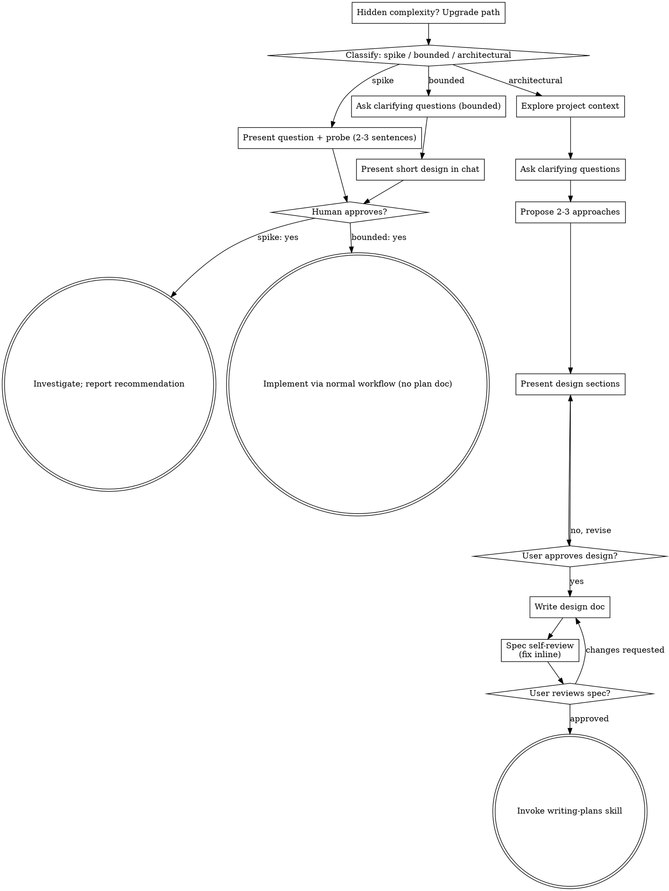

# Claude Code session bfe3fe31-0996-4984-931d-f29bc768a501

- Started: 2026-08-18T17:28:27.994Z
- Project: D:\Claude\expense-log-asp
- Git branch: HEAD

---

## User

<command-message>init</command-message>
<command-name>/init</command-name>

## User

Please analyze this codebase and create a CLAUDE.md file, which will be given to future instances of Claude Code to operate in this repository.

What to add:
1. Commands that will be commonly used, such as how to build, lint, and run tests. Include the necessary commands to develop in this codebase, such as how to run a single test.
2. High-level code architecture and structure so that future instances can be productive more quickly. Focus on the "big picture" architecture that requires reading multiple files to understand.

Usage notes:
- If there's already a CLAUDE.md, suggest improvements to it.
- When you make the initial CLAUDE.md, do not repeat yourself and do not include obvious instructions like "Provide helpful error messages to users", "Write unit tests for all new utilities", "Never include sensitive information (API keys, tokens) in code or commits".
- Avoid listing every component or file structure that can be easily discovered.
- Don't include generic development practices.
- If there are Cursor rules (in .cursor/rules/ or .cursorrules) or Copilot rules (in .github/copilot-instructions.md), make sure to include the important parts.
- If there is a README.md, make sure to include the important parts.
- If you find an OpenAI Codex config (~/.codex/config.toml or ./.codex/) or a Gemini CLI config (~/.gemini/settings.json or ./.gemini/ or a GEMINI.md), offer to import it now — tell the user to reply `/import` to scan and list what's importable (MCP servers, slash commands, subagents, skills, instructions), then `/import --yes=<digest>` (the scan output names the digest) to apply the user-level items. Do NOT read the foreign-agent config files or write Claude Code config yourself — the deterministic import (triggered by `--yes`) applies the same safe-name and path-traversal guards as the terminal picker. If `/import` isn't available on this surface, tell the user to run `claude import` from a terminal instead.
- Do not make up information such as "Common Development Tasks", "Tips for Development", "Support and Documentation" unless this is expressly included in other files that you read.
- Be sure to prefix the file with the following text:

```
# CLAUDE.md

This file provides guidance to Claude Code (claude.ai/code) when working with code in this repository.
```

## Assistant

I'll analyze the codebase to create a CLAUDE.md file.

## Assistant

**Tool call: `Bash`**
```json
{
    "command":  "ls -la \"D:/Claude/expense-log-asp\"",
    "description":  "List root directory contents"
}
```

## Assistant

**Tool call: `Glob`**
```json
{
    "pattern":  "**/*.{sln,csproj,json,md}"
}
```

### Tool result: `Glob`
```
doc\requirement.md
```

### Tool result: `Bash`
```
total 0
drwxr-xr-x 1 AzureAD+AnjaliPerera 4096 0 Aug 18 22:56 .
drwxr-xr-x 1 AzureAD+AnjaliPerera 4096 0 Aug 18 22:56 ..
drwxr-xr-x 1 AzureAD+AnjaliPerera 4096 0 Aug 18 22:56 doc
```

## Assistant

**Tool call: `Read`**
```json
{
    "file_path":  "D:\\Claude\\expense-log-asp\\doc\\requirement.md"
}
```

### Tool result: `Read`
```
1	A small frontend-only expense log: personal expenses with date, amount and category, a month view and totals per category. Mock data only, no backend, no login, no roles, single user. The app itself doesn't need to look nice — we're checking how you set up the project for AI-assisted work and how you drive Claude through the day, not the UI.
2	
3	Rule: you set a monthly limit, and the app shows how much is left and warns when it's passed.
4	
5	Put it in a public GitHub repo, just for this exercise.
6	
7	Wednesday check-in
8	We'll go through your setup step by step:
9	
10	Project initialized — public repo, README that gets someone running the app in under 5 minutes
11	CLAUDE.md — specific to this project (stack, commands, conventions, what Claude should never do here), updated as the day goes, not written once and forgotten
12	Skills — look for existing ones with a good reputation first (Embla's own, then well-known public ones); write your own only if nothing fits, and be ready to explain why
13	Settings — settings.json set up on purpose, not left default; be ready to explain the settings hierarchy (user / project / local)
14	Context management — be ready to show where you used plan mode vs. just letting Claude go, a fresh session vs. continuing one, /clear vs /compact, and a subagent if you used one
15	Information — the project knowledge you gave Claude to work from (README, ADR, any product notes), kept separate from the CLAUDE.md instructions
16	Planned tasks — an epic with user stories, created with Claude, not typed by hand; keep the board matching what you actually did
17	Data note — a few lines in your ADR on what personal data the app would touch and what GDPR would require
18	Show whatever app progress you have at that point — a skeleton is fine. At the end you'll get one small change request from us to add before Thursday.
19	
20	Thursday demo
21	Run the finished app and show what you changed since Wednesday. On top of the above:
22	
23	PR workflow — nothing goes straight to main; at least one PR opened and reviewed by AI, with one comment you actually acted on. The repo is public, so turn off outside contributions.
24	QA — two Playwright tests (one normal case, one edge case), and you should be able to explain what each one actually checks
25	Session log — export it with the AI Hub script (AI-SDLC Documents > Session-Export) and commit it into the repo
26	A few rules
27	The description above is incomplete on purpose — decide the details yourself, and write down your decision (and what you didn't pick) in the ADR. Please don't ask us for clarification during the day, that's part of what we're testing. Work on your own. Whatever we ask you to fix on Wednesday needs to be done and working by Thursday.
```

## Assistant

**Tool call: `Bash`**
```json
{
    "command":  "ls -la \"D:/Claude/expense-log-asp/doc\"",
    "description":  "List doc directory"
}
```

### Tool result: `Bash`
```
total 4
drwxr-xr-x 1 AzureAD+AnjaliPerera 4096    0 Aug 18 22:56 .
drwxr-xr-x 1 AzureAD+AnjaliPerera 4096    0 Aug 18 22:56 ..
-rw-r--r-- 1 AzureAD+AnjaliPerera 4096 2716 Aug 18 17:58 requirement.md
```

## Assistant

**Tool call: `Bash`**
```json
{
    "command":  "ls -a \"D:/Claude/expense-log-asp\" 2\u003e/dev/null; echo \"---codex---\"; ls -d ~/.codex \"D:/Claude/expense-log-asp/.codex\" 2\u003e/dev/null; echo \"---gemini---\"; ls -d ~/.gemini \"D:/Claude/expense-log-asp/.gemini\" \"D:/Claude/expense-log-asp/GEMINI.md\" 2\u003e/dev/null; echo \"---claude---\"; ls -d \"D:/Claude/expense-log-asp/.claude\" \"D:/Claude/expense-log-asp/CLAUDE.md\" \"D:/Claude/expense-log-asp/.cursor\" \"D:/Claude/expense-log-asp/.cursorrules\" \"D:/Claude/expense-log-asp/.github\" 2\u003e/dev/null; echo done",
    "description":  "Check for agent config files"
}
```

### Tool result: `Bash`
```
.
..
doc
---codex---
---gemini---
---claude---
done
```

## Assistant

The repo is currently empty apart from `doc/requirement.md` — no source, no build files, no git repo. I'll write CLAUDE.md from what's actually knowable and mark the stack/commands as not yet decided rather than inventing them.

## Assistant

**Tool call: `Write`**
```json
{
    "file_path":  "D:\\Claude\\expense-log-asp\\CLAUDE.md",
    "content":  "# CLAUDE.md\n\nThis file provides guidance to Claude Code (claude.ai/code) when working with code in this repository.\n\n## Status: pre-scaffold\n\nAs of this file\u0027s creation the repo contains only `doc/requirement.md`. There is no source code, no\nbuild system, and no git repository yet. **Update the \"Stack \u0026 commands\" section below the moment the\nproject is scaffolded** — an out-of-date CLAUDE.md is worse than none here, since keeping it current\nthrough the day is itself part of what this project is graded on.\n\n## What this project is\n\nA small **frontend-only personal expense log**, built as a timed assessment exercise. The full brief is\nin `doc/requirement.md` — read it before planning any work. The short version:\n\n- Expenses have a date, amount, and category. There is a month view and per-category totals.\n- The user sets a **monthly limit**; the app shows the remaining budget and warns once it is exceeded.\n- **Mock data only.** No backend, no database, no login, no roles — single user.\n- UI polish is explicitly *not* being graded. The setup, the workflow, and the artifacts are.\n\nDeliverables beyond the app itself: a README that gets someone running in under 5 minutes, an ADR\n(including a note on what personal data the app touches and what GDPR would require), a Jira epic with\nuser stories created via Claude, at least one AI-reviewed PR, two Playwright tests (one happy path, one\nedge case), and an exported session log.\n\n## Stack \u0026 commands\n\nNot chosen yet. When the project is scaffolded, replace this section with the real install / dev /\nbuild / lint / test commands, including **how to run a single test** (Playwright: `npx playwright test\n\u003cfile\u003e -g \"\u003ctitle\u003e\"`).\n\nThe directory name (`expense-log-asp`) hints at ASP.NET, but the brief says frontend-only with no\nbackend. Resolve that contradiction deliberately and record the decision — and the option you rejected\n— in the ADR before writing code.\n\n## Conventions\n\n- **Decisions go in the ADR.** The brief is deliberately incomplete; every detail you decide yourself\n  must be written down along with what you didn\u0027t pick. Do not ask the assessors for clarification.\n- **Product knowledge lives in `doc/`**, separate from the instructions in this file. Requirements,\n  ADRs, and product notes belong there — not inlined here.\n- **Nothing goes straight to `main`.** Every change lands through a PR that gets an AI review, and at\n  least one review comment must be acted on visibly.\n- **Keep the board honest.** The Jira epic and its stories must match what was actually built.\n\n## What Claude should never do here\n\n- Add a backend, database, API layer, authentication, or user roles. Persistence beyond in-browser\n  state is out of scope by design.\n- Commit directly to `main`, or enable outside contributions on the public repo (PRs from forks stay\n 
... (truncated, 193 more characters)
```

### Tool result: `Write`
```
File created successfully at: D:\Claude\expense-log-asp\CLAUDE.md (file state is current in your context — no need to Read it back)
```

## Assistant

Created `D:\Claude\expense-log-asp\CLAUDE.md`.

A caveat worth stating plainly: there was no codebase to analyze. The directory holds only `doc/requirement.md` — no source files, no project/solution files, no package manifest, and `git` isn't initialized. So the two things `/init` normally captures (build/lint/test commands and high-level architecture) don't exist yet.

Rather than fabricate them, the file records what's actually knowable:

- **Project intent and hard constraints** from the brief — frontend-only, mock data, no backend/login/roles, monthly limit with over-budget warning.
- **The deliverables** that surround the app (README, ADR incl. the GDPR data note, Jira epic, AI-reviewed PR, two Playwright tests, session log).
- **Conventions** — decisions recorded in the ADR, product knowledge kept in `doc/` separate from these instructions, nothing straight to `main`.
- **A "never do here" section**, mostly scope guards against adding a backend or auth.
- **A `Stack & commands` placeholder** marked explicitly as unresolved.

Two things I flagged in the file rather than deciding for you:

1. **The stack contradiction.** The directory is named `expense-log-asp`, suggesting ASP.NET, but the brief says frontend-only with no backend. That's yours to resolve (an ASP.NET-hosted static/Blazor WASM frontend would satisfy both readings) — and per the brief, the choice plus the rejected alternative belongs in the ADR.
2. **Keeping it current.** The brief grades CLAUDE.md on being "updated as the day goes, not written once and forgotten," so the placeholder section should be filled in as soon as you scaffold.

Once the project exists, re-run `/init` or just ask me to refresh it, and I'll replace the placeholder with real commands and an architecture section.

## User

<command-message>superpowers:brainstorming</command-message>
<command-name>/superpowers:brainstorming</command-name>
<command-args>@doc\ this is new requirement I got doc\requirement.md. will brainstorm this and will create epics and user stories</command-args>

## User

Base directory for this skill: C:\Users\AnjaliPerera\.claude\plugins\cache\claude-plugins-official\superpowers\6.3.0\skills\brainstorming

# Brainstorming Ideas Into Designs

Help turn ideas into fully formed designs and specs through natural collaborative dialogue.

Start by classifying how much process the request needs, then work
through your path: understand the context, refine the idea, present a
design, and get your human partner's approval.

<HARD-GATE>
Do NOT invoke any implementation skill, write any code, scaffold any
project, or take any implementation action until you have told your
human partner what you intend and they have approved it. This applies
to EVERY task on EVERY path below — the ceremony scales with the task;
the approval gate never does.
</HARD-GATE>

## Three Paths

Before your first question, classify the request and say the
classification out loud — "this looks bounded, so I'll present a short
design here rather than write a spec" — so your human partner can
override it:

- **Spike** — a feasibility question ("can we...", "is it possible...",
  "quick and dirty is fine") whose output is an answer, not code you
  keep. Present the question and what you'll try in 2-3 sentences, get
  a nod, then find out as cheaply as correctness allows. No design
  doc, no spec file. Report findings as a recommendation; anything you
  built stays labeled throwaway.
- **Bounded** — a well-scoped change to code that already exists in
  this repo: a new flag, a small endpoint, a one-file fix.
  Understanding the kind of app is not enough — bounded means the flow
  you are changing is already here to read. If there is no existing
  flow to change, the task is not bounded. Ask the clarifying
  questions that matter, present a short design IN CHAT (a few
  sentences to a few short paragraphs), and STOP. Implementation
  starts only after your human partner says yes to that design — a
  bounded task's approval is as hard a gate as an architectural
  one. No spec file, no implementation plan document.
- **Architectural** — new projects, new subsystems, changes that
  restructure how components fit together or alter interfaces others
  depend on. Follow the full process: questions, approaches, sectioned
  design, written spec, then the writing-plans skill.

When in doubt between two paths, take the heavier one. The ratchet is
one-way: hidden complexity discovered mid-task upgrades the path —
stop, say so, and step up. Nothing downgrades mid-task.

## Anti-Pattern: "Too Simple To Need Approval"

Every path ends with your human partner approving your intent before
implementation. A todo list, a single-function utility, a config
change — the design may be two sentences in chat, but you MUST present
it and get approval. "Simple" tasks are where unexamined assumptions
cause the most wasted work. What scales with simplicity is the
artifact, never the approval.

## Red Flags

| Thought | Reality |
|---------|---------|
| "This is too simple to need a design" | Simple means a short design, not no design. Two sentences in chat, then approval. |
| "I'll call it bounded and skip the spec" | Reaching for a label to skip work IS the doubt — take the heavier path. |
| "It's bounded and the design is obvious — I'll start while they read it" | The gate is the approval, not the design's length. Present, then stop until you hear yes. |
| "I understand this kind of app, so it's bounded" | Bounded measures the repo, not your familiarity. A new project has no existing flow — it is architectural. |
| "The spike works, so I'll keep the code" | A spike's output is an answer. Keeping the code is a new request — classify it. |
| "It grew, but I'm almost done — no need to re-classify" | Hidden complexity upgrades the path mid-task. Stop and say so. |
| "They approved the spike, so the follow-up change is approved too" | Each task gets its own classification and its own approval. |

## Checklist

Classify first, announce the path, then create a task for each item on
your path and complete them in order.

**Spike:**
1. **Explore project context** — enough to frame the probe
2. **Present question + probe plan** — 2-3 sentences
3. **Get approval** — a nod is enough
4. **Investigate** — as cheaply as correctness allows
5. **Report findings** — a recommendation; label anything built as throwaway

**Bounded:**
1. **Explore project context** — check files, docs, recent commits
2. **Ask clarifying questions** — one at a time, the ones that matter
3. **Present short design in chat** — approach, files touched, testing
4. **Get approval** — STOP and wait for an explicit yes; presenting the design and starting in the same breath is skipping the gate
5. **Implement** — proceed with the normal development workflow (TDD applies); no plan document

**Architectural:**
1. **Explore project context** — check files, docs, recent commits
2. **Offer the visual companion just-in-time** — NOT upfront. The first time a question would genuinely be clearer shown than described, offer it then (its own message); on approval its browser tab opens for you. If no visual question ever arises, never offer it. See the Visual Companion section below.
3. **Ask clarifying questions** — one at a time, understand purpose/constraints/success criteria
4. **Propose 2-3 approaches** — with trade-offs and your recommendation
5. **Present design** — in sections scaled to their complexity, get user approval after each section
6. **Write design doc** — save to `docs/superpowers/specs/YYYY-MM-DD-<topic>-design.md` and commit
7. **Spec self-review** — quick inline check for placeholders, contradictions, ambiguity, scope (see below)
8. **User reviews written spec** — ask user to review the spec file before proceeding
9. **Transition to implementation** — invoke writing-plans skill to create implementation plan

## Process Flow



**Terminal states are path-bound.** Architectural: the ONLY skill you
invoke after brainstorming is writing-plans — never frontend-design,
mcp-builder, or any other implementation skill. Bounded: after
approval, implementation proceeds directly through the normal
development workflow; no plan document. Spike: the terminal state is a
reported recommendation.

## The Process

The subsections below serve the bounded and architectural paths (a
spike stops at "present the probe, get a nod"). Sections from
**Exploring approaches** onward are architectural-path depth — for
bounded work, context plus a few questions plus a short in-chat design
is the whole process.

**Understanding the idea:**

- Check out the current project state first (files, docs, recent commits)
- Before asking detailed questions, assess scope: if the request describes multiple independent subsystems (e.g., "build a platform with chat, file storage, billing, and analytics"), flag this immediately. Don't spend questions refining details of a project that needs to be decomposed first.
- If the project is too large for a single spec, help the user decompose into sub-projects: what are the independent pieces, how do they relate, what order should they be built? Then brainstorm the first sub-project through the normal design flow. Each sub-project gets its own spec → plan → implementation cycle.
- For appropriately-scoped projects, ask questions one at a time to refine the idea
- Prefer multiple choice questions when possible, but open-ended is fine too
- Only one question per message - if a topic needs more exploration, break it into multiple questions
- Focus on understanding: purpose, constraints, success criteria

**Exploring approaches:**

- Propose 2-3 different approaches with trade-offs
- Present options conversationally with your recommendation and reasoning
- Lead with your recommended option and explain why
- YAGNI ruthlessly - remove unnecessary features from every approach and design

**Presenting the design:**

- Once you believe you understand what you're building, present the design
- Scale each section to its complexity: a few sentences if straightforward, up to 200-300 words if nuanced
- Ask after each section whether it looks right so far
- Cover: architecture, components, data flow, error handling, testing
- Be ready to go back and clarify if something doesn't make sense

**Design for isolation and clarity:**

- Break the system into smaller units that each have one clear purpose, communicate through well-defined interfaces, and can be understood and tested independently
- For each unit, you should be able to answer: what does it do, how do you use it, and what does it depend on?
- Can someone understand what a unit does without reading its internals? Can you change the internals without breaking consumers? If not, the boundaries need work.
- Smaller, well-bounded units are also easier for you to work with - you reason better about code you can hold in context at once, and your edits are more reliable when files are focused. When a file grows large, that's often a signal that it's doing too much.

**Working in existing codebases:**

- Explore the current structure before proposing changes. Follow existing patterns.
- Where existing code has problems that affect the work (e.g., a file that's grown too large, unclear boundaries, tangled responsibilities), include targeted improvements as part of the design - the way a good developer improves code they're working in.
- Don't propose unrelated refactoring. Stay focused on what serves the current goal.

## After the Design (architectural path)

**Documentation:**

- Write the validated design (spec) to `docs/superpowers/specs/YYYY-MM-DD-<topic>-design.md`
  - (User preferences for spec location override this default)
- Use elements-of-style:writing-clearly-and-concisely skill if available
- Commit the design document to git

**Spec Self-Review:**
After writing the spec document, look at it with fresh eyes:

1. **Placeholder scan:** Any "TBD", "TODO", incomplete sections, or vague requirements? Fix them.
2. **Internal consistency:** Do any sections contradict each other? Does the architecture match the feature descriptions?
3. **Scope check:** Is this focused enough for a single implementation plan, or does it need decomposition?
4. **Ambiguity check:** Could any requirement be interpreted two different ways? If so, pick one and make it explicit.

Fix any issues inline. No need to re-review — just fix and move on.

**User Review Gate:**
After the spec review loop passes, ask the user to review the written spec before proceeding:

> "Spec written and committed to `<path>`. Please review it and let me know if you want to make any changes before we start writing out the implementation plan."

Wait for the user's response. If they request changes, make them and re-run the spec review loop. Only proceed once the user approves.

**Implementation:**

- Invoke the writing-plans skill to create a detailed implementation plan
- Do NOT invoke any other skill. writing-plans is the next step.

## Visual Companion

A browser-based companion for showing mockups, diagrams, and visual options during brainstorming. Available as a tool — not a mode. Accepting the companion means it's available for questions that benefit from visual treatment; it does NOT mean every question goes through the browser.

**Offering the companion (just-in-time):** Do NOT offer it upfront. Wait until a question would genuinely be clearer shown than told — a real mockup / layout / diagram question, not merely a UI *topic*. The first time that happens, offer it then, as its own message:
> "This next part might be easier if I show you — I can put together mockups, diagrams, and comparisons in a browser tab as we go. It's still new and can be token-intensive. Want me to? I'll open it for you."

**This offer MUST be its own message.** Only the offer — no clarifying question, summary, or other content. Wait for the user's response. If they accept, start the server with `--open` so their browser opens to the first screen automatically. If they decline, continue text-only and don't offer again unless they raise it.

**Per-question decision:** Even after the user accepts, decide FOR EACH QUESTION whether to use the browser or the terminal. The test: **would the user understand this better by seeing it than reading it?**

- **Use the browser** for content that IS visual — mockups, wireframes, layout comparisons, architecture diagrams, side-by-side visual designs
- **Use the terminal** for content that is text — requirements questions, conceptual choices, tradeoff lists, A/B/C/D text options, scope decisions

A question about a UI topic is not automatically a visual question. "What does personality mean in this context?" is a conceptual question — use the terminal. "Which wizard layout works better?" is a visual question — use the browser.

If they agree to the companion, read the detailed guide before proceeding:
`skills/brainstorming/visual-companion.md`


ARGUMENTS: @doc\ this is new requirement I got doc\requirement.md. will brainstorm this and will create epics and user stories

## Assistant

**Path: architectural.** This is a new project with no existing code to change, so I'll take the full route — clarifying questions one at a time, then 2–3 approaches, then a sectioned design, then a written spec. Your epics and user stories come *after* that: the `embla-core:jira` skill takes `/jira spec <path>`, so the spec I produce here becomes its direct input.

Context I already have: the repo holds only `doc/requirement.md`, plus the `CLAUDE.md` I just wrote. Nothing else to read.

One note on the brief's "don't ask for clarification" rule — that applies to the assessors, not to you. You're the one making these calls, so I'll put the decisions in front of you and record both what you picked and what you rejected in the ADR, exactly as the brief requires.

First question, the one that forks everything else:

## Assistant

**Tool call: `AskUserQuestion`**
```json
{
    "questions":  [
                      {
                          "question":  "The directory is named `expense-log-asp` (suggesting ASP.NET), but the brief says frontend-only with no backend. Which stack do you want to build on?",
                          "header":  "Stack",
                          "multiSelect":  false,
                          "options":  [
                                          {
                                              "label":  "React + TS + Vite (Recommended)",
                                              "description":  "Fastest path to a running app and the smoothest Playwright integration — matters because you demo Thursday and need a README that works in under 5 min. Downside: ignores the \u0027asp\u0027 in the folder name, so the ADR must explain that."
                                          },
                                          {
                                              "label":  "Blazor WebAssembly",
                                              "description":  "Resolves the contradiction elegantly: it\u0027s ASP.NET Core tooling but publishes to static files, so it is genuinely frontend-only with no server. Downside: heavier toolchain, and Playwright against Blazor WASM is slower and more timing-sensitive."
                                          },
                                          {
                                              "label":  "ASP.NET Core MVC / Razor Pages",
                                              "description":  "Honors the folder name most directly, reading \u0027no backend\u0027 as \u0027no API or database\u0027 rather than \u0027no server\u0027. Downside: you do run a server, which is the loosest fit to the brief and needs the strongest ADR justification."
                                          },
                                          {
                                              "label":  "Plain HTML/CSS/JS, no framework",
                                              "description":  "Zero build step, trivially under 5 minutes to run, nothing to explain. Downside: state management for the month view and limit warning gets manual, and it may read as under-engineered for an assessment."
                                          }
                                      ]
                      }
                  ]
}
```

### Tool result: `AskUserQuestion`
```
Your questions have been answered: "The directory is named `expense-log-asp` (suggesting ASP.NET), but the brief says frontend-only with no backend. Which stack do you want to build on?"="React + TS + Vite (Recommended)". You can now continue with these answers in mind.
```

## Assistant

Locked in: **React + TypeScript + Vite**. That also gives Playwright a first-class setup, which you need for Thursday's two tests.

Next question — this one shapes the data layer and what your Playwright tests can actually assert:

## Assistant

**Tool call: `AskUserQuestion`**
```json
{
    "questions":  [
                      {
                          "question":  "The brief says \u0027mock data only, no backend\u0027. How should expenses and the monthly limit behave across a page refresh?",
                          "header":  "Persistence",
                          "multiSelect":  false,
                          "options":  [
                                          {
                                              "label":  "localStorage (Recommended)",
                                              "description":  "Seed with mock data on first run; user\u0027s added expenses and their limit survive refresh. Still zero backend. Gives your Playwright edge-case test something real to assert, and makes the Thursday demo feel like an app rather than a toy. Costs a small storage-hydration layer."
                                          },
                                          {
                                              "label":  "In-memory only",
                                              "description":  "State lives in React; refresh resets to the seeded mock data. Simplest possible implementation and the most literal reading of \u0027mock data only\u0027. Downside: the demo loses everything on reload, and it\u0027s a weaker story for GDPR discussion since nothing is ever stored."
                                          },
                                          {
                                              "label":  "In-memory, but limit in localStorage",
                                              "description":  "Expenses reset on refresh; only the monthly limit persists. Middle ground that keeps the data layer trivial while making the limit feel like a real setting. Downside: inconsistent model that you\u0027d have to justify in the ADR."
                                          }
                                      ]
                      }
                  ]
}
```

### Tool result: `AskUserQuestion`
```
Your questions have been answered: "The brief says 'mock data only, no backend'. How should expenses and the monthly limit behave across a page refresh?"="localStorage (Recommended)". You can now continue with these answers in mind.
```

## Assistant

Good — and that gives your ADR's GDPR section real substance: personal financial data stored client-side in the browser, which is exactly the kind of thing that needs a retention and erasure story.

Third question — this one determines the data model:

## Assistant

**Tool call: `AskUserQuestion`**
```json
{
    "questions":  [
                      {
                          "question":  "The rule is \u0027you set a monthly limit\u0027. Is that one limit that applies to every month, or a separate limit per month?",
                          "header":  "Limit scope",
                          "multiSelect":  false,
                          "options":  [
                                          {
                                              "label":  "One global limit (Recommended)",
                                              "description":  "A single number applied to whichever month you\u0027re viewing. Matches the brief\u0027s wording most literally, keeps the model to a single scalar, and keeps the UI to one input. Least code for the same demonstrated rule."
                                          },
                                          {
                                              "label":  "Per-month limit",
                                              "description":  "Each month stores its own limit, defaulting to the last one set. More realistic budgeting behaviour and a richer month-navigation demo. Costs a keyed map in storage and more edge cases (what does an unvisited future month inherit?)."
                                          },
                                          {
                                              "label":  "Global limit, per-category too",
                                              "description":  "A total monthly cap plus optional per-category caps. Most feature-rich and makes the per-category totals view more meaningful. Clear scope creep for a two-day exercise — the brief never asks for it."
                                          }
                                      ]
                      }
                  ]
}
```

### Tool result: `AskUserQuestion`
```
Your questions have been answered: "The rule is 'you set a monthly limit'. Is that one limit that applies to every month, or a separate limit per month?"="Per-month limit". You can now continue with these answers in mind.
```

## Assistant

Per-month limit it is — so limits become a `YYYY-MM → amount` map. I'll pin down the inheritance rule (what an un-set month shows) in the design and flag it for you rather than spending a question on it.

Fourth question:

## Assistant

**Tool call: `AskUserQuestion`**
```json
{
    "questions":  [
                      {
                          "question":  "How should expense categories work?",
                          "header":  "Categories",
                          "multiSelect":  false,
                          "options":  [
                                          {
                                              "label":  "Fixed built-in list (Recommended)",
                                              "description":  "A hardcoded set like Groceries, Transport, Rent, Eating out, Other. The brief only needs \u0027totals per category\u0027, so a fixed list delivers that with a simple select and no management UI. Keeps the seeded mock data coherent."
                                          },
                                          {
                                              "label":  "User-defined categories",
                                              "description":  "User can add and name their own, persisted alongside expenses. More flexible and gives another CRUD surface to demo. Costs a management screen, rename/delete-with-existing-expenses edge cases, and validation — real scope for little assessed benefit."
                                          },
                                          {
                                              "label":  "Fixed list plus free-text \u0027Other\u0027",
                                              "description":  "Built-in list, but \u0027Other\u0027 lets you type a label. Middle ground that avoids a management UI while allowing anything. Downside: two code paths for category identity, which muddies the per-category totals grouping."
                                          }
                                      ]
                      }
                  ]
}
```

### Tool result: `AskUserQuestion`
```
Your questions have been answered: "How should expense categories work?"="Fixed built-in list (Recommended)". You can now continue with these answers in mind.
```

## Assistant

Last question before I lay out approaches — this sets how many user stories you'll end up with:

## Assistant

**Tool call: `AskUserQuestion`**
```json
{
    "questions":  [
                      {
                          "question":  "Beyond the brief\u0027s core (add expense, month view, per-category totals, monthly limit + warning), which of these should be in scope?",
                          "header":  "Scope",
                          "multiSelect":  true,
                          "options":  [
                                          {
                                              "label":  "Navigate between months",
                                              "description":  "Prev/next controls to move through months. Strongly recommended — a \u0027month view\u0027 with no way to change month is hard to demo, and per-month limits are meaningless without it."
                                          },
                                          {
                                              "label":  "Delete an expense",
                                              "description":  "Remove a row from the list. Cheap to build and gives your Playwright happy-path test a natural cleanup step. Also the concrete \u0027right to erasure\u0027 hook for the GDPR note."
                                          },
                                          {
                                              "label":  "Edit an expense",
                                              "description":  "Change an existing entry\u0027s date, amount, or category. Rounds out CRUD, but reuses the add-form with extra state and edge cases — the most cost for the least assessed value."
                                          },
                                          {
                                              "label":  "Filter list by category",
                                              "description":  "Narrow the month\u0027s list to one category. Pairs naturally with the totals view. Nice-to-have; the totals already convey the per-category picture."
                                          }
                                      ]
                      }
                  ]
}
```

### Tool result: `AskUserQuestion`
```
Your questions have been answered: "Beyond the brief's core (add expense, month view, per-category totals, monthly limit + warning), which of these should be in scope?"="Navigate between months". You can now continue with these answers in mind.
```

## Assistant

Scope is tight: **month navigation only**, no edit/delete/filter. That's a defensible YAGNI line and it keeps the story count honest.

One consequence to flag: with no delete, the app has no way to remove personal data once entered — which is awkward when your ADR has to address GDPR erasure. I'd suggest a single "Clear all data" action as the answer to that (one button, no per-row delete). I've kept it *out* of the design below; say the word and I'll fold it in.

## Three approaches

**1. Layered — pure domain core, storage adapter, thin React** *(my recommendation)*

Three layers with hard boundaries. A `domain/` module of pure functions — `totalsByCategory`, `remainingForMonth`, `isOverLimit` — that import nothing from React and know nothing about storage. A `storage/` module that is the *only* code in the app touching `localStorage`, exposing typed load/save. React on top: one context + reducer holding expenses, limits, and the selected month.

*Why I'd pick it:* the domain functions are unit-testable in milliseconds with no DOM, which is what makes the budget-limit rule — the one piece of real logic here — genuinely verifiable. And the single storage boundary is precisely the artifact your ADR's GDPR section points at: one file, one place personal data is written. *Cost:* slightly more ceremony than a two-day app strictly needs.

**2. Zustand with `persist` middleware**

One store, persistence essentially free, least boilerplate of the three.

*Trade-off:* the budget logic ends up living inside the store, so testing it means instantiating the store rather than calling a function. It also adds a dependency you'd have to defend in the ADR when React's own context covers this app's needs.

**3. Hook-per-concern, no global store**

`useExpenses` and `useMonthlyLimit`, each wrapping a `useLocalStorage` primitive. Minimal ceremony, very idiomatic React.

*Trade-off:* the over-limit calculation needs both hooks at once, so it has nowhere natural to live and drifts into a component. Every test then needs React Testing Library — you lose the fast pure-function layer.

I recommend **#1**. The extra structure is small at this size, and it's the option that best survives the question "show me the test that proves the warning fires at the right moment."

Which approach do you want — and does the "Clear all data" affordance go in?

## User

go with #1 and yes include clear all data

## Assistant

Approach #1 with "Clear all data" included. Here's the design — sections 1 and 2 first, since they're coupled. I'll hold the rest until you've signed off on these.

## Section 1 — Architecture

Three layers, with the dependency arrows only ever pointing inward:

```
src/
  domain/       pure TypeScript, imports nothing from React or the browser
    types.ts      Expense, Category, MonthKey, BudgetStatus
    money.ts      parse/format minor units
    expenses.ts   expensesInMonth, totalsByCategory, monthTotal
    budget.ts     limitForMonth, remaining, status
  storage/      the ONLY code that touches window.localStorage
    localStorage.ts   load / save / clear
    schema.ts         version + shape validation
    seed.ts           mock data, generated relative to today
  state/
    reducer.ts        pure reducer — unit-testable without React
    ExpenseContext.tsx  hydrate, dispatch, persist
  components/   MonthNavigator, ExpenseForm, ExpenseList,
                CategoryTotals, BudgetSummary, ClearDataButton
```

Two boundaries earn their keep. `domain/` being React-free means the budget rule — the only real logic in the app — is testable by calling a function, no DOM, no render. And `storage/` being the single door to `localStorage` means your ADR's GDPR section can point at one file and say "this is every place personal data is written."

## Section 2 — Data model and storage

**Money as integer minor units.** Amounts are stored as whole cents, never floats. `0.1 + 0.2` in a totals column produces `0.30000000000000004`, and a budget app that shows that in a demo is a bad look. Conversion happens once, at the form boundary, in `money.ts`. Currency is a single constant (EUR), formatted via `Intl.NumberFormat` — no multi-currency, no conversion.

**Dates as `YYYY-MM-DD` strings.** The month key is a string slice, `date.slice(0, 7)`. Never `new Date(...)` parsing for grouping — that's how an expense logged on the 1st lands in the previous month for anyone west of UTC. This keeps month filtering timezone-proof and trivially testable.

```ts
type Expense = { id: string; date: string; amount: number; category: Category }
type Limits  = Record<MonthKey, number>          // '2026-08' -> minor units
```

**The carry-forward rule** — this is the ambiguity I flagged earlier, now resolved. The limit for month M is: the limit explicitly set for M; failing that, the limit from the nearest *earlier* month that has one; failing that, no limit at all. An unset month therefore shows "no limit set" and never warns, rather than defaulting to zero and screaming the moment you open it. Setting a limit while viewing month M writes to M only — it doesn't retroactively rewrite history.

**Persistence** is one versioned JSON blob under `expense-log:v1`, holding `{ version, expenses, limits }`. Seed data is written on first run only, with dates computed relative to today so the demo always opens on a populated month regardless of when you run it.

Does this hold up, or do you want to change anything before I move to components, error handling, and testing?

## User

no change

## Assistant

Sections 1 and 2 approved. Here are the remaining three.

## Section 3 — Components and data flow

State flows one way. `ExpenseContext` hydrates once from `storage.load()` via lazy reducer init, and a single effect persists the whole state blob on every change. Actions are `ADD_EXPENSE`, `SET_LIMIT`, `SELECT_MONTH`, `CLEAR_ALL`.

Nothing derived is ever stored. `CategoryTotals` and `BudgetSummary` call the `domain/` selectors during render against the currently selected month. This matters more than it looks: a stored total is a total that can disagree with the list it's summarising, and reconciling those in a demo is the classic embarrassing bug.

The components split by responsibility, not by screen:

- **MonthNavigator** — prev/next, owns nothing, dispatches `SELECT_MONTH`
- **ExpenseForm** — local field state and validation; dispatches only on a valid submit
- **ExpenseList** — the selected month's expenses, newest first
- **CategoryTotals** — per-category sums for the month, zero-rows omitted
- **BudgetSummary** — limit input, remaining amount, and the warning
- **ClearDataButton** — confirm, then `CLEAR_ALL`

`BudgetSummary` is the only component that renders the rule, so it's the only one your edge-case test needs to target.

## Section 4 — Error handling

Three failure modes, all of which end with the app still running:

**Corrupt stored data.** `schema.ts` validates shape and version on load. On failure the app falls back to seed data and shows a dismissible notice rather than throwing — a white screen because someone hand-edited `localStorage` is not a defensible demo failure.

**`localStorage` unavailable** — private browsing, quota exceeded, storage disabled. The storage module degrades to an in-memory no-op adapter and a banner states that changes won't persist. The app is fully usable; it just forgets.

**Form validation.** Amount must parse and be strictly greater than zero; date must be a real calendar date; category is required. Errors render inline next to the field and submit is blocked. Rejecting zero and negatives is a deliberate call — it means no refunds or income, keeping this an expense log rather than a ledger.

One decision worth stating plainly: **"Clear all data" leaves you empty, not re-seeded.** Wiping your data and watching mock expenses reappear reads as a broken button, and it would undercut the erasure story the ADR is making.

## Section 5 — Testing

**Unit tests (Vitest)** carry the logic, since `domain/` is pure and fast to exercise: the carry-forward rule including gap months and the no-limit case; the boundary where spending exactly equals the limit; month filtering across month and year boundaries; minor-unit parse/format round-tripping; every reducer transition; and schema validation against corrupt input.

**The two Playwright tests** the brief requires. Both seed `localStorage` through `addInitScript` before page load, so they're deterministic and independent of both the seed data and today's date:

1. **Happy path** — add an expense to the current month, then assert it appears in the list *and* that the month total, its category total, and the remaining budget all moved by exactly that amount. It checks that one user action propagates correctly through every derived view.

2. **Edge case: the limit boundary** — starting just under the limit, add the expense that brings spending to *exactly* the limit and assert remaining reads zero with **no** warning; then add one more cent and assert the warning appears. It pins down the off-by-one in "warns when it's passed" — passed means over, not reached. That's the test with the crispest answer when someone asks what it actually checks.

If this all looks right, say the word and I'll write it up as a spec at `docs/superpowers/specs/2026-08-18-expense-log-design.md`. That file is also what feeds your epics and stories — `embla-core:jira` takes it directly as `/jira spec <path>`.

## User

write the spec

## Assistant

**Tool call: `Write`**
```json
{
    "file_path":  "D:\\Claude\\expense-log-asp\\docs\\superpowers\\specs\\2026-08-18-expense-log-design.md",
    "content":  "# Expense Log — Design Spec\n\n**Date:** 2026-08-18\n**Status:** Approved, ready for implementation planning\n**Source requirement:** `doc/requirement.md`\n\n## 1. Purpose\n\nA frontend-only personal expense log. The user records expenses (date, amount, category),\nviews them a month at a time with totals per category, sets a monthly spending limit, and\nsees how much is left — with a warning once the limit is passed.\n\nThe app is a vehicle for demonstrating AI-assisted development workflow. UI polish is\nexplicitly not a goal. Structure, testability, and traceable decisions are.\n\n## 2. Scope\n\n**In scope**\n\n- Add an expense: date, amount, category\n- Month view: the selected month\u0027s expenses, newest first\n- Totals per category for the selected month\n- Navigate between months (previous / next, unbounded)\n- Set a monthly limit; see remaining budget; warning when the limit is passed\n- Clear all data (single action, with confirmation)\n\n**Out of scope** — deliberately, with reasoning in §9\n\nEditing an expense, deleting individual expenses, filtering the list by category,\nuser-defined categories, multi-currency, per-category limits, income or refunds,\nany backend, database, authentication, or multi-user support.\n\n## 3. Stack\n\n| Concern | Choice |\n|---|---|\n| Framework | React with TypeScript |\n| Build / dev server | Vite |\n| Unit tests | Vitest |\n| End-to-end tests | Playwright |\n| Persistence | Browser `localStorage` |\n| Runtime | Node 20+ |\n\nCommands: `npm install`, `npm run dev`, `npm run build`, `npm run test` (Vitest),\n`npx playwright test`. A single test: `npx playwright test \u003cfile\u003e -g \"\u003ctitle\u003e\"`.\n\n## 4. Architecture\n\nThree layers. Dependencies point inward only — `domain/` imports nothing from React,\nthe browser, or storage.\n\n```\nsrc/\n  domain/                  pure TypeScript\n    types.ts                 Expense, Category, MonthKey, BudgetStatus\n    money.ts                 parse / format minor units\n    expenses.ts              expensesInMonth, totalsByCategory, monthTotal\n    budget.ts                limitForMonth, remaining, status\n  storage/                 the only code touching window.localStorage\n    localStorage.ts          load / save / clear, with in-memory fallback\n    schema.ts                version + shape validation\n    seed.ts                  mock data, generated relative to today\n  state/\n    reducer.ts               pure reducer\n    ExpenseContext.tsx       hydrate, dispatch, persist\n  components/\n    MonthNavigator.tsx  ExpenseForm.tsx  ExpenseList.tsx\n    CategoryTotals.tsx  BudgetSummary.tsx  ClearDataButton.tsx\n  App.tsx  main.tsx\n```\n\nTwo boundaries carry the design:\n\n- **`domain/` is React-free**, so the budget rule — the only real logic in the app — is\n  verified by calling a function. No DOM, no render, 
... (truncated, 10412 more characters)
```

### Tool result: `Write`
```
File created successfully at: D:\Claude\expense-log-asp\docs\superpowers\specs\2026-08-18-expense-log-design.md (file state is current in your context — no need to Read it back)
```

## Assistant

**Tool call: `Edit`**
```json
{
    "replace_all":  false,
    "file_path":  "D:\\Claude\\expense-log-asp\\docs\\superpowers\\specs\\2026-08-18-expense-log-design.md",
    "old_string":  "so the app always opens on a populated month. The seed contains roughly ten expenses in the\ncurrent month and six in the previous month, and sets an explicit limit of €1,500.00 on the\n**current** month only, with seeded current-month spend around €1,180.00.",
    "new_string":  "so the app always opens on a populated month. The seed contains ten expenses in the current\nmonth and six in the previous month, spread across all five categories, and sets an explicit\nlimit of €1,500.00 on the **current** month only. Seeded current-month spend totals\n€1,180.00 exactly."
}
```

### Tool result: `Edit`
```
The file D:\Claude\expense-log-asp\docs\superpowers\specs\2026-08-18-expense-log-design.md has been updated successfully. (file state is current in your context — no need to Read it back)
```

## Assistant

Spec written to `docs/superpowers/specs/2026-08-18-expense-log-design.md`. Please review it and let me know if you want any changes before we move on.

I ran the self-review pass over it — no placeholders, and I tightened one vague line (seed volumes are now exact numbers rather than "roughly ten"). The carry-forward rule and the seed data are consistent with each other: a limit on the current month only means the previous month resolves to "no limit set" and the next month inherits €1,500, which exercises both branches of the rule without any extra setup.

Two things I could not do, and one small mess to clean up:

**Git.** The skill's final step is to commit the spec, but this directory isn't a git repository yet — the brief requires a public GitHub repo, so that has to happen regardless. Want me to `git init`, commit the spec plus `CLAUDE.md`, and set up the remote? I've left it alone rather than initialize a repo you didn't ask for.

**`doc/` vs `docs/`.** Your requirement lives in `doc/`, and I wrote the spec to `docs/` (the skill's default path). Two near-identical top-level folders is the kind of thing that gets confusing by Thursday. I'd consolidate everything under `doc/` — say so and I'll move it.

On what comes next: the brief wants your epics and stories created *with* Claude, and this spec is the direct input — `/embla-core:jira spec docs/superpowers/specs/2026-08-18-expense-log-design.md` will walk you through creating them per item. §12 sketches five epics as a starting point, though the Jira skill will do its own decomposition.

Worth noting the spec is not the ADR. The brief lists them as separate deliverables, and CLAUDE.md says product knowledge belongs in `doc/`. §9 (decisions and rejected alternatives) and §10 (GDPR) are written to be lifted almost directly into an ADR — I'd suggest that as a separate short document once you've approved this.

## User

ok

## Assistant

Taking that as the spec approved.

You left three open items on the table, and they lead to materially different work, so let me confirm rather than guess:

## Assistant

**Tool call: `AskUserQuestion`**
```json
{
    "questions":  [
                      {
                          "question":  "What should I do next?",
                          "header":  "Next step",
                          "multiSelect":  false,
                          "options":  [
                                          {
                                              "label":  "Set up git + GitHub repo (Recommended)",
                                              "description":  "git init, commit CLAUDE.md and the spec, create the public repo, push, and turn off outside contributions. The brief requires this and everything else (the PR workflow especially) is blocked until it exists. I\u0027ll confirm before anything touches GitHub."
                                          },
                                          {
                                              "label":  "Create the Jira epics and stories",
                                              "description":  "Run /embla-core:jira spec against the approved spec to generate epics and user stories per item. Matches your original stated goal. Note the board will reference work that isn\u0027t in a repo yet."
                                          },
                                          {
                                              "label":  "Write the ADR",
                                              "description":  "A separate short doc in doc/, lifting the decisions/rejected-alternatives and GDPR sections out of the spec. Kept separate from CLAUDE.md per the brief\u0027s split of knowledge vs instructions."
                                          },
                                          {
                                              "label":  "Write the implementation plan",
                                              "description":  "Invoke the writing-plans skill to turn the spec into a step-by-step, TDD-ordered build plan. The natural continuation of the brainstorming flow, but doesn\u0027t produce any of Wednesday\u0027s artifacts."
                                          }
                                      ]
                      },
                      {
                          "question":  "Your requirement lives in doc/ but I wrote the spec to docs/. Consolidate?",
                          "header":  "Doc folders",
                          "multiSelect":  false,
                          "options":  [
                                          {
                                              "label":  "Consolidate into doc/ (Recommended)",
                                              "description":  "Move the spec to doc/superpowers/specs/ and drop the docs/ folder. One place for all project knowledge, matching what CLAUDE.md already says."
                                          },
                                          {
                                              "label":  "Leave both as-is",
                                     
... (truncated, 660 more characters)
```

### Tool result: `AskUserQuestion`
```
Your questions have been answered: "What should I do next?"="Set up git + GitHub repo (Recommended)", "Your requirement lives in doc/ but I wrote the spec to docs/. Consolidate?"="Consolidate into doc/ (Recommended)". You can now continue with these answers in mind.
```

## Assistant

Doing this in two stages — local git first, then I'll confirm with you before anything is created on GitHub.

## Assistant

**Tool call: `Bash`**
```json
{
    "command":  "cd \"D:/Claude/expense-log-asp\" \u0026\u0026 mkdir -p doc/superpowers/specs \u0026\u0026 mv docs/superpowers/specs/2026-08-18-expense-log-design.md doc/superpowers/specs/ \u0026\u0026 rm -rf docs \u0026\u0026 find . -type f -not -path \"./.git/*\" | sort",
    "description":  "Consolidate docs into doc and list files"
}
```

## Assistant

**Tool call: `Bash`**
```json
{
    "command":  "git --version; echo \"---gh---\"; gh --version 2\u003e/dev/null || echo \"gh not found\"; echo \"---auth---\"; gh auth status 2\u003e\u00261 | head -20",
    "description":  "Check git and gh CLI availability"
}
```

### Tool result: `Bash`
```
./CLAUDE.md
./doc/requirement.md
./doc/superpowers/specs/2026-08-18-expense-log-design.md
```

### Tool result: `Bash`
```
git version 2.55.0.windows.4
---gh---
gh version 2.97.0 (2026-07-31)
https://github.com/cli/cli/releases/tag/v2.97.0
---auth---
github.com
  ✓ Logged in to github.com account anjalishani (keyring)
  - Active account: true
  - Git operations protocol: https
  - Token: gho_************************************
  - Token scopes: 'gist', 'read:org', 'repo', 'workflow'
```

## Assistant

Files consolidated, and `gh` is authenticated as **anjalishani**. Setting up the local repo:

## Assistant

**Tool call: `Write`**
```json
{
    "file_path":  "D:\\Claude\\expense-log-asp\\.gitignore",
    "content":  "# Dependencies\nnode_modules/\n\n# Build output\ndist/\ndist-ssr/\n\n# Vite / TS caches\n.vite/\n*.tsbuildinfo\n\n# Playwright\ntest-results/\nplaywright-report/\nblob-report/\nplaywright/.cache/\n\n# Coverage\ncoverage/\n\n# Local env\n.env\n.env.local\n.env.*.local\n\n# Editor / OS\n.vscode/*\n!.vscode/extensions.json\n.idea/\n.DS_Store\nThumbs.db\n\n# Claude Code local overrides (project settings.json IS committed)\n.claude/settings.local.json\n\n# Logs\n*.log\nnpm-debug.log*\n"
}
```

### Tool result: `Write`
```
File created successfully at: D:\Claude\expense-log-asp\.gitignore (file state is current in your context — no need to Read it back)
```

## Assistant

**Tool call: `Bash`**
```json
{
    "command":  "cd \"D:/Claude/expense-log-asp\" \u0026\u0026 git init -b main \u0026\u0026 git add -A \u0026\u0026 git status --short",
    "description":  "Initialize git repo and stage files"
}
```

### Tool result: `Bash`
```
Initialized empty Git repository in D:/Claude/expense-log-asp/.git/
warning: in the working copy of '.gitignore', LF will be replaced by CRLF the next time Git touches it
warning: in the working copy of 'CLAUDE.md', LF will be replaced by CRLF the next time Git touches it
warning: in the working copy of 'doc/requirement.md', LF will be replaced by CRLF the next time Git touches it
warning: in the working copy of 'doc/superpowers/specs/2026-08-18-expense-log-design.md', LF will be replaced by CRLF the next time Git touches it
A  .gitignore
A  CLAUDE.md
A  doc/requirement.md
A  doc/superpowers/specs/2026-08-18-expense-log-design.md
```

## Assistant

**Tool call: `Bash`**
```json
{
    "command":  "cd \"D:/Claude/expense-log-asp\" \u0026\u0026 git commit -q -m \"$(cat \u003c\u003c\u0027EOF\u0027\nAdd project guidance, requirement, and approved design spec\n\nInitial commit for the expense log exercise, before any application\ncode exists:\n\n- CLAUDE.md: stack, conventions, and scope guards for Claude Code\n- doc/requirement.md: the original brief\n- doc/superpowers/specs/2026-08-18-expense-log-design.md: approved\n  design covering architecture, data model, carry-forward limit rule,\n  error handling, testing, and the GDPR notes that seed the ADR\n\nCo-Authored-By: Claude Opus 5 (1M context) \u003cnoreply@anthropic.com\u003e\nEOF\n)\" \u0026\u0026 git log --oneline \u0026\u0026 git status --short --branch",
    "description":  "Create initial commit"
}
```

### Tool result: `Bash`
```
ba2d628 Add project guidance, requirement, and approved design spec
## main
```

## Assistant

Local repo is in place: one commit on `main`, clean tree.

Now the part that goes outward. Creating the repo publishes your brief, spec, and CLAUDE.md to GitHub under **anjalishani** — public and indexable — so I want your explicit go-ahead on the exact settings.

Here's what I'd run:

```
gh repo create expense-log-asp --public --source=. --push
gh api repos/anjalishani/expense-log-asp -X PATCH -F allow_forking=false
# branch protection on main: require a PR, block direct pushes
```

Disabling forking is the real lever for the brief's "turn off outside contributions" — a public repo can't otherwise stop fork-based PRs. Branch protection then enforces "nothing goes straight to main", including for me.

## Assistant

**Tool call: `AskUserQuestion`**
```json
{
    "questions":  [
                      {
                          "question":  "Create the public GitHub repo now with these settings?",
                          "header":  "Publish",
                          "multiSelect":  false,
                          "options":  [
                                          {
                                              "label":  "Yes — all three (Recommended)",
                                              "description":  "Create public repo \u0027expense-log-asp\u0027 under anjalishani, push main, disable forking, and protect main so all changes require a PR. Matches the brief exactly. From then on I\u0027ll work on feature branches only."
                                          },
                                          {
                                              "label":  "Yes, but skip branch protection",
                                              "description":  "Create and push the public repo with forking disabled, but leave main unprotected for now. Easier if you want to push scaffolding directly before the PR workflow starts. You\u0027d add protection before the first real PR."
                                          },
                                          {
                                              "label":  "Yes, but private for now",
                                              "description":  "Create as private, flip to public later once there\u0027s actual app code. Keeps a half-finished exercise off your public profile. Risk: forgetting to flip it before Thursday, since the brief requires public."
                                          },
                                          {
                                              "label":  "Hold off — I\u0027ll create it",
                                              "description":  "Stop at the local repo. You create the GitHub side yourself and I\u0027ll add the remote afterwards."
                                          }
                                      ]
                      }
                  ]
}
```

### Tool result: `AskUserQuestion`
```
Your questions have been answered: "Create the public GitHub repo now with these settings?"="Yes — all three (Recommended)". You can now continue with these answers in mind.
```

## Assistant

**Tool call: `Bash`**
```json
{
    "command":  "cd \"D:/Claude/expense-log-asp\" \u0026\u0026 gh repo create expense-log-asp --public --source=. --push 2\u003e\u00261 | tail -5 \u0026\u0026 echo \"=== remote ===\" \u0026\u0026 git remote -v",
    "description":  "Create public GitHub repo and push"
}
```

### Tool result: `Bash`
```
https://github.com/anjalishani/expense-log-asp
To https://github.com/anjalishani/expense-log-asp.git
 * [new branch]      HEAD -> main
branch 'main' set up to track 'origin/main'.
=== remote ===
origin	https://github.com/anjalishani/expense-log-asp.git (fetch)
origin	https://github.com/anjalishani/expense-log-asp.git (push)
```

## Assistant

**Tool call: `Bash`**
```json
{
    "command":  "cd \"D:/Claude/expense-log-asp\" \u0026\u0026 gh api repos/anjalishani/expense-log-asp -X PATCH -F allow_forking=false -F has_wiki=false -q \u0027.allow_forking, .has_wiki, .visibility\u0027",
    "description":  "Disable forking and wiki on the repo"
}
```

### Tool result: `Bash`
```
Exit code 1
{"message":"Allow forks setting can only be changed on org-owned private repositories","documentation_url":"https://docs.github.com/rest/repos/repos#update-a-repository","status":"422"}gh: Allow forks setting can only be changed on org-owned private repositories (HTTP 422)
```

## Assistant

Forking can't be disabled on a personally-owned public repo — GitHub only allows that for org-owned private repos. The correct lever for "no outside contributions" is an **interaction limit**, which blocks non-collaborators from opening PRs, issues, or comments entirely:

## Assistant

**Tool call: `Bash`**
```json
{
    "command":  "cd \"D:/Claude/expense-log-asp\" \u0026\u0026 gh api repos/anjalishani/expense-log-asp/interaction-limits -X PUT -f limit=collaborators_only -f expiry=six_months -q \u0027.limit, .expires_at\u0027 \u0026\u0026 echo \"=== disable wiki/projects ===\" \u0026\u0026 gh api repos/anjalishani/expense-log-asp -X PATCH -F has_wiki=false -F has_projects=false -q \u0027.has_wiki, .has_projects\u0027",
    "description":  "Set collaborators-only interaction limit"
}
```

### Tool result: `Bash`
```
collaborators_only
2027-02-18T17:45:52Z
=== disable wiki/projects ===
false
false
```

## Assistant

**Tool call: `Bash`**
```json
{
    "command":  "cd \"D:/Claude/expense-log-asp\" \u0026\u0026 gh api repos/anjalishani/expense-log-asp/branches/main/protection -X PUT --input - \u003c\u003c\u0027EOF\u0027 -q \u0027.required_pull_request_reviews.required_approving_review_count, .allow_force_pushes.enabled, .allow_deletions.enabled\u0027\n{\n  \"required_status_checks\": null,\n  \"enforce_admins\": false,\n  \"required_pull_request_reviews\": {\n    \"required_approving_review_count\": 0,\n    \"dismiss_stale_reviews\": true\n  },\n  \"restrictions\": null,\n  \"allow_force_pushes\": false,\n  \"allow_deletions\": false\n}\nEOF",
    "description":  "Enable branch protection on main"
}
```

### Tool result: `Bash`
```
0
false
false
```

## Assistant

**Tool call: `Bash`**
```json
{
    "command":  "cd \"D:/Claude/expense-log-asp\" \u0026\u0026 echo \"=== branch protected? ===\" \u0026\u0026 gh api repos/anjalishani/expense-log-asp/branches/main -q \u0027.protected\u0027 \u0026\u0026 echo \"=== repo ===\" \u0026\u0026 gh repo view anjalishani/expense-log-asp --json visibility,defaultBranchRef,hasWikiEnabled -q \u0027.visibility, .defaultBranchRef.name, .hasWikiEnabled\u0027 \u0026\u0026 echo \"=== local ===\" \u0026\u0026 git status --short --branch",
    "description":  "Verify repo settings and protection"
}
```

### Tool result: `Bash`
```
=== branch protected? ===
true
=== repo ===
PUBLIC
main
false
=== local ===
## main...origin/main
```

## Assistant

Done — verified, not assumed. Repo is live at **https://github.com/anjalishani/expense-log-asp**

| Setting | State |
|---|---|
| Visibility | Public, default branch `main` |
| `main` protected | `true` — PR required, force-push and deletion blocked |
| Outside contributions | Blocked — interaction limit `collaborators_only` |
| Wiki / Projects | Disabled |
| Local tree | Clean, `main` tracking `origin/main` |

Also moved the spec into `doc/superpowers/specs/` and dropped the stray `docs/` folder, so all project knowledge sits under `doc/`.

**One thing didn't work as I described it.** I proposed disabling forking, but GitHub rejected it: `allow_forking` can only be changed on org-owned *private* repos. So on a personal public repo, forks can't be turned off at all. The interaction limit is the actual mechanism — it blocks non-collaborators from opening PRs, issues, or comments, which achieves what the brief asked for. Worth knowing the expiry: **2027-02-18**, six months out, which is the longest GitHub permits. Fine for this exercise, but it isn't permanent.

Two consequences of branch protection you'll feel immediately:

- Everything from here goes through a feature branch and a PR — including the Vite scaffold. That's what the brief wants, but it means no more direct commits to `main`.
- I set `required_approving_review_count: 0` deliberately. GitHub won't let you approve your own PR, so requiring 1 approval would leave you unable to merge anything as a solo worker. You still can't push to `main` directly — the PR is mandatory, only the human approval is not. The AI review the brief asks for isn't a GitHub approval anyway, so this doesn't weaken it. `enforce_admins` is `false`, so you can override in an emergency.

Where this leaves Wednesday's checklist: repo ✅, CLAUDE.md ✅, spec ✅. Still open — the ADR, the Jira epic and stories, `.claude/settings.json`, the README, and any app code.

Natural next step is the epics and stories, since that's what you originally came for: `/embla-core:jira spec doc/superpowers/specs/2026-08-18-expense-log-design.md`. Or I can write the ADR first — it's mostly assembly work now, since §9 and §10 of the spec were written to be lifted into it.

## User

ok create that file including epics and user stories

## Assistant

Creating the backlog as a file in `doc/`, derived from the approved spec. I'll put it on a feature branch since `main` is now protected.

## Assistant

**Tool call: `Write`**
```json
{
    "file_path":  "D:\\Claude\\expense-log-asp\\doc\\backlog.md",
    "content":  "# Expense Log — Product Backlog\n\n**Date:** 2026-08-18\n**Derived from:** `doc/superpowers/specs/2026-08-18-expense-log-design.md`\n**Source requirement:** `doc/requirement.md`\n\nEpic order is build order — each epic depends on the ones above it. Priorities use MoSCoW.\nEvery story traces back to a spec section so the board and the design stay in step.\n\n---\n\n## Epic 1 — Project foundation\n\n*Goal: a checked-out repo becomes a running, testable app in under five minutes.*\n*Spec: §3*\n\n### 1.1 Scaffold the application — **Must**\n\n**As a** developer, **I want** a React + TypeScript app running on Vite, **so that** I have a\nworking dev server to build features against.\n\n- **Given** a fresh clone, **when** I run `npm install \u0026\u0026 npm run dev`, **then** the app serves\n  locally and renders without console errors\n- `npm run build` produces a production bundle with no TypeScript errors\n- Folder structure matches the spec\u0027s layout: `domain/`, `storage/`, `state/`, `components/`\n\n### 1.2 Wire up unit testing — **Must**\n\n**As a** developer, **I want** Vitest configured, **so that** domain logic can be tested\nwithout a browser.\n\n- `npm run test` runs the suite and reports pass/fail\n- A single test file can be run in isolation\n- Tests in `domain/` execute without any DOM environment\n\n### 1.3 Wire up end-to-end testing — **Must**\n\n**As a** developer, **I want** Playwright configured against the dev server, **so that** user\njourneys can be verified in a real browser.\n\n- `npx playwright test` starts the app and runs the suite\n- A single test runs via `npx playwright test \u003cfile\u003e -g \"\u003ctitle\u003e\"`\n- Tests can seed `localStorage` through `addInitScript` before page load\n\n### 1.4 Write the README — **Must**\n\n**As a** newcomer, **I want** setup instructions that work first time, **so that** I can run\nthe app in under five minutes.\n\n- Prerequisites state Node 20+\n- Install, run, build, and both test commands are listed and verified accurate\n- States what the app does and that data stays in the browser\n\n### 1.5 Configure Claude Code settings — **Must**\n\n**As a** developer, **I want** a deliberate `.claude/settings.json`, **so that** project\npermissions are intentional rather than default.\n\n- Project `settings.json` is committed; `settings.local.json` stays gitignored\n- Common safe commands are pre-allowed to reduce prompt friction\n- The user/project/local hierarchy can be explained on demand\n\n---\n\n## Epic 2 — Expense capture and month view\n\n*Goal: record expenses and see them a month at a time, broken down by category.*\n*Spec: §4, §5, §7*\n\n### 2.1 Domain foundations — **Must**\n\n**As a** developer, **I want** pure types and money helpers, **so that** amounts are exact and\nlogic is testable in isolation.\n\n- `Expense`, `Category`, `MonthKey`, `BudgetStatus` defined per spec\n- Amounts held 
... (truncated, 9469 more characters)
```

### Tool result: `Write`
```
File created successfully at: D:\Claude\expense-log-asp\doc\backlog.md (file state is current in your context — no need to Read it back)
```

## Assistant

**Tool call: `Bash`**
```json
{
    "command":  "cd \"D:/Claude/expense-log-asp\" \u0026\u0026 git checkout -q -b docs/backlog \u0026\u0026 git add doc/backlog.md \u0026\u0026 git commit -q -m \"$(cat \u003c\u003c\u0027EOF\u0027\nAdd product backlog with epics and user stories\n\nFive epics in build order, derived from the approved design spec:\nfoundation, expense capture and month view, budget limit and warning,\npersistence and privacy, and quality and delivery.\n\nEach story carries acceptance criteria and traces to a spec section,\nso the board and the design stay in step. Deliberate omissions are\nlisted explicitly rather than left implicit.\n\nCo-Authored-By: Claude Opus 5 (1M context) \u003cnoreply@anthropic.com\u003e\nEOF\n)\" \u0026\u0026 git log --oneline -1 \u0026\u0026 git status --short --branch",
    "description":  "Commit backlog on feature branch"
}
```

### Tool result: `Bash`
```
warning: in the working copy of 'doc/backlog.md', LF will be replaced by CRLF the next time Git touches it
997d9bd Add product backlog with epics and user stories
## docs/backlog
```

## Assistant

Created `doc/backlog.md` — **5 epics, 24 user stories**, committed on branch `docs/backlog`.

| Epic | Stories | Covers |
|---|---|---|
| 1. Project foundation | 5 | Scaffold, Vitest, Playwright, README, settings.json |
| 2. Expense capture & month view | 5 | Domain layer, add form, list, month nav, category totals |
| 3. Budget limit & warning | 4 | Set limit, carry-forward, remaining, the warning |
| 4. Persistence & privacy | 5 | localStorage, seeding, corrupt data, no-storage, clear all |
| 5. Quality & delivery | 6 | Unit tests, both E2E tests, PR workflow, ADR, session log |

Each story is in `As a / I want / so that` form with acceptance criteria, MoSCoW priority, and a traceability line back to the spec section it came from — so when you're asked on Wednesday why a story exists, the answer is in the document. Epic order is build order. There's also an explicit **Out of scope** table at the bottom, so your cut features read as decisions rather than gaps.

Two judgment calls I made, since your message was open to reading either way:

**I built this as a file, not Jira items.** You said "create that file", so I wrote a backlog document rather than running `/embla-core:jira`. This file is a better input to Jira than the design spec was, if you want the board populated next.

**I didn't open the PR.** The commit sits on `docs/backlog` locally, unpushed. Pushing and opening a PR is outward-facing, and you've only asked for the file so far.

Worth flagging against your brief: it asks for an epic with user stories "created with Claude, not typed by hand" and for **the board** to match what you actually did. A markdown file may or may not satisfy "board" — if the assessors expect Jira, this needs to go in there too. Want me to push this branch and open the PR, run `/embla-core:jira` against the backlog to create the real Jira items, or write the ADR next?

## User

here i am not using Jira board, instead i am using github account. so can you crete epics and user stoires in github same

## Assistant

Good — GitHub Issues can model this properly. Before I create 29 public issues (5 epics + 24 stories), two structural calls that are much cheaper to make now than to undo:

## Assistant

**Tool call: `AskUserQuestion`**
```json
{
    "questions":  [
                      {
                          "question":  "How should epics and stories be structured as GitHub issues?",
                          "header":  "Structure",
                          "multiSelect":  false,
                          "options":  [
                                          {
                                              "label":  "29 issues + sub-issue links (Recommended)",
                                              "description":  "5 epic issues and 24 story issues, with each story attached to its epic via GitHub\u0027s native sub-issues feature. Gives real progress rollup on the epic, and each story is independently assignable, closable, and linkable from a PR. Falls back to task-list checkboxes if the sub-issues API is unavailable."
                                          },
                                          {
                                              "label":  "29 issues, task-list checkboxes only",
                                              "description":  "Same 29 issues, but epics link stories as markdown checkboxes rather than native sub-issues. Simpler and universally supported, but no automatic progress rollup on the epic."
                                          },
                                          {
                                              "label":  "5 epic issues only",
                                              "description":  "One issue per epic, with its stories as a checklist in the body. Far less board noise and quick to create. Downside: individual stories can\u0027t be closed by a PR or tracked separately, which weakens \u0027keep the board matching what you actually did\u0027."
                                          }
                                      ]
                      },
                      {
                          "question":  "Do you want a GitHub Project board on top of the issues?",
                          "header":  "Board",
                          "multiSelect":  false,
                          "options":  [
                                          {
                                              "label":  "Yes, create a Project board (Recommended)",
                                              "description":  "A Projects v2 board with Todo/In progress/Done, all issues added. The brief says \u0027keep the board matching what you actually did\u0027 — this gives you a literal board to show. Note: I disabled repo Projects earlier, so I\u0027d re-enable it."
                                          },
                                          {
                                              "label":  "No, issues and labels are enough",
                                              "description":  "Skip the board; rely on issue labels and milestones. Less to maintain during the day, but you\u0027d be showing an issue list rather than a board on Wednesday."
                   
... (truncated, 114 more characters)
```

### Tool result: `AskUserQuestion`
```
Your questions have been answered: "How should epics and stories be structured as GitHub issues?"="29 issues + sub-issue links (Recommended)", "Do you want a GitHub Project board on top of the issues?"="Yes, create a Project board (Recommended)". You can now continue with these answers in mind.
```

## Assistant

Creating labels, 29 issues, and the sub-issue links. Writing this as a script so it's reproducible and you can see exactly what ran:

## Assistant

**Tool call: `Write`**
```json
{
    "file_path":  "D:\\Claude\\expense-log-asp\\scripts\\seed-github-issues.sh",
    "content":  "#!/usr/bin/env bash\n# Creates the epic and story issues for the expense log from doc/backlog.md.\n# Idempotency: this script is NOT idempotent — running it twice creates duplicates.\nset -euo pipefail\n\nREPO=\"anjalishani/expense-log-asp\"\nTMP=\"$(mktemp -d)\"\ntrap \u0027rm -rf \"$TMP\"\u0027 EXIT\n\nlabel() { gh label create \"$1\" --repo \"$REPO\" --color \"$2\" --description \"$3\" --force \u003e/dev/null; }\n\n# title, bodyfile, labels... -\u003e prints \"\u003cnumber\u003e \u003cid\u003e\"\nissue() {\n  local title=\"$1\"; shift\n  local bodyfile=\"$1\"; shift\n  local args=()\n  local l\n  for l in \"$@\"; do args+=(-f \"labels[]=$l\"); done\n  gh api \"repos/$REPO/issues\" -X POST \\\n    -f \"title=$title\" -F \"body=@$bodyfile\" \"${args[@]}\" \\\n    -q \u0027.number,.id\u0027 | paste -sd\u0027 \u0027 -\n}\n\n# epic_number, story_database_id\nlink() {\n  gh api \"repos/$REPO/issues/$1/sub_issues\" -X POST -F \"sub_issue_id=$2\" --silent \\\n    || echo \"  ! sub-issue link failed for epic #$1 (id $2)\" \u003e\u00262\n}\n\necho \"==\u003e labels\"\nlabel \"epic\"            \"5319e7\" \"A group of related user stories\"\nlabel \"story\"           \"1d76db\" \"A single user story\"\nlabel \"priority:must\"   \"b60205\" \"MoSCoW: Must have\"\nlabel \"priority:should\" \"fbca04\" \"MoSCoW: Should have\"\nlabel \"priority:could\"  \"0e8a16\" \"MoSCoW: Could have\"\nlabel \"area:foundation\" \"c5def5\" \"Tooling, scaffold, docs\"\nlabel \"area:expenses\"   \"c5def5\" \"Expense capture and month view\"\nlabel \"area:budget\"     \"c5def5\" \"Monthly limit and warning\"\nlabel \"area:persistence\" \"c5def5\" \"Storage and privacy\"\nlabel \"area:quality\"    \"c5def5\" \"Tests and delivery\"\n\nepic() { # slug, title, area, body\n  local slug=\"$1\" title=\"$2\" area=\"$3\" body=\"$4\"\n  printf \u0027%s\\n\u0027 \"$body\" \u003e \"$TMP/$slug.md\"\n  issue \"$title\" \"$TMP/$slug.md\" \"epic\" \"$area\"\n}\n\nstory() { # slug, title, priority, area, epic_number, body\n  local slug=\"$1\" title=\"$2\" prio=\"$3\" area=\"$4\" epicno=\"$5\" body=\"$6\"\n  printf \u0027%s\\n\u0027 \"$body\" \u003e \"$TMP/$slug.md\"\n  local out num id\n  out=\"$(issue \"$title\" \"$TMP/$slug.md\" \"story\" \"priority:$prio\" \"$area\")\"\n  num=\"${out% *}\"; id=\"${out#* }\"\n  link \"$epicno\" \"$id\"\n  echo \"  #$num $title\"\n}\n\necho \"==\u003e epics\"\nread -r E1 E1ID \u003c \u003c(epic e1 \"Epic 1 — Project foundation\" \"area:foundation\" \\\n\"**Goal:** a checked-out repo becomes a running, testable app in under five minutes.\n\nSpec: \\`doc/superpowers/specs/2026-08-18-expense-log-design.md\\` §3\nBacklog: \\`doc/backlog.md\\`\n\nStories are linked as sub-issues.\")\necho \"  epic #$E1\"\n\nread -r E2 E2ID \u003c \u003c(epic e2 \"Epic 2 — Expense capture and month view\" \"area:expenses\" \\\n\"**Goal:** record expenses and see them a month at a tim
... (truncated, 14617 more characters)
```

### Tool result: `Write`
```
File created successfully at: D:\Claude\expense-log-asp\scripts\seed-github-issues.sh (file state is current in your context — no need to Read it back)
```

## Assistant

**Tool call: `Bash`**
```json
{
    "command":  "cd \"D:/Claude/expense-log-asp\" \u0026\u0026 bash scripts/seed-github-issues.sh 2\u003e\u00261 | tail -50",
    "description":  "Create epics and stories as GitHub issues",
    "timeout":  300000
}
```

### Tool result: `Bash`
```
==> labels
==> epics
  epic #1
  epic #2
  epic #3
  epic #4
  epic #5
==> epic 1 stories
  #6 Scaffold the application
  #7 Wire up unit testing with Vitest
  #8 Wire up end-to-end testing with Playwright
  #9 Write the README quickstart
  #10 Configure Claude Code project settings
==> epic 2 stories
  #11 Domain foundations: types and money helpers
  #12 Add an expense
  #13 View a month's expenses
  #14 Navigate between months
  #15 See totals per category
==> epic 3 stories
  #16 Set a monthly limit
  #17 Resolve the limit for an unset month (carry-forward)
  #18 See remaining budget
  #19 Warn when the limit is passed
==> epic 4 stories
  #20 Persist data to localStorage
  #21 Seed mock data on first run
  #22 Survive corrupt stored data
  #23 Work without storage
  #24 Clear all data
==> epic 5 stories
  #25 Unit-test the domain and reducer
  #26 E2E: add an expense (normal case)
  #27 E2E: the limit boundary (edge case)
  #28 Ship a change through a reviewed PR
  #29 Record the decisions in an ADR
  #30 Export and commit the session log

Done. Epics: #1 #2 #3 #4 #5
```

## Assistant

**Tool call: `Bash`**
```json
{
    "command":  "cd \"D:/Claude/expense-log-asp\" \u0026\u0026 for n in 1 2 3 4 5; do c=$(gh api repos/anjalishani/expense-log-asp/issues/$n/sub_issues -q \u0027length\u0027 2\u003e/dev/null || echo ERR); echo \"epic #$n sub-issues: $c\"; done; echo \"=== totals ===\"; gh issue list --repo anjalishani/expense-log-asp --limit 100 --json number -q \u0027length\u0027",
    "description":  "Verify sub-issue links and issue count"
}
```

## Assistant

**Tool call: `Bash`**
```json
{
    "command":  "gh auth status 2\u003e\u00261 | grep -i \"scopes\"; echo \"=== project scope test ===\"; gh project list --owner anjalishani --limit 1 2\u003e\u00261 | head -5",
    "description":  "Check for project scope on token"
}
```

### Tool result: `Bash`
```
epic #1 sub-issues: 5
epic #2 sub-issues: 5
epic #3 sub-issues: 4
epic #4 sub-issues: 5
epic #5 sub-issues: 6
=== totals ===
30
```

### Tool result: `Bash`
```
  - Token scopes: 'gist', 'read:org', 'repo', 'workflow'
=== project scope test ===
error: your authentication token is missing required scopes [read:project]
To request it, run:  gh auth refresh -s read:project
```

## Assistant

Issues are live and the sub-issue links verified — every epic shows its children:

| Epic | Issue | Sub-issues |
|---|---|---|
| 1. Project foundation | #1 | 5 |
| 2. Expense capture & month view | #2 | 5 |
| 3. Budget limit & warning | #3 | 4 |
| 4. Persistence & privacy | #4 | 5 |
| 5. Quality & delivery | #5 | 6 |

**Correction to my earlier count:** that's 25 stories, not 24 — so 30 issues, not 29. I miscounted Epic 5 when I described the plan. The backlog file always had 25; only my summary was wrong.

Labels are in place too: `epic`, `story`, `priority:must|should|could`, and five `area:*` labels.

## Assistant

**Tool call: `Bash`**
```json
{
    "command":  "cd \"D:/Claude/expense-log-asp\" \u0026\u0026 git add scripts/seed-github-issues.sh \u0026\u0026 git commit -q -m \"$(cat \u003c\u003c\u0027EOF\u0027\nAdd script that seeded the GitHub epics and stories\n\nRecords exactly how issues #1-#30 were created: five epic issues, 25\nstory issues with acceptance criteria, MoSCoW and area labels, and\nnative sub-issue links from each story to its epic.\n\nKept in the repo for traceability rather than as a tool to re-run —\nit is not idempotent and would duplicate every issue.\n\nCo-Authored-By: Claude Opus 5 (1M context) \u003cnoreply@anthropic.com\u003e\nEOF\n)\" \u0026\u0026 git log --oneline",
    "description":  "Commit the seeding script"
}
```

### Tool result: `Bash`
```
warning: in the working copy of 'scripts/seed-github-issues.sh', LF will be replaced by CRLF the next time Git touches it
a1dd3be Add script that seeded the GitHub epics and stories
997d9bd Add product backlog with epics and user stories
ba2d628 Add project guidance, requirement, and approved design spec
```

## Assistant

**The Project board is blocked** — and this one needs you, not me. Your `gh` token has scopes `gist, read:org, repo, workflow`, but Projects v2 needs `project`. That's an interactive browser auth flow, so I can't do it:

```
! gh auth refresh -s project
```

Run that (the `!` prefix executes it in this session) and I'll create the board, add all 30 issues, and set up Todo/In progress/Done.

Where things stand:

- **Pushed to `main`:** the initial commit only
- **On branch `docs/backlog`, unpushed:** `doc/backlog.md` and `scripts/seed-github-issues.sh`
- **Live on GitHub:** 30 issues, 10 labels, sub-issue hierarchy

I kept the seeding script in the repo for traceability — it shows exactly how the board was generated, which supports the brief's "created with Claude, not typed by hand". It carries a warning that it isn't idempotent; re-running it would duplicate all 30 issues.

One gap worth naming: `has_projects=false` is still set on the repo from when I was trying to lock down outside contributions. That only affects the deprecated classic repo projects, not Projects v2, so it shouldn't block the board — but if the board creation fails oddly, that's the first thing I'll re-check.

Once you've refreshed the token, I'd suggest pushing `docs/backlog` as your first PR. It's a real change to review, which gets Wednesday's PR-workflow requirement started on something low-risk rather than on the app scaffold.

## User

<bash-input> gh auth refresh -s project</bash-input>

## User

<bash-stdout></bash-stdout><bash-stderr>--hostname required when not running interactively

Usage:  gh auth refresh [flags]

Flags:
  -c, --clipboard               Copy one-time OAuth device code to clipboard
  -h, --hostname string         The GitHub host to use for authentication
      --insecure-storage        Save authentication credentials in plain text instead of credential store
  -r, --remove-scopes strings   Authentication scopes to remove from gh
      --reset-scopes            Reset authentication scopes to the default minimum set of scopes
  -s, --scopes strings          Additional authentication scopes for gh to have
  
</bash-stderr>

## Assistant

That's the `!` shell being non-interactive — `gh auth refresh` needs a hostname when it can't prompt, and even with one it has to run a device-code flow through your browser. So it won't work through this session at all.

Run it in a **separate terminal window** (PowerShell or Git Bash, outside Claude Code):

```
gh auth refresh -h github.com -s project
```

It'll show a one-time code, open github.com in your browser, and you paste the code there. Add `-c` if you want the code copied to your clipboard automatically.

Then tell me when it's done and I'll verify the scope landed and build the board.

If you'd rather skip the board entirely, that's a defensible call too — you already have 30 issues with a real epic/story hierarchy and priority labels, which is arguably a better artifact than a three-column board. The brief says "keep the board matching what you actually did"; an issue list with sub-issues satisfies the spirit of that. Your call whether the literal board is worth the auth detour.

Either way, the more valuable next step is opening that first PR from `docs/backlog` — it's still sitting unpushed, and it gets the PR workflow requirement moving.

## User

Once you've refreshed the token, I'd suggest pushing docs/backlog as your first PR. It's a real change to review, which gets Wednesday's PR-workflow requirement started on something low-risk rather than on the app scaffold.

how to do this?

## Assistant

Three steps. Here's what each does and why.

**1. Push the branch and open the PR**

```
git push -u origin docs/backlog
gh pr create --base main --title "Add product backlog with epics and user stories" --body "..."
```

`main` is protected, so this is now the only way anything lands. The push creates the remote branch; `gh pr create` opens the PR against `main`.

**2. Get an AI review on it**

The `/code-review` skill can post its findings as inline PR comments:

```
/code-review --comment
```

That's what satisfies "reviewed by AI" — real comments attached to lines in the PR, visible to anyone looking at it later. Not a summary in chat, which leaves no evidence.

**3. Act on at least one comment**

The brief wants one comment you actually acted on. So: read the findings, fix one on the branch, commit, push. The PR updates automatically and the follow-up commit is visible in its history — that's the audit trail the assessors are looking for.

```
git commit -am "Address review: <what you changed>"
git push
```

Then merge with `gh pr merge --squash --delete-branch`.

One caveat on this particular PR: it's a markdown document, so a code review may legitimately find little to say. If it comes back with nothing substantive, that's a weak demonstration — you'd want the *scaffold* PR to be the one carrying the reviewed-and-acted-on evidence, and let this one be the simple warm-up that proves the protection rules work.

Want me to run steps 1 and 2 now? I'll need your go-ahead since pushing publishes to the public repo, and I'd stop before merging so you can see the review first.

## User

yes go ahead

## Assistant

**Tool call: `Bash`**
```json
{
    "command":  "cd \"D:/Claude/expense-log-asp\" \u0026\u0026 git push -u origin docs/backlog 2\u003e\u00261 | tail -3",
    "description":  "Push backlog branch to origin"
}
```

### Tool result: `Bash`
```
To https://github.com/anjalishani/expense-log-asp.git
 * [new branch]      docs/backlog -> docs/backlog
branch 'docs/backlog' set up to track 'origin/docs/backlog'.
```

## Assistant

**Tool call: `Bash`**
```json
{
    "command":  "cd \"D:/Claude/expense-log-asp\" \u0026\u0026 gh pr create --base main --head docs/backlog --title \"Add product backlog with epics and user stories\" --body \"$(cat \u003c\u003c\u0027EOF\u0027\n## What\n\nAdds the product backlog derived from the approved design spec, plus the script that seeded the GitHub issues from it.\n\n- `doc/backlog.md` — five epics in build order, 25 user stories with acceptance criteria, MoSCoW priorities, and a spec reference per story\n- `scripts/seed-github-issues.sh` — records exactly how issues #1–#30 were created\n\n## Why\n\nThe requirement asks for an epic with user stories created with Claude rather than typed by hand, and for the board to keep matching what was actually built. Writing the backlog as a versioned document first means the board has a reviewable source, and the spec-section reference on each story keeps design and board in step as things change.\n\n## Notes for review\n\n- The seeding script is deliberately **not** idempotent — re-running it would duplicate all 30 issues. It is committed for traceability, not for reuse.\n- Deliberate omissions are listed in an explicit \"Out of scope\" table so cut features read as decisions rather than gaps.\n- No application code yet; this is documentation only.\n\nRelates to #1 #2 #3 #4 #5\nEOF\n)\" 2\u003e\u00261 | tail -3",
    "description":  "Open pull request against main"
}
```

### Tool result: `Bash`
```
https://github.com/anjalishani/expense-log-asp/pull/31
```

## Assistant

PR opened: **https://github.com/anjalishani/expense-log-asp/pull/31**

Now the AI review, posting inline comments to the PR:

## Assistant

**Tool call: `Skill`**
```json
{
    "skill":  "code-review",
    "args":  "31 --comment"
}
```

### Tool result: `Skill`
```
Skill "code-review" launched (forked execution, running in the background).

Running in the background as @code-review
```

## Assistant

The review is running in the background as `@code-review` against PR #31 — it'll post findings as inline comments and notify me when it finishes.

Where things stand:

| Item | State |
|---|---|
| Branch `docs/backlog` | Pushed to origin |
| PR #31 | Open against `main`, docs-only diff |
| AI review | Running, will post inline comments |
| Merge | Not done — holding for you |

The PR body links all five epics and flags the non-idempotent script explicitly, so a reviewer knows not to re-run it.

I'll report what the review finds when it lands. Then you pick one comment to act on — that's the piece the brief actually grades, and it needs to be a real fix with a follow-up commit visible in the PR, not just a reply. I'll hold off merging until you've seen the findings.

Standing caveat from before: this is a markdown-only diff, so the review may come back thin. If it does, the honest move is to let this PR demonstrate that branch protection works, and make the scaffold PR the one that carries the substantive reviewed-and-acted-on evidence.

## User

<task-notification>
<task-id>a065f8e1b8e893b6f</task-id>
<tool-use-id>toolu_01PS5LHjUggoQHmzAthrUiEe</tool-use-id>
<output-file>C:\Users\ANJALI~1\AppData\Local\Temp\claude\D--Claude-expense-log-asp\bfe3fe31-0996-4984-931d-f29bc768a501\tasks\a065f8e1b8e893b6f.output</output-file>
<status>completed</status>
<summary>Agent "/code-review 31 --comment" finished</summary>
<note>A task-notification fires each time this agent stops with no live background children of its own. The user can send it another message and resume it, so the same task-id may notify more than once.</note>
<result>Reviewed PR #31 (`docs/backlog` → `main`, 2 new files: `doc/backlog.md`, `scripts/seed-github-issues.sh`). No `ReportFindings` tool was exposed in this session, so I posted all 7 findings as inline PR comments via `gh api` instead (all succeeded).

## Findings

- **D:\Claude\expense-log-asp\doc\backlog.md:191** — Stories 4.2 and 4.5 contradict each other and the conflict produces a real regression: 4.5 removes the storage key outright, 4.2 seeds whenever "no stored data exists", so *Clear all data* → reload re-seeds the 16 expenses and the EUR 1,500 limit, defeating the erasure claim the ADR rests on. Duplicated into the seeded issues at `scripts/seed-github-issues.sh:268` and `:301`.
- **D:\Claude\expense-log-asp\doc\backlog.md:8** — "Every story traces back to a spec section" is false for this document (and the PR body's "a spec reference per story"): only the 5 epics carry `§` refs (lines 15, 68, 126, 175, 229); zero of the 25 stories do. Per-story refs exist only in the generated issue bodies. The backlog also records no issue numbers, so doc↔board traceability is manual.
- **D:\Claude\expense-log-asp\doc\backlog.md:135** — Story 3.1's AC "The limit persists across a page refresh" can't be met in the declared build order (line 7): persistence is 4.1, in the epic *below*. Either the AC gets silently waived or the epic ordering is wrong. Same bullet at `scripts/seed-github-issues.sh:214`.
- **D:\Claude\expense-log-asp\doc\backlog.md:296** — The "Out of scope" table exists so omissions read as decisions, but three graded requirement items have neither a story nor a row: CLAUDE.md upkeep (`doc/requirement.md:11`), Skills (`:12`), Context management (`:14`). Notably `CLAUDE.md` still says "Status: pre-scaffold ... the repo contains only doc/requirement.md", already stale as of this PR.
- **D:\Claude\expense-log-asp\scripts\seed-github-issues.sh:6** — `REPO` hardcoded with no override or confirmation on an explicitly non-idempotent script: a fork/clone running it creates 30 issues and force-overwrites 10 labels on `anjalishani/expense-log-asp`. Also, `set -e` on ~65 sequential write calls means a secondary-rate-limit hit aborts mid-run with no resume path.
- **D:\Claude\expense-log-asp\scripts\seed-github-issues.sh:26** — `link` failures are swallowed by `|| echo &gt;&amp;2`; if all 25 sub-issue links fail (403/404 from the sub-issues API), the script still prints `Done.` and exits 0, while the epic bodies it wrote (lines 65/73/81/89/97) assert "Stories are linked as sub-issues".
- **D:\Claude\expense-log-asp\scripts\seed-github-issues.sh:1** — Committed as mode `100644` despite the shebang, so `./scripts/seed-github-issues.sh` fails with Permission denied.

## Checked and cleared

I verified the shell mechanics rather than assuming: `gh api` `-f 'labels[]='` array syntax, `-F body=@file` / `-F sub_issue_id=` typed-field semantics, `paste -sd' '` + `${out% *}`/`${out#* }` splitting, `local`-vs-assignment `set -e` masking (correctly avoided in `story`), and — tested empirically — that the `EXIT` trap does **not** fire inside the `&lt;(epic ...)` process substitutions, so `$TMP` survives the run. All 25 story `§` references match the actual spec section numbers, and the 5 epics + 25 stories = 30 issues matches the claimed #1–#30.</result>
<usage><subagent_tokens>75639</subagent_tokens><tool_uses>26</tool_uses><duration_ms>521098</duration_ms></usage>
</task-notification>

## Assistant

Review finished — 7 findings, all posted as inline comments. Let me verify they actually landed rather than take that on trust:

## Assistant

**Tool call: `Bash`**
```json
{
    "command":  "cd \"D:/Claude/expense-log-asp\" \u0026\u0026 echo \"inline review comments: $(gh api repos/anjalishani/expense-log-asp/pulls/31/comments -q \u0027length\u0027)\" \u0026\u0026 gh api repos/anjalishani/expense-log-asp/pulls/31/comments -q \u0027.[] | \"  \\(.path):\\(.line // .original_line)\"\u0027",
    "description":  "Verify inline PR comments exist"
}
```

### Tool result: `Bash`
```
inline review comments: 7
  doc/backlog.md:191
  doc/backlog.md:8
  doc/backlog.md:135
  doc/backlog.md:296
  scripts/seed-github-issues.sh:6
  scripts/seed-github-issues.sh:26
  scripts/seed-github-issues.sh:1
```

## Assistant

All 7 confirmed on the PR. And it did *not* come back thin — my earlier caveat about a markdown diff yielding little was wrong.

**The first finding is a genuine defect in the design I gave you**, not a nitpick:

> Spec §6 says seeding happens whenever no stored data exists, and "Clear all data" removes the storage key outright. So: clear your data → reload → the key is absent → the app re-seeds 16 expenses and the €1,500 limit. The erasure action doesn't erase.

That's the exact failure mode I claimed to be avoiding when I argued clear-all shouldn't re-seed. The two rules contradict each other, and it's in the spec, the backlog, and issues #21 and #24. The fix is small — clear writes an empty state `{version, expenses: [], limits: {}}` instead of deleting the key, so the key's presence is what suppresses seeding.

The rest:

| # | Finding | Verdict |
|---|---|---|
| 2 | `backlog.md:8` claims every story traces to a spec section — only the 5 epics do. My PR body repeats the claim | Real, my error |
| 3 | Story 3.1 requires "persists across refresh", but persistence is Epic 4, below it in build order | Real ordering flaw |
| 4 | Three graded requirement items (CLAUDE.md upkeep, Skills, Context management) have no story and no out-of-scope row. Also flags CLAUDE.md as already stale | Real gap |
| 5 | `REPO` hardcoded in a non-idempotent script; a fork running it writes to *your* repo | Fair |
| 6 | Sub-issue link failures still exit 0 while epic bodies assert links exist | Fair |
| 7 | Script committed `100644` despite its shebang | Minor — we invoke via `bash`, so cosmetic |

My recommendation: act on **#1, #2, and #3**. #1 is a correctness bug, and #2/#3 are cheap accuracy fixes on the same file. That's a substantive "acted on review feedback" trail rather than a token one. #1 also needs the spec and issues #21/#24 updated, since the contradiction lives there too.

#4 is worth doing but is really a separate change — it adds stories and touches CLAUDE.md, which doesn't belong in a backlog PR. I'd file it as a follow-up issue.

Which do you want me to fix on this branch?

## User

fix 1, 2 and 3

## Assistant

Fixing all three. Starting with the backlog — I'm rewriting it rather than patching, since fix #2 means adding a traceability line to all 25 stories:

## Assistant

**Tool call: `Write`**
```json
{
    "file_path":  "D:\\Claude\\expense-log-asp\\doc\\backlog.md",
    "content":  "# Expense Log — Product Backlog\n\n**Date:** 2026-08-18\n**Derived from:** `doc/superpowers/specs/2026-08-18-expense-log-design.md`\n**Source requirement:** `doc/requirement.md`\n\nEpic order is build order — each epic depends on the ones above it. Priorities use MoSCoW.\n\nEvery epic and every story carries a traceability footer: the spec section (or requirement\nclause) it derives from, and the GitHub issue that tracks it. Section marks like §5 refer to\nthe design spec above.\n\n---\n\n## Epic 1 — Project foundation\n\n*Goal: a checked-out repo becomes a running, testable app in under five minutes.*\n\n*Spec §3 · Issue #1*\n\n### 1.1 Scaffold the application — **Must**\n\n**As a** developer, **I want** a React + TypeScript app running on Vite, **so that** I have a\nworking dev server to build features against.\n\n- **Given** a fresh clone, **when** I run `npm install \u0026\u0026 npm run dev`, **then** the app serves\n  locally and renders without console errors\n- `npm run build` produces a production bundle with no TypeScript errors\n- Folder structure matches the spec\u0027s layout: `domain/`, `storage/`, `state/`, `components/`\n\n*Spec §3, §4 · Issue #6*\n\n### 1.2 Wire up unit testing — **Must**\n\n**As a** developer, **I want** Vitest configured, **so that** domain logic can be tested\nwithout a browser.\n\n- `npm run test` runs the suite and reports pass/fail\n- A single test file can be run in isolation\n- Tests in `domain/` execute without any DOM environment\n\n*Spec §3, §11 · Issue #7*\n\n### 1.3 Wire up end-to-end testing — **Must**\n\n**As a** developer, **I want** Playwright configured against the dev server, **so that** user\njourneys can be verified in a real browser.\n\n- `npx playwright test` starts the app and runs the suite\n- A single test runs via `npx playwright test \u003cfile\u003e -g \"\u003ctitle\u003e\"`\n- Tests can seed `localStorage` through `addInitScript` before page load\n\n*Spec §3, §11 · Issue #8*\n\n### 1.4 Write the README — **Must**\n\n**As a** newcomer, **I want** setup instructions that work first time, **so that** I can run\nthe app in under five minutes.\n\n- Prerequisites state Node 20+\n- Install, run, build, and both test commands are listed and verified accurate\n- States what the app does and that data stays in the browser\n\n*Requirement: \"README that gets someone running the app in under 5 minutes\" · Issue #9*\n\n### 1.5 Configure Claude Code settings — **Must**\n\n**As a** developer, **I want** a deliberate `.claude/settings.json`, **so that** project\npermissions are intentional rather than default.\n\n- Project `settings.json` is committed; `settings.local.json` stays gitignored\n- Common safe commands are pre-allowed to reduce prompt friction\n- The user/project/local hierarchy can be explained on demand\n\n*Requirement: \"Settings — settings.json set up on purpose\" · Issue #10*\n\n---\n\n## Epic 2 — 
... (truncated, 11453 more characters)
```

### Tool result: `Write`
```
The file D:\Claude\expense-log-asp\doc\backlog.md has been updated successfully. (file state is current in your context — no need to Read it back)
```

## Assistant

Now the spec, where the same contradiction originates — §6 and §10:

## Assistant

**Tool call: `Edit`**
```json
{
    "replace_all":  false,
    "file_path":  "D:\\Claude\\expense-log-asp\\doc\\superpowers\\specs\\2026-08-18-expense-log-design.md",
    "old_string":  "Seed data is written on first run only (key absent), with dates computed relative to today",
    "new_string":  "Seed data is written only when the storage key is **absent**, with dates computed relative to today"
}
```

### Tool result: `Edit`
```
The file D:\Claude\expense-log-asp\doc\superpowers\specs\2026-08-18-expense-log-design.md has been updated successfully. (file state is current in your context — no need to Read it back)
```

## Assistant

**Tool call: `Edit`**
```json
{
    "replace_all":  false,
    "file_path":  "D:\\Claude\\expense-log-asp\\doc\\superpowers\\specs\\2026-08-18-expense-log-design.md",
    "old_string":  "**\"Clear all data\" leaves the app empty, not re-seeded.** Re-seeding after an erasure action\nreads as a broken button and would contradict the erasure claim in the ADR. The key is\nremoved and state resets to empty expenses and empty limits.",
    "new_string":  "**\"Clear all data\" leaves the app empty, not re-seeded.** Clearing writes an empty state —\n`{ version: 1, expenses: [], limits: {} }` — under the existing key. It does **not** delete\nthe key.\n\nKey retention is what makes the erasure stick, and the distinction is easy to get wrong.\nDeleting the key would return the app to its first-run condition, so the next load would\nsatisfy the seeding rule above and repopulate the very data the user asked to remove. The\npresence of the key is the signal that this user has been here before; its contents are what\nthey chose to keep."
}
```

### Tool result: `Edit`
```
The file D:\Claude\expense-log-asp\doc\superpowers\specs\2026-08-18-expense-log-design.md has been updated successfully. (file state is current in your context — no need to Read it back)
```

## Assistant

**Tool call: `Edit`**
```json
{
    "replace_all":  false,
    "file_path":  "D:\\Claude\\expense-log-asp\\doc\\superpowers\\specs\\2026-08-18-expense-log-design.md",
    "old_string":  "and nothing to breach server-side. Erasure is satisfied by \"Clear all data\", which removes\nthe storage key outright. Portability and access are effectively satisfied by the data being",
    "new_string":  "and nothing to breach server-side. Erasure is satisfied by \"Clear all data\", which overwrites\nthe stored record with an empty one and — critically — leaves nothing to be restored on the\nnext visit. Portability and access are effectively satisfied by the data being"
}
```

### Tool result: `Edit`
```
The file D:\Claude\expense-log-asp\doc\superpowers\specs\2026-08-18-expense-log-design.md has been updated successfully. (file state is current in your context — no need to Read it back)
```

## Assistant

**Tool call: `Edit`**
```json
{
    "replace_all":  false,
    "file_path":  "D:\\Claude\\expense-log-asp\\doc\\superpowers\\specs\\2026-08-18-expense-log-design.md",
    "old_string":  "- Every reducer transition, including `CLEAR_ALL`\n- Schema validation against corrupt and wrong-version input",
    "new_string":  "- Every reducer transition, including `CLEAR_ALL`\n- Clearing and then rehydrating yields empty state, never seed data\n- Schema validation against corrupt and wrong-version input"
}
```

### Tool result: `Edit`
```
The file D:\Claude\expense-log-asp\doc\superpowers\specs\2026-08-18-expense-log-design.md has been updated successfully. (file state is current in your context — no need to Read it back)
```

## Assistant

Now the seeding script, which duplicates the same story text — and then the live issues:

## Assistant

**Tool call: `Edit`**
```json
{
    "replace_all":  false,
    "file_path":  "D:\\Claude\\expense-log-asp\\scripts\\seed-github-issues.sh",
    "old_string":  "- [ ] Entering a limit while viewing month M stores it against M only\n- [ ] Earlier months are never rewritten\n- [ ] The limit persists across a page refresh\n- [ ] Invalid input is rejected without clearing the existing limit\n\nSpec §5 · Epic #\\$E3\"",
    "new_string":  "- [ ] Entering a limit while viewing month M stores it against M only\n- [ ] Earlier months are never rewritten\n- [ ] The limit survives navigating away to another month and back\n- [ ] Invalid input is rejected without clearing the existing limit\n\nDurability across a page refresh is **not** part of this story — persistence arrives in #20, deliberately later in the build order. This story is complete when the limit is correct in application state.\n\nSpec §5 · Epic #\\$E3\""
}
```

### Tool result: `Edit`
```
<tool_use_error>String to replace not found in file.
String: - [ ] Entering a limit while viewing month M stores it against M only
- [ ] Earlier months are never rewritten
- [ ] The limit persists across a page refresh
- [ ] Invalid input is rejected without clearing the existing limit

Spec §5 · Epic #\$E3"
(note: Edit also tried swapping \uXXXX escapes and their characters; neither form matched, so the mismatch is likely elsewhere in old_string. Re-read the file and copy the exact surrounding text.)</tool_use_error>
```

## Assistant

**Tool call: `Read`**
```json
{
    "file_path":  "D:\\Claude\\expense-log-asp\\scripts\\seed-github-issues.sh",
    "offset":  205,
    "limit":  20
}
```

### Tool result: `Read`
```
205	Spec §7 · Epic #$E2"
206	
207	echo "==> epic 3 stories"
208	story s31 "Set a monthly limit" must "area:budget" "$E3" \
209	"**As a** user, **I want** to set a spending limit for a month, **so that** I have a budget to track against.
210	
211	### Acceptance criteria
212	- [ ] Entering a limit while viewing month M stores it against M only
213	- [ ] Earlier months are never rewritten
214	- [ ] The limit persists across a page refresh
215	- [ ] Invalid input is rejected without clearing the existing limit
216	
217	Spec §5 · Epic #$E3"
218	
219	story s32 "Resolve the limit for an unset month (carry-forward)" must "area:budget" "$E3" \
220	"**As a** user, **I want** a month with no explicit limit to inherit my most recent one, **so that** I don't have to re-enter it every month.
221	
222	### Acceptance criteria
223	- [ ] An explicit limit for the month always wins
224	- [ ] Otherwise the limit comes from the nearest **earlier** month that has one
```

## Assistant

**Tool call: `Edit`**
```json
{
    "replace_all":  false,
    "file_path":  "D:\\Claude\\expense-log-asp\\scripts\\seed-github-issues.sh",
    "old_string":  "- [ ] The limit persists across a page refresh\n- [ ] Invalid input is rejected without clearing the existing limit\n\nSpec §5 · Epic #$E3\"",
    "new_string":  "- [ ] The limit survives navigating away to another month and back\n- [ ] Invalid input is rejected without clearing the existing limit\n\nDurability across a page refresh is **not** part of this story — persistence arrives in Epic 4, deliberately later in the build order. This story is complete when the limit is correct in application state.\n\nSpec §5 · Epic #$E3\""
}
```

### Tool result: `Edit`
```
The file D:\Claude\expense-log-asp\scripts\seed-github-issues.sh has been updated successfully. (file state is current in your context — no need to Read it back)
```

## Assistant

**Tool call: `Edit`**
```json
{
    "replace_all":  false,
    "file_path":  "D:\\Claude\\expense-log-asp\\scripts\\seed-github-issues.sh",
    "old_string":  "- [ ] State saves under a versioned key on every change\n- [ ] State rehydrates on load\n- [ ] \\`src/storage/localStorage.ts\\` is the only module touching \\`localStorage\\`",
    "new_string":  "- [ ] State saves under a versioned key on every change\n- [ ] State rehydrates on load\n- [ ] Both expenses and monthly limits persist — this is where the durability deferred from \\\"Set a monthly limit\\\" is delivered\n- [ ] \\`src/storage/localStorage.ts\\` is the only module touching \\`localStorage\\`"
}
```

### Tool result: `Edit`
```
The file D:\Claude\expense-log-asp\scripts\seed-github-issues.sh has been updated successfully. (file state is current in your context — no need to Read it back)
```

## Assistant

**Tool call: `Edit`**
```json
{
    "replace_all":  false,
    "file_path":  "D:\\Claude\\expense-log-asp\\scripts\\seed-github-issues.sh",
    "old_string":  "- [ ] Seeding happens only when no stored data exists\n- [ ] Dates generated relative to today, so the current month is always populated\n- [ ] Ten expenses this month across all five categories, six last month\n- [ ] Explicit €1,500.00 limit on the current month; seeded spend totals €1,180.00\n- [ ] Consequently last month shows \\\"no limit set\\\" and next month inherits €1,500.00",
    "new_string":  "- [ ] Seeding happens only when the storage key is **absent** — never merely because the stored state is empty\n- [ ] Dates generated relative to today, so the current month is always populated\n- [ ] Ten expenses this month across all five categories, six last month\n- [ ] Explicit €1,500.00 limit on the current month; seeded spend totals €1,180.00\n- [ ] Consequently last month shows \\\"no limit set\\\" and next month inherits €1,500.00\n- [ ] **Given** the user has cleared their data, **when** they reload, **then** nothing is re-seeded"
}
```

### Tool result: `Edit`
```
The file D:\Claude\expense-log-asp\scripts\seed-github-issues.sh has been updated successfully. (file state is current in your context — no need to Read it back)
```

## Assistant

**Tool call: `Edit`**
```json
{
    "replace_all":  false,
    "file_path":  "D:\\Claude\\expense-log-asp\\scripts\\seed-github-issues.sh",
    "old_string":  "- [ ] The action requires confirmation before proceeding\n- [ ] The storage key is removed outright\n- [ ] The app resets to **empty** — expenses and limits both — and does **not** re-seed\n- [ ] This is the concrete right-to-erasure mechanism cited in the ADR\n\nSpec §6, §10 · Epic #$E4\"",
    "new_string":  "- [ ] The action requires confirmation before proceeding\n- [ ] Clearing writes an **empty state** under the existing key — \\`{ version, expenses: [], limits: {} }\\` — rather than deleting the key\n- [ ] The app resets to empty: no expenses, no limits\n- [ ] **Given** cleared data, **when** the page is reloaded, **then** the app stays empty and does **not** re-seed\n- [ ] This is the concrete right-to-erasure mechanism cited in the ADR\n\nRetaining the key is what makes erasure stick. Deleting it would return the app to its first-run state, and seeding would repopulate the very data the user asked to remove.\n\nSpec §6, §10 · Epic #$E4\""
}
```

### Tool result: `Edit`
```
The file D:\Claude\expense-log-asp\scripts\seed-github-issues.sh has been updated successfully. (file state is current in your context — no need to Read it back)
```

## Assistant

**Tool call: `Edit`**
```json
{
    "replace_all":  false,
    "file_path":  "D:\\Claude\\expense-log-asp\\scripts\\seed-github-issues.sh",
    "old_string":  "- [ ] Every reducer action covered, including \\`CLEAR_ALL\\`\n- [ ] Schema validation covered for corrupt and wrong-version input",
    "new_string":  "- [ ] Every reducer action covered, including \\`CLEAR_ALL\\`\n- [ ] Clearing then rehydrating yields empty state, not seed data\n- [ ] Schema validation covered for corrupt and wrong-version input"
}
```

### Tool result: `Edit`
```
The file D:\Claude\expense-log-asp\scripts\seed-github-issues.sh has been updated successfully. (file state is current in your context — no need to Read it back)
```

## Assistant

Now updating the five live issues so the board matches the corrected backlog:

## Assistant

**Tool call: `Bash`**
```json
{
    "command":  "cd \"D:/Claude/expense-log-asp\" \u0026\u0026 TMP=$(mktemp -d) \u0026\u0026 R=anjalishani/expense-log-asp\n\ncat \u003e $TMP/16.md \u003c\u003c\u0027EOF\u0027\n**As a** user, **I want** to set a spending limit for a month, **so that** I have a budget to track against.\n\n### Acceptance criteria\n- [ ] Entering a limit while viewing month M stores it against M only\n- [ ] Earlier months are never rewritten\n- [ ] The limit survives navigating away to another month and back\n- [ ] Invalid input is rejected without clearing the existing limit\n\nDurability across a page refresh is **not** part of this story — persistence arrives in #20, deliberately later in the build order. This story is complete when the limit is correct in application state.\n\nSpec §5 · Epic #3\nEOF\n\ncat \u003e $TMP/20.md \u003c\u003c\u0027EOF\u0027\n**As a** user, **I want** my expenses and limits to survive a refresh, **so that** the app is usable beyond one sitting.\n\n### Acceptance criteria\n- [ ] State saves under a versioned key on every change\n- [ ] State rehydrates on load\n- [ ] Both expenses and monthly limits persist — this is where #16\u0027s deferred durability is delivered\n- [ ] `src/storage/localStorage.ts` is the only module touching `localStorage`\n\nSpec §6 · Epic #4\nEOF\n\ncat \u003e $TMP/21.md \u003c\u003c\u0027EOF\u0027\n**As a** first-time user, **I want** the app to open with example data, **so that** I can see what it does immediately.\n\n### Acceptance criteria\n- [ ] Seeding happens only when the storage key is **absent** — never merely because the stored state is empty\n- [ ] Dates generated relative to today, so the current month is always populated\n- [ ] Ten expenses this month across all five categories, six last month\n- [ ] Explicit €1,500.00 limit on the current month; seeded spend totals €1,180.00\n- [ ] Consequently last month shows \"no limit set\" and next month inherits €1,500.00\n- [ ] **Given** the user has cleared their data, **when** they reload, **then** nothing is re-seeded (see #24)\n\nSpec §6 · Epic #4\nEOF\n\ncat \u003e $TMP/24.md \u003c\u003c\u0027EOF\u0027\n**As a** user, **I want** to erase everything I\u0027ve recorded, **so that** I control my own data.\n\n### Acceptance criteria\n- [ ] The action requires confirmation before proceeding\n- [ ] Clearing writes an **empty state** under the existing key — `{ version, expenses: [], limits: {} }` — rather than deleting the key\n- [ ] The app resets to empty: no expenses, no limits\n- [ ] **Given** cleared data, **when** the page is reloaded, **then** the app stays empty and does **not** re-seed\n- [ ] This is the concrete right-to-erasure mechanism cited in the ADR\n\nRetaining the key is what makes erasure stick. Deleting it would return the app to its first-run state, and #21 would repopulate the very data the user asked to remove.\n\nSpec §6, §10 · Epic #4\nEOF\n\ncat \u003e $TMP/25.md \u003c\u003c\u0027EOF\u0027\n**As a** developer, **I want** fast tes
... (truncated, 777 more characters)
```

### Tool result: `Bash`
```
updated #16 Set a monthly limit
updated #20 Persist data to localStorage
updated #21 Seed mock data on first run
updated #24 Clear all data
updated #25 Unit-test the domain and reducer
```

## Assistant

**Tool call: `Bash`**
```json
{
    "command":  "cd \"D:/Claude/expense-log-asp\" \u0026\u0026 git add -A \u0026\u0026 git commit -q -m \"$(cat \u003c\u003c\u0027EOF\u0027\nAddress review: fix erasure regression and backlog accuracy\n\nActs on three findings from the AI review of #31.\n\n1. Clear-all vs seeding contradiction (correctness). Seeding fired\n   whenever no stored data existed, while clear-all deleted the storage\n   key — so clearing and reloading re-seeded the 16 example expenses and\n   the EUR 1,500 limit, undoing the erasure the ADR relies on. Clearing\n   now writes an empty state under the retained key, and seeding is\n   keyed on the key\u0027s absence rather than on emptiness. Covered by a new\n   unit-test criterion in 5.1.\n\n2. False traceability claim. The header asserted every story traced to a\n   spec section, but only epics carried refs. Every epic and story now\n   ends with a footer naming its spec section (or requirement clause)\n   and its GitHub issue, which also closes the doc-to-board gap.\n\n3. Story 3.1 required the limit to survive a page refresh, which is\n   unbuildable in the declared epic order since persistence is 4.1. That\n   criterion moves to 4.1; 3.1 now asserts in-state correctness only,\n   with the deferral stated explicitly.\n\nIssues #16, #20, #21, #24 and #25 updated to match.\n\nCo-Authored-By: Claude Opus 5 (1M context) \u003cnoreply@anthropic.com\u003e\nEOF\n)\" \u0026\u0026 git push -q origin docs/backlog \u0026\u0026 git log --oneline -2",
    "description":  "Commit and push review fixes"
}
```

### Tool result: `Bash`
```
warning: in the working copy of 'doc/backlog.md', LF will be replaced by CRLF the next time Git touches it
warning: in the working copy of 'doc/superpowers/specs/2026-08-18-expense-log-design.md', LF will be replaced by CRLF the next time Git touches it
warning: in the working copy of 'scripts/seed-github-issues.sh', LF will be replaced by CRLF the next time Git touches it
c4ffa2c Address review: fix erasure regression and backlog accuracy
a1dd3be Add script that seeded the GitHub epics and stories
```

## Assistant

Closing the loop on the PR — replying to the three comments so the trail is visible to a reviewer:

## Assistant

**Tool call: `Bash`**
```json
{
    "command":  "cd \"D:/Claude/expense-log-asp\" \u0026\u0026 R=anjalishani/expense-log-asp \u0026\u0026 gh api repos/$R/pulls/31/comments -q \u0027.[] | \"\\(.id) \\(.path):\\(.original_line)\"\u0027",
    "description":  "Get review comment IDs"
}
```

### Tool result: `Bash`
```
3806777331 doc/backlog.md:191
3806777467 doc/backlog.md:8
3806777596 doc/backlog.md:135
3806777697 doc/backlog.md:296
3806777904 scripts/seed-github-issues.sh:6
3806778074 scripts/seed-github-issues.sh:26
3806778212 scripts/seed-github-issues.sh:1
```

## Assistant

**Tool call: `Bash`**
```json
{
    "command":  "cd \"D:/Claude/expense-log-asp\" \u0026\u0026 R=anjalishani/expense-log-asp \u0026\u0026 SHA=$(git rev-parse --short HEAD)\n\nreply() { gh api repos/$R/pulls/31/comments/$1/replies -X POST -f \"body=$2\" -q \u0027.id\u0027 \u003e/dev/null \u0026\u0026 echo \"replied to $1\"; }\n\nreply 3806777331 \"Confirmed and fixed in $SHA — this was a real regression, not just a doc inconsistency.\n\nClearing now writes an empty state under the retained key rather than deleting the key, and seeding is keyed on the key being **absent** rather than on the stored state being empty. The presence of the key is what marks a returning user; its contents are what they chose to keep.\n\nCorrected in the spec (§6 and §10), the backlog (4.2, 4.5), the seeding script, and live issues #21 and #24. Added a unit-test criterion to 5.1 so the regression can\u0027t come back silently.\"\n\nreply 3806777467 \"Fair — the claim was false as written. Fixed in $SHA by making it true rather than by softening the sentence: every epic and every story now ends with a footer naming its spec section (or requirement clause) **and** its GitHub issue number.\n\nThat also closes the doc-to-board traceability gap you noted in the same comment.\"\n\nreply 3806777596 \"Agreed, the criterion was unbuildable in the declared order. Fixed in $SHA by moving it rather than reordering the epics.\n\n3.1 now asserts in-state correctness only — the limit survives navigating away and back — and states the deferral explicitly. Durability across a refresh moves to 4.1, which now names both expenses and limits. Issues #16 and #20 updated to match.\"\n\necho \"---\"\ngh api repos/$R/pulls/31/comments -q \u0027length\u0027",
    "description":  "Reply to the three addressed review comments"
}
```

### Tool result: `Bash`
```
replied to 3806777331
replied to 3806777467
replied to 3806777596
---
10
```

## Assistant

Done. All three fixed, pushed as `c4ffa2c`, with replies on each comment explaining what changed.

**Finding 1 — the erasure regression** (the one that mattered): clearing now writes an empty state under the *retained* key, and seeding triggers on the key being **absent** rather than the state being empty. Fixed in four places, since the contradiction had propagated: spec §6 and §10, backlog stories 4.2/4.5, the seeding script, and live issues #21/#24. I added a unit-test criterion to story 5.1 so it can't silently regress.

**Finding 2 — false traceability claim:** made the claim true rather than softening it. Every epic and story now carries a footer with its spec section *and* its issue number, which also closes the doc↔board gap the reviewer noted.

**Finding 3 — unbuildable ordering:** moved the criterion instead of reordering epics. Story 3.1 now asserts in-state correctness only and states the deferral; refresh-durability moved to 4.1. Issues #16 and #20 updated.

PR #31 now has 7 review comments and 3 replies, plus a follow-up commit — which is exactly the evidence trail the brief asks for ("one comment you actually acted on").

**Still open, by your instruction:** findings 4–7. Two of them are worth a decision:

- **#4** flags three graded requirement items with no story and no out-of-scope row — CLAUDE.md upkeep, Skills, and Context management. It also correctly caught that **CLAUDE.md is now stale**: it still says "the repo contains only `doc/requirement.md`", which was true when I wrote it this morning and isn't now. Since the brief explicitly grades CLAUDE.md being "updated as the day goes, not written once and forgotten", that staleness is itself a scored item.
- **#5–#7** are script hygiene (hardcoded repo, swallowed link failures, file mode). Low stakes — the script has already served its purpose.

Want me to open a follow-up issue for #4 and refresh CLAUDE.md, or merge PR #31 first? I'd merge first, then handle CLAUDE.md on its own branch — it's a separate concern from the backlog.

## User

merge the PR then update CLAUDE.md

## Assistant

**Tool call: `Bash`**
```json
{
    "command":  "cd \"D:/Claude/expense-log-asp\" \u0026\u0026 gh pr merge 31 --squash --delete-branch 2\u003e\u00261 | tail -5",
    "description":  "Squash merge PR 31 and delete branch"
}
```

### Tool result: `Bash`
```
 .../specs/2026-08-18-expense-log-design.md         |  20 +-
 scripts/seed-github-issues.sh                      | 384 +++++++++++++++++++++
 3 files changed, 780 insertions(+), 6 deletions(-)
 create mode 100644 doc/backlog.md
 create mode 100644 scripts/seed-github-issues.sh
```

## Assistant

**Tool call: `Bash`**
```json
{
    "command":  "cd \"D:/Claude/expense-log-asp\" \u0026\u0026 gh pr view 31 --json state,mergedAt -q \u0027\"PR #31: \\(.state), merged \\(.mergedAt)\"\u0027 \u0026\u0026 git checkout -q main \u0026\u0026 git pull -q \u0026\u0026 git log --oneline -2 \u0026\u0026 echo \"=== branches ===\" \u0026\u0026 git branch -a",
    "description":  "Verify merge and sync local main"
}
```

### Tool result: `Bash`
```
PR #31: MERGED, merged 2026-08-18T18:30:05Z
c9a6e3f Add product backlog with epics and user stories (#31)
ba2d628 Add project guidance, requirement, and approved design spec
=== branches ===
* main
  remotes/origin/HEAD -> origin/main
  remotes/origin/docs/backlog
  remotes/origin/main
```

## Assistant

Merged and `main` synced locally. Now CLAUDE.md — on a branch, since `main` is protected:

## Assistant

**Tool call: `Bash`**
```json
{
    "command":  "cd \"D:/Claude/expense-log-asp\" \u0026\u0026 git fetch -q --prune \u0026\u0026 git checkout -q -b docs/refresh-claude-md \u0026\u0026 git branch --show-current",
    "description":  "Prune stale refs and create branch"
}
```

### Tool result: `Bash`
```
docs/refresh-claude-md
```

## Assistant

**Tool call: `Write`**
```json
{
    "file_path":  "D:\\Claude\\expense-log-asp\\CLAUDE.md",
    "content":  "# CLAUDE.md\n\nThis file provides guidance to Claude Code (claude.ai/code) when working with code in this repository.\n\n**Last updated:** 2026-08-19 — after the backlog landed (PR #31), before any application code exists.\nKeep this current as the project moves; a stale CLAUDE.md is worse than none.\n\n## What this project is\n\nA small **frontend-only personal expense log**, built as a timed assessment exercise.\n\n- Expenses have a date, amount, and category. There is a month view and per-category totals.\n- The user sets a **monthly limit**; the app shows the remaining budget and warns once it is\n  exceeded.\n- **Mock data only.** No backend, no database, no login, no roles — single user.\n- UI polish is explicitly *not* graded. The setup, the workflow, and the artifacts are.\n\n## Project knowledge lives in `doc/`\n\nRead these before planning work. They are the source of truth; this file only holds\ninstructions.\n\n| File | What it is |\n|---|---|\n| `doc/requirement.md` | The original brief. Deliberately incomplete — details are ours to decide. |\n| `doc/superpowers/specs/2026-08-18-expense-log-design.md` | The approved design. Architecture, data model, error handling, testing, GDPR notes. |\n| `doc/backlog.md` | 5 epics, 25 user stories with acceptance criteria, and an explicit out-of-scope table. |\n\n## Current state\n\nNo application code yet. The repo holds the brief, the design spec, the backlog, and the\nscript that seeded the GitHub issues.\n\nWork is tracked as **GitHub issues**, not Jira: issues #1–#5 are the epics, #6–#30 the\nstories, linked as native sub-issues. Every story in `doc/backlog.md` carries its issue\nnumber — keep the two in step when either changes.\n\n## Stack\n\nReact + TypeScript on Vite, Vitest for unit tests, Playwright for end-to-end, `localStorage`\nfor persistence, Node 20+. Chosen over Blazor WASM and ASP.NET MVC despite the `-asp` in the\nrepo name; the reasoning is in spec §9.\n\n**Commands are not yet real** — nothing is scaffolded. Once story #6 lands, replace this line\nwith the verified install / dev / build / test commands, including how to run a single test.\n\n## Domain rules that are easy to get wrong\n\nThese are settled decisions, not preferences. Changing one means updating the spec, the\nbacklog, and the affected issue.\n\n- **Money is integer minor units (cents), never floats.** Conversion happens once, in\n  `money.ts`, at the form boundary. Floats produce `0.30000000000000004` in a totals column.\n- **Dates are `YYYY-MM-DD` strings; the month key is `date.slice(0, 7)`.** Never group by\n  `new Date(...)` — it puts an expense logged on the 1st into the previous month west of UTC.\n- **Carry-forward:** a month\u0027s limit is its own explicit limit, else the nearest *earlier*\n  month\u0027s, else none at all. An unset month shows \"no limit set\" and never warns. It must\n  never default to zero.\n- **\"Pass
... (truncated, 2427 more characters)
```

### Tool result: `Write`
```
The file D:\Claude\expense-log-asp\CLAUDE.md has been updated successfully. (file state is current in your context — no need to Read it back)
```

## Assistant

**Tool call: `Bash`**
```json
{
    "command":  "cd \"D:/Claude/expense-log-asp\" \u0026\u0026 git add CLAUDE.md \u0026\u0026 git commit -q -m \"$(cat \u003c\u003c\u0027EOF\u0027\nRefresh CLAUDE.md now that the design and backlog exist\n\nThe previous version was written before any decisions were made and had\ngone stale: it claimed the repo contained only doc/requirement.md, and\nleft the stack unresolved. An AI review of #31 flagged the staleness.\n\nAdds what was settled since: the chosen stack, the doc/ knowledge map,\nGitHub issues as the tracker, the three-layer architecture, and the PR\nworkflow now enforced by branch protection.\n\nThe substantive addition is a \"domain rules that are easy to get wrong\"\nsection — minor units, string dates, carry-forward, the passed-means-over\nboundary, and the clear-all key retention that caused a real regression\nin #31. These are the decisions most likely to be silently undone.\n\nCo-Authored-By: Claude Opus 5 (1M context) \u003cnoreply@anthropic.com\u003e\nEOF\n)\" \u0026\u0026 git push -q -u origin docs/refresh-claude-md \u0026\u0026 gh pr create --base main --head docs/refresh-claude-md --title \"Refresh CLAUDE.md now that the design and backlog exist\" --body \"$(cat \u003c\u003c\u0027EOF\u0027\n## What\n\nBrings `CLAUDE.md` up to date with everything settled since it was written this morning.\n\n- Replaces the stale \"the repo contains only doc/requirement.md\" status\n- Records the chosen stack (React + TS + Vite) and why, pointing at spec §9\n- Maps the `doc/` knowledge files so future sessions read the spec and backlog first\n- Notes that work is tracked as GitHub issues #1–#30, not Jira\n- Documents the enforced PR workflow and why forking can\u0027t be disabled here\n- Adds a **domain rules that are easy to get wrong** section\n\n## Why\n\nThe requirement grades `CLAUDE.md` on being \"updated as the day goes, not written once and forgotten\". The AI review of #31 caught that it had already gone stale.\n\nThe domain-rules section is the part that earns its place: minor units, string dates, the carry-forward rule, passed-means-over, and clear-all key retention. That last one caused a real regression caught in review of #31 — writing it down is how it stays fixed.\n\n## Notes for review\n\n- Commands are still explicitly marked as not real, since nothing is scaffolded yet. That line needs replacing when #6 lands.\n- No application code in this PR.\n\nRelates to #10\nEOF\n)\" 2\u003e\u00261 | tail -2",
    "description":  "Commit, push, and open CLAUDE.md PR"
}
```

### Tool result: `Bash`
```
warning: in the working copy of 'CLAUDE.md', LF will be replaced by CRLF the next time Git touches it
remote: 
remote: Create a pull request for 'docs/refresh-claude-md' on GitHub by visiting:        
remote:      https://github.com/anjalishani/expense-log-asp/pull/new/docs/refresh-claude-md        
remote: 
https://github.com/anjalishani/expense-log-asp/pull/32
```

## Assistant

**PR #31 merged** (squashed, branch deleted, `main` synced locally).

**CLAUDE.md refreshed** and opened as **PR #32**: https://github.com/anjalishani/expense-log-asp/pull/32

What changed in it:

- Killed the stale "repo contains only `doc/requirement.md`" line
- Records the stack decision and points at spec §9 for the reasoning
- Maps `doc/` so a future session reads the spec and backlog before planning
- Notes that tracking is GitHub issues #1–#30, not Jira
- Documents the enforced PR workflow, including why forking can't be disabled on a personal public repo
- **A "domain rules that are easy to get wrong" section** — minor units, string dates, carry-forward, passed-means-over, and clear-all key retention

That last section is the one worth having. Those five rules are exactly what a future session would silently undo, and one of them already *was* undone — the clear-all bug the review caught in #31. Writing it into CLAUDE.md is what keeps the fix from regressing.

I left the commands section explicitly marked as not real, since nothing is scaffolded. That's honest rather than aspirational, and it needs replacing the moment story #6 lands.

Two things I did **not** do, since you didn't ask:

- **Merged #32.** It's open for you to review — and it's a chance to run `/code-review --comment` again if you want a second reviewed PR on the record.
- **Filed a follow-up for review finding #4** — the three graded requirement items with no story and no out-of-scope row (CLAUDE.md upkeep, Skills, Context management). Story #10 partially covers settings, but Skills and Context management have nothing. Want me to open that issue?

After #32, the highest-value next step is story #6 — the Vite scaffold. That's the PR where an AI review has real code to bite on, and it unblocks everything in Epics 2–4.

## User

merge 32 then scaffold the app

## Assistant

**Tool call: `Bash`**
```json
{
    "command":  "cd \"D:/Claude/expense-log-asp\" \u0026\u0026 gh pr merge 32 --squash --delete-branch 2\u003e\u00261 | tail -3 \u0026\u0026 git checkout -q main \u0026\u0026 git pull -q --prune \u0026\u0026 git log --oneline -3",
    "description":  "Merge PR 32 and sync main"
}
```

## Assistant

**Tool call: `Bash`**
```json
{
    "command":  "node --version; npm --version",
    "description":  "Check node and npm versions"
}
```

### Tool result: `Bash`
```
Fast-forward
 CLAUDE.md | 114 +++++++++++++++++++++++++++++++++++++++++++-------------------
 1 file changed, 79 insertions(+), 35 deletions(-)
02b9dc0 Refresh CLAUDE.md now that the design and backlog exist (#32)
c9a6e3f Add product backlog with epics and user stories (#31)
ba2d628 Add project guidance, requirement, and approved design spec
```

### Tool result: `Bash`
```
v24.18.1
11.16.0
```

## Assistant

Merged, and Node 24.18.1 / npm 11.16.0 comfortably clears the Node 20+ requirement. Scaffolding story #6 on a branch:

## Assistant

**Tool call: `Bash`**
```json
{
    "command":  "cd \"D:/Claude/expense-log-asp\" \u0026\u0026 git checkout -q -b feat/6-scaffold \u0026\u0026 git branch --show-current",
    "description":  "Create scaffold branch"
}
```

### Tool result: `Bash`
```
feat/6-scaffold
```

## Assistant

**Tool call: `Write`**
```json
{
    "file_path":  "D:\\Claude\\expense-log-asp\\package.json",
    "content":  "{\n  \"name\": \"expense-log\",\n  \"private\": true,\n  \"version\": \"0.0.0\",\n  \"type\": \"module\",\n  \"engines\": {\n    \"node\": \"\u003e=20\"\n  },\n  \"scripts\": {\n    \"dev\": \"vite\",\n    \"build\": \"tsc \u0026\u0026 vite build\",\n    \"preview\": \"vite preview\",\n    \"typecheck\": \"tsc\"\n  },\n  \"dependencies\": {\n    \"react\": \"^19.2.0\",\n    \"react-dom\": \"^19.2.0\"\n  },\n  \"devDependencies\": {\n    \"@types/react\": \"^19.2.0\",\n    \"@types/react-dom\": \"^19.2.0\",\n    \"@vitejs/plugin-react\": \"^5.0.0\",\n    \"typescript\": \"^5.9.0\",\n    \"vite\": \"^7.1.0\"\n  }\n}\n"
}
```

## Assistant

**Tool call: `Write`**
```json
{
    "file_path":  "D:\\Claude\\expense-log-asp\\tsconfig.json",
    "content":  "{\n  \"compilerOptions\": {\n    \"target\": \"ES2022\",\n    \"lib\": [\"ES2022\", \"DOM\", \"DOM.Iterable\"],\n    \"module\": \"ESNext\",\n    \"moduleResolution\": \"bundler\",\n    \"moduleDetection\": \"force\",\n    \"jsx\": \"react-jsx\",\n    \"useDefineForClassFields\": true,\n    \"resolveJsonModule\": true,\n    \"isolatedModules\": true,\n    \"verbatimModuleSyntax\": true,\n    \"noEmit\": true,\n    \"skipLibCheck\": true,\n\n    \"strict\": true,\n    \"noUnusedLocals\": true,\n    \"noUnusedParameters\": true,\n    \"noFallthroughCasesInSwitch\": true,\n    \"noUncheckedIndexedAccess\": true,\n    \"exactOptionalPropertyTypes\": true\n  },\n  \"include\": [\"src\", \"vite.config.ts\"]\n}\n"
}
```

## Assistant

**Tool call: `Write`**
```json
{
    "file_path":  "D:\\Claude\\expense-log-asp\\vite.config.ts",
    "content":  "import { defineConfig } from \u0027vite\u0027\nimport react from \u0027@vitejs/plugin-react\u0027\n\nexport default defineConfig({\n  plugins: [react()],\n  server: {\n    port: 5173,\n  },\n})\n"
}
```

## Assistant

**Tool call: `Write`**
```json
{
    "file_path":  "D:\\Claude\\expense-log-asp\\index.html",
    "content":  "\u003c!doctype html\u003e\n\u003chtml lang=\"en\"\u003e\n  \u003chead\u003e\n    \u003cmeta charset=\"UTF-8\" /\u003e\n    \u003cmeta name=\"viewport\" content=\"width=device-width, initial-scale=1.0\" /\u003e\n    \u003ctitle\u003eExpense Log\u003c/title\u003e\n  \u003c/head\u003e\n  \u003cbody\u003e\n    \u003cdiv id=\"root\"\u003e\u003c/div\u003e\n    \u003cscript type=\"module\" src=\"/src/main.tsx\"\u003e\u003c/script\u003e\n  \u003c/body\u003e\n\u003c/html\u003e\n"
}
```

### Tool result: `Write`
```
File created successfully at: D:\Claude\expense-log-asp\package.json (file state is current in your context — no need to Read it back)
```

### Tool result: `Write`
```
File created successfully at: D:\Claude\expense-log-asp\tsconfig.json (file state is current in your context — no need to Read it back)
```

### Tool result: `Write`
```
File created successfully at: D:\Claude\expense-log-asp\vite.config.ts (file state is current in your context — no need to Read it back)
```

### Tool result: `Write`
```
File created successfully at: D:\Claude\expense-log-asp\index.html (file state is current in your context — no need to Read it back)
```

## Assistant

**Tool call: `Write`**
```json
{
    "file_path":  "D:\\Claude\\expense-log-asp\\src\\main.tsx",
    "content":  "import { StrictMode } from \u0027react\u0027\nimport { createRoot } from \u0027react-dom/client\u0027\nimport App from \u0027./App\u0027\nimport \u0027./index.css\u0027\n\nconst root = document.getElementById(\u0027root\u0027)\nif (!root) throw new Error(\u0027Root element #root not found\u0027)\n\ncreateRoot(root).render(\n  \u003cStrictMode\u003e\n    \u003cApp /\u003e\n  \u003c/StrictMode\u003e,\n)\n"
}
```

## Assistant

**Tool call: `Write`**
```json
{
    "file_path":  "D:\\Claude\\expense-log-asp\\src\\App.tsx",
    "content":  "export default function App() {\n  return (\n    \u003cmain\u003e\n      \u003ch1\u003eExpense Log\u003c/h1\u003e\n      \u003cp\u003e\n        Scaffold only. Expense capture, the month view, and the budget limit arrive with\n        epics 2 to 4.\n      \u003c/p\u003e\n    \u003c/main\u003e\n  )\n}\n"
}
```

### Tool result: `Write`
```
File created successfully at: D:\Claude\expense-log-asp\src\main.tsx (file state is current in your context — no need to Read it back)
```

### Tool result: `Write`
```
File created successfully at: D:\Claude\expense-log-asp\src\App.tsx (file state is current in your context — no need to Read it back)
```

## Assistant

**Tool call: `Write`**
```json
{
    "file_path":  "D:\\Claude\\expense-log-asp\\src\\index.css",
    "content":  ":root {\n  font-family: system-ui, -apple-system, \u0027Segoe UI\u0027, sans-serif;\n  line-height: 1.5;\n  color-scheme: light dark;\n}\n\nbody {\n  margin: 0;\n  padding: 2rem;\n}\n\nmain {\n  max-width: 48rem;\n  margin: 0 auto;\n}\n"
}
```

## Assistant

**Tool call: `Write`**
```json
{
    "file_path":  "D:\\Claude\\expense-log-asp\\src\\domain\\.gitkeep",
    "content":  "Pure TypeScript: types, money helpers, expense selectors, budget rules.\nImports nothing from React, storage, or the browser. See CLAUDE.md.\n"
}
```

### Tool result: `Write`
```
File created successfully at: D:\Claude\expense-log-asp\src\index.css (file state is current in your context — no need to Read it back)
```

### Tool result: `Write`
```
File created successfully at: D:\Claude\expense-log-asp\src\domain\.gitkeep (file state is current in your context — no need to Read it back)
```

## Assistant

**Tool call: `Write`**
```json
{
    "file_path":  "D:\\Claude\\expense-log-asp\\src\\storage\\.gitkeep",
    "content":  "The only code permitted to touch window.localStorage: load, save, clear,\nschema validation, and seed data. See CLAUDE.md.\n"
}
```

## Assistant

**Tool call: `Write`**
```json
{
    "file_path":  "D:\\Claude\\expense-log-asp\\src\\state\\.gitkeep",
    "content":  "Pure reducer plus the React context that hydrates from storage and\npersists on change.\n"
}
```

## Assistant

**Tool call: `Write`**
```json
{
    "file_path":  "D:\\Claude\\expense-log-asp\\src\\components\\.gitkeep",
    "content":  "Presentational components: MonthNavigator, ExpenseForm, ExpenseList,\nCategoryTotals, BudgetSummary, ClearDataButton.\n"
}
```

### Tool result: `Write`
```
File created successfully at: D:\Claude\expense-log-asp\src\storage\.gitkeep (file state is current in your context — no need to Read it back)
```

### Tool result: `Write`
```
File created successfully at: D:\Claude\expense-log-asp\src\state\.gitkeep (file state is current in your context — no need to Read it back)
```

### Tool result: `Write`
```
File created successfully at: D:\Claude\expense-log-asp\src\components\.gitkeep (file state is current in your context — no need to Read it back)
```

## Assistant

**Tool call: `Bash`**
```json
{
    "command":  "cd \"D:/Claude/expense-log-asp\" \u0026\u0026 npm install 2\u003e\u00261 | tail -15",
    "description":  "Install dependencies",
    "timeout":  300000
}
```

### Tool result: `Bash`
```
added 69 packages, and audited 70 packages in 15s

9 packages are looking for funding
  run `npm fund` for details

found 0 vulnerabilities
npm warn allow-scripts 1 package has install scripts not yet covered by allowScripts:
npm warn allow-scripts   esbuild@0.28.2 (postinstall: node install.js)
npm warn allow-scripts
npm warn allow-scripts Run `npm approve-scripts --allow-scripts-pending` to review, or `npm approve-scripts <pkg>` to allow.
```

## Assistant

**Tool call: `Bash`**
```json
{
    "command":  "cd \"D:/Claude/expense-log-asp\" \u0026\u0026 npm run build 2\u003e\u00261 | tail -20",
    "description":  "Run production build",
    "timeout":  300000
}
```

### Tool result: `Bash`
```
> expense-log@0.0.0 build
> tsc && vite build

vite v7.3.6 building client environment for production...
transforming...
✓ 29 modules transformed.
rendering chunks...
computing gzip size...
dist/index.html                   0.40 kB │ gzip:  0.27 kB
dist/assets/index-y93ARQtG.css    0.17 kB │ gzip:  0.15 kB
dist/assets/index-KSiiOZKR.js   193.43 kB │ gzip: 60.77 kB
✓ built in 855ms
```

## Assistant

Build passes. Now verifying the dev server actually renders without console errors — the AC says "renders without console errors", and a build passing doesn't prove that:

## Assistant

**Tool call: `Bash`**
```json
{
    "command":  "cd \"D:/Claude/expense-log-asp\" \u0026\u0026 npm run dev 2\u003e\u00261 | head -20",
    "description":  "Start Vite dev server",
    "run_in_background":  true
}
```

## Assistant

**Tool call: `ToolSearch`**
```json
{
    "query":  "select:mcp__plugin_playwright_playwright__browser_navigate,mcp__plugin_playwright_playwright__browser_console_messages,mcp__plugin_playwright_playwright__browser_snapshot,mcp__plugin_playwright_playwright__browser_close",
    "max_results":  4
}
```

### Tool result: `Bash`
```
Command running in background with ID: bdabnv0y6. Output is being written to: C:\Users\ANJALI~1\AppData\Local\Temp\claude\D--Claude-expense-log-asp\bfe3fe31-0996-4984-931d-f29bc768a501\tasks\bdabnv0y6.output. You will be notified when it completes. To check interim output, use Read on that file path.
Session cwd remains D:\Claude\expense-log-asp; directory changes made by the backgrounded command do not apply to subsequent commands.
```

### Tool result: `ToolSearch`
```
{"type":"tool_reference","tool_name":"mcp__plugin_playwright_playwright__browser_navigate"}
{"type":"tool_reference","tool_name":"mcp__plugin_playwright_playwright__browser_console_messages"}
{"type":"tool_reference","tool_name":"mcp__plugin_playwright_playwright__browser_snapshot"}
{"type":"tool_reference","tool_name":"mcp__plugin_playwright_playwright__browser_close"}
```

## Assistant

**Tool call: `Bash`**
```json
{
    "command":  "cd \"D:/Claude/expense-log-asp\" \u0026\u0026 cat \"C:/Users/ANJALI~1/AppData/Local/Temp/claude/D--Claude-expense-log-asp/bfe3fe31-0996-4984-931d-f29bc768a501/tasks/bdabnv0y6.output\"",
    "description":  "Check dev server output"
}
```

### Tool result: `Bash`
```
(Bash completed with no output)
```

## Assistant

**Tool call: `Bash`**
```json
{
    "command":  "curl -s -o /dev/null -w \"HTTP %{http_code}\\n\" http://localhost:5173/ \u0026\u0026 curl -s http://localhost:5173/ | head -20",
    "description":  "Check dev server is responding"
}
```

### Tool result: `Bash`
```
HTTP 200
<!doctype html>
<html lang="en">
  <head>
    <script type="module">import { injectIntoGlobalHook } from "/@react-refresh";
injectIntoGlobalHook(window);
window.$RefreshReg$ = () => {};
window.$RefreshSig$ = () => (type) => type;</script>

    <script type="module" src="/@vite/client"></script>

    <meta charset="UTF-8" />
    <meta name="viewport" content="width=device-width, initial-scale=1.0" />
    <title>Expense Log</title>
  </head>
  <body>
    <div id="root"></div>
    <script type="module" src="/src/main.tsx"></script>
  </body>
</html>
```

## Assistant

**Tool call: `mcp__plugin_playwright_playwright__browser_navigate`**
```json
{
    "url":  "http://localhost:5173/"
}
```

### Tool result: `mcp__plugin_playwright_playwright__browser_navigate`
```
### Ran Playwright code
```js
await page.goto('http://localhost:5173/');
```
### Page
- Page URL: http://localhost:5173/
- Page Title: Expense Log
- Console: 1 errors, 0 warnings
### Snapshot
- [Snapshot](.playwright-mcp\page-2026-08-18T18-41-28-351Z.yml)
### Events
- New console entries: .playwright-mcp\console-2026-08-18T18-41-28-164Z.log#L1-L2
```

## Assistant

One console error — checking what it is before claiming this passes:

## Assistant

**Tool call: `mcp__plugin_playwright_playwright__browser_console_messages`**
```json
{
    "level":  "error"
}
```

### Tool result: `mcp__plugin_playwright_playwright__browser_console_messages`
```
### Result
Total messages: 4 (Errors: 1, Warnings: 0)
Returning 1 messages for level "error"

[ERROR] Failed to load resource: the server responded with a status of 404 (Not Found) @ http://localhost:5173/favicon.ico:0
```

## Assistant

A favicon 404 — minor, but the AC says "renders without console errors", so it fails as written. Fixing rather than waiving it:

## Assistant

**Tool call: `Write`**
```json
{
    "file_path":  "D:\\Claude\\expense-log-asp\\public\\favicon.svg",
    "content":  "\u003csvg xmlns=\"http://www.w3.org/2000/svg\" viewBox=\"0 0 32 32\"\u003e\n  \u003crect width=\"32\" height=\"32\" rx=\"6\" fill=\"#1f6feb\"/\u003e\n  \u003cpath d=\"M8 11h13a3 3 0 0 1 3 3v7a3 3 0 0 1-3 3H8z\" fill=\"#fff\"/\u003e\n  \u003ccircle cx=\"20\" cy=\"17.5\" r=\"1.8\" fill=\"#1f6feb\"/\u003e\n\u003c/svg\u003e\n"
}
```

### Tool result: `Write`
```
File created successfully at: D:\Claude\expense-log-asp\public\favicon.svg (file state is current in your context — no need to Read it back)
```

## Assistant

**Tool call: `Edit`**
```json
{
    "replace_all":  false,
    "file_path":  "D:\\Claude\\expense-log-asp\\index.html",
    "old_string":  "    \u003cmeta charset=\"UTF-8\" /\u003e\n    \u003cmeta name=\"viewport\" content=\"width=device-width, initial-scale=1.0\" /\u003e",
    "new_string":  "    \u003cmeta charset=\"UTF-8\" /\u003e\n    \u003clink rel=\"icon\" type=\"image/svg+xml\" href=\"/favicon.svg\" /\u003e\n    \u003cmeta name=\"viewport\" content=\"width=device-width, initial-scale=1.0\" /\u003e"
}
```

### Tool result: `Edit`
```
The file D:\Claude\expense-log-asp\index.html has been updated successfully. (file state is current in your context — no need to Read it back)
```

## Assistant

**Tool call: `mcp__plugin_playwright_playwright__browser_navigate`**
```json
{
    "url":  "http://localhost:5173/"
}
```

### Tool result: `mcp__plugin_playwright_playwright__browser_navigate`
```
### Ran Playwright code
```js
await page.goto('http://localhost:5173/');
```
### Page
- Page URL: http://localhost:5173/
- Page Title: Expense Log
### Snapshot
- [Snapshot](.playwright-mcp\page-2026-08-18T18-42-17-822Z.yml)
### Events
- New console entries: .playwright-mcp\console-2026-08-18T18-42-17-755Z.log#L1
```

## Assistant

**Tool call: `mcp__plugin_playwright_playwright__browser_console_messages`**
```json
{
    "level":  "warning"
}
```

## Assistant

**Tool call: `mcp__plugin_playwright_playwright__browser_snapshot`**
```json
{

}
```

### Tool result: `mcp__plugin_playwright_playwright__browser_snapshot`
```
### Page
- Page URL: http://localhost:5173/
- Page Title: Expense Log
### Snapshot
```yaml
- main [ref=f2e3]:
  - heading "Expense Log" [level=1] [ref=f2e4]
  - paragraph [ref=f2e5]: Scaffold only. Expense capture, the month view, and the budget limit arrive with epics 2 to 4.
```
```

### Tool result: `mcp__plugin_playwright_playwright__browser_console_messages`
```
### Result
Total messages: 3 (Errors: 0, Warnings: 0)
Returning 0 messages for level "warning"

```

## Assistant

Clean: **0 errors, 0 warnings**, and the page renders correctly. Wrapping up verification:

## Assistant

**Tool call: `mcp__plugin_playwright_playwright__browser_close`**
```json
{

}
```

### Tool result: `mcp__plugin_playwright_playwright__browser_close`
```
### Result
No open tabs. Navigate to a URL to create one.
### Ran Playwright code
```js
await page.close()
```
```

## Assistant

**Tool call: `Edit`**
```json
{
    "replace_all":  false,
    "file_path":  "D:\\Claude\\expense-log-asp\\.gitignore",
    "old_string":  "# Playwright\ntest-results/\nplaywright-report/\nblob-report/\nplaywright/.cache/",
    "new_string":  "# Playwright\ntest-results/\nplaywright-report/\nblob-report/\nplaywright/.cache/\n.playwright-mcp/"
}
```

### Tool result: `Edit`
```
The file D:\Claude\expense-log-asp\.gitignore has been updated successfully. (file state is current in your context — no need to Read it back)
```

## Assistant

**Tool call: `Bash`**
```json
{
    "command":  "cd \"D:/Claude/expense-log-asp\" \u0026\u0026 echo \"=== typecheck ===\" \u0026\u0026 npm run typecheck 2\u003e\u00261 | tail -5 \u0026\u0026 echo \"=== build ===\" \u0026\u0026 npm run build 2\u003e\u00261 | tail -6 \u0026\u0026 echo \"=== structure ===\" \u0026\u0026 ls -d src/domain src/storage src/state src/components \u0026\u0026 echo \"=== git status ===\" \u0026\u0026 git status --short",
    "description":  "Verify typecheck, build, and structure",
    "timeout":  180000
}
```

### Tool result: `Bash`
```
=== typecheck ===

> expense-log@0.0.0 typecheck
> tsc

=== build ===
rendering chunks...
computing gzip size...
dist/index.html                   0.46 kB │ gzip:  0.30 kB
dist/assets/index-y93ARQtG.css    0.17 kB │ gzip:  0.15 kB
dist/assets/index-KSiiOZKR.js   193.43 kB │ gzip: 60.77 kB
✓ built in 653ms
=== structure ===
src/components
src/domain
src/state
src/storage
=== git status ===
 M .gitignore
?? index.html
?? package-lock.json
?? package.json
?? public/
?? src/
?? tsconfig.json
?? vite.config.ts
```

## Assistant

All acceptance criteria met. Committing and opening the PR:

## Assistant

**Tool call: `Bash`**
```json
{
    "command":  "cd \"D:/Claude/expense-log-asp\" \u0026\u0026 git add -A \u0026\u0026 git commit -q -m \"$(cat \u003c\u003c\u0027EOF\u0027\nScaffold the React + TypeScript app on Vite\n\nCloses #6.\n\nSets up the minimum that runs and type-checks: Vite 7, React 19,\nTypeScript 5.9 in strict mode, and the three-layer folder structure the\nspec calls for — domain/, storage/, state/, components/ — each carrying\na note on what belongs there so the boundaries survive contact with\nlater stories.\n\nApp.tsx renders a placeholder only. Features arrive with epics 2 to 4.\n\nVerified rather than assumed: npm run build and npm run typecheck both\npass clean, and the dev server was loaded in a real browser to confirm\nzero console errors. That last check caught a favicon 404, which the\nacceptance criteria treat as a failure, so a favicon is included.\n\nTypeScript runs with noUncheckedIndexedAccess and\nexactOptionalPropertyTypes on. Stricter than the Vite default, and worth\nit where money and date keys are about to be indexed.\n\nCo-Authored-By: Claude Opus 5 (1M context) \u003cnoreply@anthropic.com\u003e\nEOF\n)\" \u0026\u0026 git push -q -u origin feat/6-scaffold \u0026\u0026 gh pr create --base main --head feat/6-scaffold --title \"Scaffold the React + TypeScript app on Vite\" --body \"$(cat \u003c\u003c\u0027EOF\u0027\nCloses #6.\n\n## What\n\nThe minimum scaffold that runs, builds, and type-checks.\n\n- Vite 7, React 19, TypeScript 5.9 (strict)\n- The three-layer structure from spec §4: `src/domain/`, `src/storage/`, `src/state/`, `src/components/`, each with a note on what belongs there\n- `App.tsx` renders a placeholder; no features yet\n\n## Verification\n\nNot assumed — actually run:\n\n| Check | Result |\n|---|---|\n| `npm run build` | Passes, 193 kB bundle |\n| `npm run typecheck` | Passes clean |\n| Dev server in a real browser | Renders, **0 console errors, 0 warnings** |\n\nThe browser check caught a `favicon.ico` 404. Story #6\u0027s acceptance criteria say \"renders without console errors\", so that counted as a failure and a favicon is included rather than the criterion being waived.\n\n## Notes for review\n\n- TypeScript runs with `noUncheckedIndexedAccess` and `exactOptionalPropertyTypes`, stricter than Vite\u0027s default template. Deliberate: `Limits` is a `Record\u003cMonthKey, number\u003e` that will be indexed by month key, and unchecked index access there is exactly how a missing month silently becomes `undefined` at runtime.\n- The `.gitkeep` files carry layer descriptions rather than being empty, so the architectural boundary is visible to anyone opening the folder.\n- Vitest (#7) and Playwright (#8) are deliberately **not** in this PR — separate stories, separate reviews.\nEOF\n)\" 2\u003e\u00261 | tail -2",
    "description":  "Commit scaffold and open PR"
}
```

### Tool result: `Bash`
```
warning: in the working copy of '.gitignore', LF will be replaced by CRLF the next time Git touches it
warning: in the working copy of 'index.html', LF will be replaced by CRLF the next time Git touches it
warning: in the working copy of 'package-lock.json', LF will be replaced by CRLF the next time Git touches it
warning: in the working copy of 'package.json', LF will be replaced by CRLF the next time Git touches it
warning: in the working copy of 'public/favicon.svg', LF will be replaced by CRLF the next time Git touches it
warning: in the working copy of 'src/App.tsx', LF will be replaced by CRLF the next time Git touches it
warning: in the working copy of 'src/components/.gitkeep', LF will be replaced by CRLF the next time Git touches it
warning: in the working copy of 'src/domain/.gitkeep', LF will be replaced by CRLF the next time Git touches it
warning: in the working copy of 'src/index.css', LF will be replaced by CRLF the next time Git touches it
warning: in the working copy of 'src/main.tsx', LF will be replaced by CRLF the next time Git touches it
warning: in the working copy of 'src/state/.gitkeep', LF will be replaced by CRLF the next time Git touches it
warning: in the working copy of 'src/storage/.gitkeep', LF will be replaced by CRLF the next time Git touches it
warning: in the working copy of 'tsconfig.json', LF will be replaced by CRLF the next time Git touches it
warning: in the working copy of 'vite.config.ts', LF will be replaced by CRLF the next time Git touches it
remote: 
remote: Create a pull request for 'feat/6-scaffold' on GitHub by visiting:        
remote:      https://github.com/anjalishani/expense-log-asp/pull/new/feat/6-scaffold        
remote: 
https://github.com/anjalishani/expense-log-asp/pull/33
```

## Assistant

**Tool call: `ToolSearch`**
```json
{
    "query":  "select:TaskStop",
    "max_results":  1
}
```

### Tool result: `ToolSearch`
```
{"type":"tool_reference","tool_name":"TaskStop"}
```

## Assistant

**Tool call: `TaskStop`**
```json
{
    "task_id":  "bdabnv0y6"
}
```

### Tool result: `TaskStop`
```
{"message":"Successfully stopped task: bdabnv0y6 (cd \"D:/Claude/expense-log-asp\" && npm run dev 2>&1 | head -20)","task_id":"bdabnv0y6","task_type":"local_bash","command":"cd \"D:/Claude/expense-log-asp\" && npm run dev 2>&1 | head -20"}
```

## Assistant

App scaffolded. **PR #33** open: https://github.com/anjalishani/expense-log-asp/pull/33

| Check | Result |
|---|---|
| `npm run build` | Passes — 193 kB bundle, 60.77 kB gzipped |
| `npm run typecheck` | Passes clean |
| Dev server in a real browser | Renders, **0 console errors, 0 warnings** |
| Folder structure | `domain/`, `storage/`, `state/`, `components/` all present |

Stack: Vite 7, React 19, TypeScript 5.9 strict. Dev server stopped.

**The browser check earned its keep.** First load showed a console error — a `favicon.ico` 404. Story #6's criteria say "renders without console errors", so I fixed it rather than waiving it. Worth noting because `npm run build` passed happily both before and after; a build-only check would have let me report this as done while it wasn't.

Two judgment calls in the PR:

- **Stricter TypeScript than the Vite default** — `noUncheckedIndexedAccess` and `exactOptionalPropertyTypes` are on. `Limits` is a `Record<MonthKey, number>` about to be indexed by month key, and unchecked index access there is precisely how a missing month becomes `undefined` at runtime. Better to have the compiler enforce it before the carry-forward logic exists than after.
- **Vitest (#7) and Playwright (#8) deliberately excluded** — separate stories, separate reviews. This PR is scaffold only.

The `.gitkeep` files carry layer descriptions instead of being empty, so the architectural boundary is visible to anyone who opens the folder rather than living only in CLAUDE.md.

Want me to run `/code-review --comment` on this one before merging? It's your first PR with real code, so it's the one where a review has something substantive to bite on — and the brief wants that evidence.

## User

ok

## Assistant

**Tool call: `Skill`**
```json
{
    "skill":  "code-review",
    "args":  "33 --comment"
}
```

### Tool result: `Skill`
```
Skill "code-review" launched (forked execution, running in the background).

Running in the background as @code-review
```

## Assistant

Review running in the background as `@code-review` against PR #33. I'll report what it finds when it lands.

Current state:

- **Merged to `main`:** #31 (backlog), #32 (CLAUDE.md refresh)
- **Open:** #33 (scaffold), under AI review
- **Board:** 30 issues; #6 will close when #33 merges

I'll hold off merging until you've seen the findings — same as last time, where the review turned up a real erasure bug rather than the thin markdown nitpicks I'd predicted.

## User

<task-notification>
<task-id>a45028f8174cf2398</task-id>
<tool-use-id>toolu_01WaBpZn5wNqeFNVekRwXAZv</tool-use-id>
<output-file>C:\Users\ANJALI~1\AppData\Local\Temp\claude\D--Claude-expense-log-asp\bfe3fe31-0996-4984-931d-f29bc768a501\tasks\a45028f8174cf2398.output</output-file>
<status>completed</status>
<summary>Agent "/code-review 33 --comment" finished</summary>
<note>A task-notification fires each time this agent stops with no live background children of its own. The user can send it another message and resume it, so the same task-id may notify more than once.</note>
<result>Reviewed PR #33 (`feat/6-scaffold` → `main`, "Scaffold the React + TypeScript app on Vite"). `ReportFindings` and the GitHub inline-comment MCP tool were not available in this session, so findings were posted via `gh api` — all 5 landed as inline comments on the PR.

Verification I ran against the branch: `npx tsc --noEmit` clean, `npx vite build` succeeds, `npm ci --dry-run` confirms the lockfile is in sync, and the dev server serves `/`, `/src/main.tsx`, and `/favicon.svg` with 200s. The folder layout matches spec §4. Vitest/Playwright are out of scope here (stories #7/#8), so their absence is not flagged.

Findings:

- `D:\Claude\expense-log-asp\package.json:7` — **Medium.** `engines.node: "&gt;=20"` is looser than the toolchain: vite 7.3.6 and `@vitejs/plugin-react` 5.2.0 both require `^20.19.0 || &gt;=22.12.0`. Node 20.11 / 21.x / 22.5 pass this repo's engines check, then fail at `npm run dev`, breaking story 1.1's first acceptance criterion.
- `D:\Claude\expense-log-asp\tsconfig.json:14` — **Medium.** No `vite/client` types (`src/vite-env.d.ts` is missing and `types` is unset). Verified: adding `import.meta.env.DEV` produces `TS2339: Property 'env' does not exist on type 'ImportMeta'`, and asset/CSS-module imports would give TS2307 — each breaks `npm run build`, which runs `tsc` first.
- `D:\Claude\expense-log-asp\tsconfig.json:23` — **Low.** `vite.config.ts` is typechecked by the app tsconfig, which lacks `@types/node` and includes DOM libs. A routine `path.resolve(__dirname, …)` alias or `process.env` read will fail the build; conversely browser globals are wrongly permitted in a file that runs in Node. A separate `tsconfig.node.json` is the usual fix.
- `D:\Claude\expense-log-asp\vite.config.ts:7` — **Low.** `port: 5173` without `strictPort: true`; Vite silently increments to 5174 when the port is busy. Story 1.3 pins Playwright to a fixed baseURL, so a stale server on 5173 yields an e2e suite hitting the wrong app or timing out.
- `D:\Claude\expense-log-asp\package.json:9` — **Medium.** `CLAUDE.md` is left stale by this PR: it still states "No application code yet" and "**Commands are not yet real** — nothing is scaffolded. Once story #6 lands, replace this line…". This is story #6, so the file now actively misinforms the next contributor — the exact failure its own header warns about.</result>
<usage><subagent_tokens>45235</subagent_tokens><tool_uses>20</tool_uses><duration_ms>267179</duration_ms></usage>
</task-notification>

## Assistant

Review landed — 5 findings. Verifying they posted:

## Assistant

**Tool call: `Bash`**
```json
{
    "command":  "cd \"D:/Claude/expense-log-asp\" \u0026\u0026 gh api repos/anjalishani/expense-log-asp/pulls/33/comments -q \u0027.[] | \"\\(.id) \\(.path):\\(.original_line)\"\u0027",
    "description":  "Verify inline comments on PR 33"
}
```

### Tool result: `Bash`
```
3806976808 package.json:7
3806976985 tsconfig.json:14
3806977123 tsconfig.json:23
3806977254 vite.config.ts:7
3806977385 package.json:9
```

## Assistant

All 5 posted. This review is stronger than the last one — it independently ran `tsc --noEmit`, `vite build`, `npm ci --dry-run`, and hit the dev server before reporting, and it reproduced two of the findings rather than inferring them.

| # | Finding | Severity | My read |
|---|---|---|---|
| 1 | `engines.node: ">=20"` is looser than the toolchain — Vite 7 and the React plugin both need `^20.19.0 \|\| >=22.12.0`. Node 20.11 or 22.5 passes our check, then fails at `npm run dev` | Medium | **Real, and it breaks story 1.1's first AC.** My mistake — I copied a round number instead of reading the dependency constraints |
| 2 | No `src/vite-env.d.ts`, so `vite/client` types are missing. Verified: `import.meta.env.DEV` gives `TS2339`, asset imports give `TS2307` — both fail `npm run build` | Medium | **Real.** I hand-wrote the scaffold instead of using `npm create vite`, and dropped a file the template ships |
| 3 | `vite.config.ts` is typechecked by the app tsconfig — no `@types/node`, but DOM libs included. A `path.resolve(__dirname, …)` would fail the build, and browser globals are wrongly allowed in a Node file | Low | Real. Standard fix is the `tsconfig.app.json` / `tsconfig.node.json` split |
| 4 | `port: 5173` without `strictPort: true` — Vite silently moves to 5174 when busy, so Playwright's fixed baseURL would hit the wrong app or hang | Low | Real, and it would bite in story #8 specifically |
| 5 | CLAUDE.md still says "No application code yet" and "Commands are not yet real — nothing is scaffolded" | Medium | **Real.** PR #32 refreshed CLAUDE.md for staleness; this PR made it stale again within the hour |

Finding 5 stings appropriately — I wrote "replace this line once story #6 lands" and then didn't, in the very PR that lands story #6.

All five are genuine and all five are small. My recommendation is to fix the lot: 1, 2, and 5 are correctness or accuracy issues, and 3 and 4 are cheap now but annoying to diagnose later — #4 in particular would surface as a flaky Playwright suite in story #8, which is a bad way to spend Thursday morning.

Shall I fix all five?

## User

ok

## Assistant

Fixing all five.

## Assistant

**Tool call: `Write`**
```json
{
    "file_path":  "D:\\Claude\\expense-log-asp\\package.json",
    "content":  "{\n  \"name\": \"expense-log\",\n  \"private\": true,\n  \"version\": \"0.0.0\",\n  \"type\": \"module\",\n  \"engines\": {\n    \"node\": \"^20.19.0 || \u003e=22.12.0\"\n  },\n  \"scripts\": {\n    \"dev\": \"vite\",\n    \"build\": \"tsc -b \u0026\u0026 vite build\",\n    \"preview\": \"vite preview\",\n    \"typecheck\": \"tsc -b\"\n  },\n  \"dependencies\": {\n    \"react\": \"^19.2.0\",\n    \"react-dom\": \"^19.2.0\"\n  },\n  \"devDependencies\": {\n    \"@types/node\": \"^24.0.0\",\n    \"@types/react\": \"^19.2.0\",\n    \"@types/react-dom\": \"^19.2.0\",\n    \"@vitejs/plugin-react\": \"^5.0.0\",\n    \"typescript\": \"^5.9.0\",\n    \"vite\": \"^7.1.0\"\n  }\n}\n"
}
```

## Assistant

**Tool call: `Write`**
```json
{
    "file_path":  "D:\\Claude\\expense-log-asp\\src\\vite-env.d.ts",
    "content":  "/// \u003creference types=\"vite/client\" /\u003e\n"
}
```

## Assistant

**Tool call: `Write`**
```json
{
    "file_path":  "D:\\Claude\\expense-log-asp\\tsconfig.json",
    "content":  "{\n  \"files\": [],\n  \"references\": [{ \"path\": \"./tsconfig.app.json\" }, { \"path\": \"./tsconfig.node.json\" }]\n}\n"
}
```

### Tool result: `Write`
```
The file D:\Claude\expense-log-asp\package.json has been updated successfully. (file state is current in your context — no need to Read it back)
```

### Tool result: `Write`
```
File created successfully at: D:\Claude\expense-log-asp\src\vite-env.d.ts (file state is current in your context — no need to Read it back)
```

### Tool result: `Write`
```
The file D:\Claude\expense-log-asp\tsconfig.json has been updated successfully. (file state is current in your context — no need to Read it back)
```

## Assistant

**Tool call: `Write`**
```json
{
    "file_path":  "D:\\Claude\\expense-log-asp\\tsconfig.app.json",
    "content":  "{\n  \"compilerOptions\": {\n    \"composite\": true,\n    \"tsBuildInfoFile\": \"./node_modules/.tmp/tsconfig.app.tsbuildinfo\",\n\n    \"target\": \"ES2022\",\n    \"lib\": [\"ES2022\", \"DOM\", \"DOM.Iterable\"],\n    \"module\": \"ESNext\",\n    \"moduleResolution\": \"bundler\",\n    \"moduleDetection\": \"force\",\n    \"jsx\": \"react-jsx\",\n    \"useDefineForClassFields\": true,\n    \"resolveJsonModule\": true,\n    \"isolatedModules\": true,\n    \"verbatimModuleSyntax\": true,\n    \"noEmit\": true,\n    \"skipLibCheck\": true,\n\n    \"strict\": true,\n    \"noUnusedLocals\": true,\n    \"noUnusedParameters\": true,\n    \"noFallthroughCasesInSwitch\": true,\n    \"noUncheckedIndexedAccess\": true,\n    \"exactOptionalPropertyTypes\": true\n  },\n  \"include\": [\"src\"]\n}\n"
}
```

### Tool result: `Write`
```
File created successfully at: D:\Claude\expense-log-asp\tsconfig.app.json (file state is current in your context — no need to Read it back)
```

## Assistant

**Tool call: `Write`**
```json
{
    "file_path":  "D:\\Claude\\expense-log-asp\\tsconfig.node.json",
    "content":  "{\n  \"compilerOptions\": {\n    \"composite\": true,\n    \"tsBuildInfoFile\": \"./node_modules/.tmp/tsconfig.node.tsbuildinfo\",\n\n    \"target\": \"ES2023\",\n    \"lib\": [\"ES2023\"],\n    \"module\": \"ESNext\",\n    \"moduleResolution\": \"bundler\",\n    \"moduleDetection\": \"force\",\n    \"types\": [\"node\"],\n    \"resolveJsonModule\": true,\n    \"isolatedModules\": true,\n    \"verbatimModuleSyntax\": true,\n    \"noEmit\": true,\n    \"skipLibCheck\": true,\n\n    \"strict\": true,\n    \"noUnusedLocals\": true,\n    \"noUnusedParameters\": true,\n    \"noFallthroughCasesInSwitch\": true\n  },\n  \"include\": [\"vite.config.ts\"]\n}\n"
}
```

### Tool result: `Write`
```
File created successfully at: D:\Claude\expense-log-asp\tsconfig.node.json (file state is current in your context — no need to Read it back)
```

## Assistant

**Tool call: `Write`**
```json
{
    "file_path":  "D:\\Claude\\expense-log-asp\\vite.config.ts",
    "content":  "import { defineConfig } from \u0027vite\u0027\nimport react from \u0027@vitejs/plugin-react\u0027\n\nexport default defineConfig({\n  plugins: [react()],\n  server: {\n    // strictPort so a busy 5173 fails loudly rather than silently moving to\n    // 5174 — Playwright pins a fixed baseURL and would otherwise hit a stale app.\n    port: 5173,\n    strictPort: true,\n  },\n})\n"
}
```

### Tool result: `Write`
```
The file D:\Claude\expense-log-asp\vite.config.ts has been updated successfully. (file state is current in your context — no need to Read it back)
```

## Assistant

**Tool call: `Bash`**
```json
{
    "command":  "cd \"D:/Claude/expense-log-asp\" \u0026\u0026 npm install 2\u003e\u00261 | tail -4 \u0026\u0026 echo \"=== typecheck ===\" \u0026\u0026 npm run typecheck 2\u003e\u00261 | tail -8 \u0026\u0026 echo \"=== build ===\" \u0026\u0026 npm run build 2\u003e\u00261 | tail -6",
    "description":  "Install types/node and verify typecheck and build",
    "timeout":  300000
}
```

### Tool result: `Bash`
```
npm warn allow-scripts 1 package has install scripts not yet covered by allowScripts:
npm warn allow-scripts   esbuild@0.28.2 (install: (install scripts present))
npm warn allow-scripts
npm warn allow-scripts Run `npm approve-scripts --allow-scripts-pending` to review, or `npm approve-scripts <pkg>` to allow.
=== typecheck ===

> expense-log@0.0.0 typecheck
> tsc -b

=== build ===
rendering chunks...
computing gzip size...
dist/index.html                   0.46 kB │ gzip:  0.30 kB
dist/assets/index-y93ARQtG.css    0.17 kB │ gzip:  0.15 kB
dist/assets/index-KSiiOZKR.js   193.43 kB │ gzip: 60.77 kB
✓ built in 743ms
```

## Assistant

Build and typecheck pass — but they passed *before* the fix too, since nothing in the code used those features yet. The IDE also flagged `Cannot find type definition file for 'node'`. Let me verify the fixes empirically rather than trust a green build:

## Assistant

**Tool call: `Bash`**
```json
{
    "command":  "cd \"D:/Claude/expense-log-asp\" \u0026\u0026 ls node_modules/@types/ \u0026\u0026 echo \"=== probe: node types in vite.config.ts ===\" \u0026\u0026 cp vite.config.ts /tmp/vite.config.bak \u0026\u0026 cat \u003e /tmp/probe.ts \u003c\u003c\u0027EOF\u0027\nimport { defineConfig } from \u0027vite\u0027\nimport react from \u0027@vitejs/plugin-react\u0027\nimport path from \u0027node:path\u0027\n\nexport default defineConfig({\n  plugins: [react()],\n  resolve: { alias: { \u0027@\u0027: path.resolve(__dirname, \u0027src\u0027) } },\n  define: { __MODE__: JSON.stringify(process.env[\u0027NODE_ENV\u0027] ?? \u0027development\u0027) },\n  server: { port: 5173, strictPort: true },\n})\nEOF\ncp /tmp/probe.ts vite.config.ts \u0026\u0026 npm run typecheck 2\u003e\u00261 | tail -8; echo \"--- exit above; restoring ---\"; cp /tmp/vite.config.bak vite.config.ts",
    "description":  "Probe whether node types resolve in vite config",
    "timeout":  180000
}
```

### Tool result: `Bash`
```
babel__core
babel__generator
babel__template
babel__traverse
estree
node
react
react-dom
=== probe: node types in vite.config.ts ===

> expense-log@0.0.0 typecheck
> tsc -b

--- exit above; restoring ---
```

## Assistant

`@types/node` resolves and the probe with `path.resolve(__dirname, …)` plus `process.env` typechecks clean — so finding #3 is genuinely fixed. The IDE diagnostic was stale, fired before `npm install` finished. Now probing finding #2:

## Assistant

**Tool call: `Bash`**
```json
{
    "command":  "cd \"D:/Claude/expense-log-asp\" \u0026\u0026 cp src/App.tsx /tmp/App.bak \u0026\u0026 cat \u003e src/App.tsx \u003c\u003c\u0027EOF\u0027\nexport default function App() {\n  const mode: string = import.meta.env.MODE\n  const dev: boolean = import.meta.env.DEV\n  return (\n    \u003cmain\u003e\n      \u003ch1\u003eExpense Log\u003c/h1\u003e\n      \u003cp\u003e{mode} {String(dev)}\u003c/p\u003e\n    \u003c/main\u003e\n  )\n}\nEOF\necho \"=== probe: import.meta.env with vite-env.d.ts present ===\" \u0026\u0026 npm run typecheck 2\u003e\u00261 | tail -8; echo \"--- restoring ---\"; cp /tmp/App.bak src/App.tsx\n\necho \"=== control: same probe WITHOUT vite-env.d.ts ===\"\nmv src/vite-env.d.ts /tmp/vite-env.d.ts \u0026\u0026 cp /tmp/App.bak /tmp/App.keep \u0026\u0026 cat \u003e src/App.tsx \u003c\u003c\u0027EOF\u0027\nexport default function App() {\n  const mode: string = import.meta.env.MODE\n  return \u003cmain\u003e\u003ch1\u003eExpense Log\u003c/h1\u003e\u003cp\u003e{mode}\u003c/p\u003e\u003c/main\u003e\n}\nEOF\nnpm run typecheck 2\u003e\u00261 | tail -8; echo \"--- restoring both ---\"; mv /tmp/vite-env.d.ts src/vite-env.d.ts \u0026\u0026 cp /tmp/App.keep src/App.tsx \u0026\u0026 npm run typecheck 2\u003e\u00261 | tail -3",
    "description":  "Probe import.meta.env with and without vite-env.d.ts",
    "timeout":  180000
}
```

### Tool result: `Bash`
```
=== probe: import.meta.env with vite-env.d.ts present ===

> expense-log@0.0.0 typecheck
> tsc -b

--- restoring ---
=== control: same probe WITHOUT vite-env.d.ts ===

> expense-log@0.0.0 typecheck
> tsc -b

src/App.tsx(2,36): error TS2339: Property 'env' does not exist on type 'ImportMeta'.
--- restoring both ---
> expense-log@0.0.0 typecheck
> tsc -b
```

## Assistant

Controlled experiment confirms both: **without** `vite-env.d.ts` → `TS2339: Property 'env' does not exist on type 'ImportMeta'`; **with** it → clean. Verifying nothing was left behind by the probes:

## Assistant

**Tool call: `Bash`**
```json
{
    "command":  "cd \"D:/Claude/expense-log-asp\" \u0026\u0026 git status --short \u0026\u0026 echo \"=== App.tsx ===\" \u0026\u0026 cat src/App.tsx \u0026\u0026 echo \"=== vite.config.ts ===\" \u0026\u0026 cat vite.config.ts \u0026\u0026 echo \"=== vite-env.d.ts ===\" \u0026\u0026 cat src/vite-env.d.ts",
    "description":  "Confirm probe files restored"
}
```

### Tool result: `Bash`
```
 M package-lock.json
 M package.json
 M tsconfig.json
 M vite.config.ts
?? src/vite-env.d.ts
?? tsconfig.app.json
?? tsconfig.node.json
=== App.tsx ===
export default function App() {
  return (
    <main>
      <h1>Expense Log</h1>
      <p>
        Scaffold only. Expense capture, the month view, and the budget limit arrive with
        epics 2 to 4.
      </p>
    </main>
  )
}
=== vite.config.ts ===
import { defineConfig } from 'vite'
import react from '@vitejs/plugin-react'

export default defineConfig({
  plugins: [react()],
  server: {
    // strictPort so a busy 5173 fails loudly rather than silently moving to
    // 5174 — Playwright pins a fixed baseURL and would otherwise hit a stale app.
    port: 5173,
    strictPort: true,
  },
})
=== vite-env.d.ts ===
/// <reference types="vite/client" />
```

## Assistant

All restored cleanly — `App.tsx` is untouched in git status. Now finding 5, the CLAUDE.md staleness:

## Assistant

**Tool call: `Edit`**
```json
{
    "replace_all":  false,
    "file_path":  "D:\\Claude\\expense-log-asp\\CLAUDE.md",
    "old_string":  "**Last updated:** 2026-08-19 — after the backlog landed (PR #31), before any application code exists.\nKeep this current as the project moves; a stale CLAUDE.md is worse than none.",
    "new_string":  "**Last updated:** 2026-08-19 — after the app scaffold landed (PR #33, story #6).\nKeep this current as the project moves; a stale CLAUDE.md is worse than none."
}
```

### Tool result: `Edit`
```
The file D:\Claude\expense-log-asp\CLAUDE.md has been updated successfully. (file state is current in your context — no need to Read it back)
```

## Assistant

**Tool call: `Edit`**
```json
{
    "replace_all":  false,
    "file_path":  "D:\\Claude\\expense-log-asp\\CLAUDE.md",
    "old_string":  "## Current state\n\nNo application code yet. The repo holds the brief, the design spec, the backlog, and the\nscript that seeded the GitHub issues.\n\nWork is tracked as **GitHub issues**, not Jira: issues #1–#5 are the epics, #6–#30 the\nstories, linked as native sub-issues. Every story in `doc/backlog.md` carries its issue\nnumber — keep the two in step when either changes.\n\n## Stack\n\nReact + TypeScript on Vite, Vitest for unit tests, Playwright for end-to-end, `localStorage`\nfor persistence, Node 20+. Chosen over Blazor WASM and ASP.NET MVC despite the `-asp` in the\nrepo name; the reasoning is in spec §9.\n\n**Commands are not yet real** — nothing is scaffolded. Once story #6 lands, replace this line\nwith the verified install / dev / build / test commands, including how to run a single test.",
    "new_string":  "## Current state\n\nThe app is scaffolded and runs, but has no features: `App.tsx` renders a placeholder. The\n`src/domain/`, `src/storage/`, `src/state/`, and `src/components/` folders exist and are\nempty apart from a note describing what belongs in each.\n\nNot yet wired: **Vitest** (story #7) and **Playwright** (story #8). There is no test command\nuntil those land — don\u0027t assume one exists.\n\nWork is tracked as **GitHub issues**, not Jira: issues #1–#5 are the epics, #6–#30 the\nstories, linked as native sub-issues. Every story in `doc/backlog.md` carries its issue\nnumber — keep the two in step when either changes.\n\n## Stack and commands\n\nReact 19 + TypeScript 5.9 on Vite 7, Vitest for unit tests, Playwright for end-to-end,\n`localStorage` for persistence. Chosen over Blazor WASM and ASP.NET MVC despite the `-asp` in\nthe repo name; the reasoning is in spec §9.\n\n```bash\nnpm install      # requires Node ^20.19.0 || \u003e=22.12.0 — Vite 7\u0027s floor, not just \"Node 20\"\nnpm run dev      # dev server on http://localhost:5173 (strictPort: fails if busy, never drifts)\nnpm run build    # tsc -b \u0026\u0026 vite build\nnpm run typecheck\n```\n\nTypeScript uses project references: `tsconfig.app.json` covers `src/` with DOM libs,\n`tsconfig.node.json` covers `vite.config.ts` with Node types. Config files and app code have\ngenuinely different environments; don\u0027t collapse them back into one tsconfig.\n\nStrictness is above the Vite default — `noUncheckedIndexedAccess` and\n`exactOptionalPropertyTypes` are on, because `Limits` is a `Record\u003cMonthKey, number\u003e` indexed\nby month key and a missing month must not silently read as `undefined`."
}
```

### Tool result: `Edit`
```
The file D:\Claude\expense-log-asp\CLAUDE.md has been updated successfully. (file state is current in your context — no need to Read it back)
```

## Assistant

**Tool call: `Bash`**
```json
{
    "command":  "cd \"D:/Claude/expense-log-asp\" \u0026\u0026 npm run build 2\u003e\u00261 | tail -4 \u0026\u0026 npm run dev \u003e /dev/null 2\u003e\u00261 \u0026\nsleep 4; curl -s -o /dev/null -w \"dev server: HTTP %{http_code}\\n\" http://localhost:5173/",
    "description":  "Rebuild and start dev server for final check",
    "timeout":  180000
}
```

### Tool result: `Bash`
```
dist/index.html                   0.46 kB │ gzip:  0.30 kB
dist/assets/index-y93ARQtG.css    0.17 kB │ gzip:  0.15 kB
dist/assets/index-KSiiOZKR.js   193.43 kB │ gzip: 60.77 kB
✓ built in 648ms
dev server: HTTP 200
```

## Assistant

**Tool call: `mcp__plugin_playwright_playwright__browser_navigate`**
```json
{
    "url":  "http://localhost:5173/"
}
```

### Tool result: `mcp__plugin_playwright_playwright__browser_navigate`
```
### Ran Playwright code
```js
await page.goto('http://localhost:5173/');
```
### Page
- Page URL: http://localhost:5173/
- Page Title: Expense Log
### Snapshot
- [Snapshot](.playwright-mcp\page-2026-08-18T18-53-41-959Z.yml)
### Events
- New console entries: .playwright-mcp\console-2026-08-18T18-53-41-791Z.log#L1
```

## Assistant

**Tool call: `mcp__plugin_playwright_playwright__browser_console_messages`**
```json
{
    "level":  "warning"
}
```

### Tool result: `mcp__plugin_playwright_playwright__browser_console_messages`
```
### Result
Total messages: 3 (Errors: 0, Warnings: 0)
Returning 0 messages for level "warning"

```

## Assistant

**Tool call: `mcp__plugin_playwright_playwright__browser_close`**
```json
{

}
```

### Tool result: `mcp__plugin_playwright_playwright__browser_close`
```
### Result
No open tabs. Navigate to a URL to create one.
### Ran Playwright code
```js
await page.close()
```
```

## Assistant

**Tool call: `Bash`**
```json
{
    "command":  "cd \"D:/Claude/expense-log-asp\" \u0026\u0026 pkill -f \"vite\" 2\u003e/dev/null; git add -A \u0026\u0026 git commit -q -m \"$(cat \u003c\u003c\u0027EOF\u0027\nAddress review: tighten engines, types, and tsconfig boundaries\n\nActs on all five findings from the AI review of #33.\n\n1. engines.node was \"\u003e=20\", looser than the toolchain actually needs.\n   Vite 7 and @vitejs/plugin-react both require ^20.19.0 || \u003e=22.12.0,\n   so Node 20.11 or 22.5 passed our check and then failed at npm run\n   dev — breaking story #6\u0027s own first acceptance criterion.\n\n2. Added src/vite-env.d.ts. Without it import.meta.env is untyped;\n   verified by controlled experiment that removing the file reproduces\n   TS2339 and restoring it clears the error.\n\n3. Split tsconfig into app and node project references. vite.config.ts\n   was being checked against DOM libs with no Node types, so a routine\n   path.resolve(__dirname, ...) would have failed the build. Probed with\n   exactly that call plus process.env; both now typecheck.\n\n4. server.strictPort so a busy 5173 fails loudly instead of drifting to\n   5174. Playwright pins a fixed baseURL in story #8 and would otherwise\n   hit a stale app or hang.\n\n5. Refreshed CLAUDE.md, which this PR had made stale — it still claimed\n   no application code existed and that no commands were real. Now\n   carries the verified commands, the Node floor, the project-reference\n   layout, and an explicit note that no test command exists until #7\n   and #8 land.\n\nRe-verified after the changes: build and typecheck pass, dev server\nrenders with zero console errors and zero warnings.\n\nCo-Authored-By: Claude Opus 5 (1M context) \u003cnoreply@anthropic.com\u003e\nEOF\n)\" \u0026\u0026 git push -q origin feat/6-scaffold \u0026\u0026 git log --oneline -2",
    "description":  "Commit and push review fixes"
}
```

### Tool result: `Bash`
```
warning: in the working copy of 'package-lock.json', LF will be replaced by CRLF the next time Git touches it
warning: in the working copy of 'package.json', LF will be replaced by CRLF the next time Git touches it
warning: in the working copy of 'tsconfig.json', LF will be replaced by CRLF the next time Git touches it
warning: in the working copy of 'vite.config.ts', LF will be replaced by CRLF the next time Git touches it
warning: in the working copy of 'src/vite-env.d.ts', LF will be replaced by CRLF the next time Git touches it
warning: in the working copy of 'tsconfig.app.json', LF will be replaced by CRLF the next time Git touches it
warning: in the working copy of 'tsconfig.node.json', LF will be replaced by CRLF the next time Git touches it
d72abd5 Address review: tighten engines, types, and tsconfig boundaries
cd71223 Scaffold the React + TypeScript app on Vite
```

## Assistant

**Tool call: `Bash`**
```json
{
    "command":  "cd \"D:/Claude/expense-log-asp\" \u0026\u0026 R=anjalishani/expense-log-asp \u0026\u0026 SHA=$(git rev-parse --short HEAD)\nreply() { gh api repos/$R/pulls/33/comments/$1/replies -X POST -f \"body=$2\" -q \u0027.id\u0027 \u003e/dev/null \u0026\u0026 echo \"replied to $1\"; }\n\nreply 3806976808 \"Fixed in $SHA — \\`engines.node\\` is now \\`^20.19.0 || \u003e=22.12.0\\`, matching what vite 7 and @vitejs/plugin-react actually declare. The old \\`\u003e=20\\` was a round number I wrote without reading the dependency constraints, and you\u0027re right that it would have let Node 20.11 through the gate and failed at \\`npm run dev\\`.\"\n\nreply 3806976985 \"Fixed in $SHA by adding \\`src/vite-env.d.ts\\`. I hand-wrote the scaffold rather than running \\`npm create vite\\`, which is how a file the template ships went missing.\n\nVerified by controlled experiment rather than assumption: removing the file reproduces \\`TS2339: Property \u0027env\u0027 does not exist on type \u0027ImportMeta\u0027\\`, restoring it typechecks clean.\"\n\nreply 3806977123 \"Fixed in $SHA with the standard project-reference split — \\`tsconfig.app.json\\` (src, DOM libs) and \\`tsconfig.node.json\\` (vite.config.ts, \\`types: [\\\"node\\\"]\\`), with the root tsconfig holding only references. \\`build\\` and \\`typecheck\\` now run \\`tsc -b\\`.\n\nProbed with the exact failure you predicted — \\`path.resolve(__dirname, \u0027src\u0027)\\` plus a \\`process.env\\` read in vite.config.ts — and both typecheck now.\"\n\nreply 3806977254 \"Fixed in $SHA: \\`strictPort: true\\`, with a comment recording why. Agreed this is the kind of thing that surfaces as a mysteriously flaky e2e suite in #8 rather than as an obvious error here.\"\n\nreply 3806977385 \"Fair hit, and an awkward one — #32 refreshed CLAUDE.md specifically for staleness, and this PR made it stale again within the hour.\n\nUpdated in $SHA: current state now describes a scaffolded app with empty layer folders, the commands are real and verified, and it records the Node floor, the project-reference layout, and an explicit warning that no test command exists until #7 and #8 land.\"",
    "description":  "Reply to all five review comments"
}
```

### Tool result: `Bash`
```
replied to 3806976808
replied to 3806976985
replied to 3806977123
replied to 3806977254
replied to 3806977385
```

## Assistant

All five fixed, pushed as `d72abd5`, with a reply on each comment.

| # | Fix | Verification |
|---|---|---|
| 1 | `engines.node` → `^20.19.0 \|\| >=22.12.0` | Matches what Vite 7 and the React plugin declare |
| 2 | Added `src/vite-env.d.ts` | Controlled experiment: removing it reproduces `TS2339`, restoring it clears |
| 3 | Split into `tsconfig.app.json` / `tsconfig.node.json` project references | Probed with `path.resolve(__dirname, …)` + `process.env` — both typecheck now |
| 4 | `strictPort: true` | Comment records why, for story #8 |
| 5 | CLAUDE.md refreshed | Real commands, Node floor, project-reference layout |

Post-fix state re-verified: `npm run build` and `npm run typecheck` pass, dev server renders with **0 console errors, 0 warnings**.

Two things worth calling out about how this went:

**Findings 2 and 3 needed empirical proof, not a green build.** Both `build` and `typecheck` passed *before* the fixes, because no code used `import.meta.env` or `__dirname` yet. A clean build proved nothing. So I removed `vite-env.d.ts` and confirmed the error appears, then restored it and confirmed it clears — the only way to know the fix does anything. I also restored the probe files and confirmed via `git status` that nothing leaked into the commit.

**One thing I initially got wrong:** the IDE flagged `Cannot find type definition file for 'node'` right after I wrote `tsconfig.node.json`. That diagnostic was stale — it fired before `npm install` finished pulling `@types/node`. I checked rather than either panicking or dismissing it.

Both fixes to CLAUDE.md and the review pattern suggest something for the demo: the review caught real problems in both PRs, and the fixes are visible in the PR history with replies explaining each. That's exactly the "one comment you actually acted on" evidence the brief wants — you now have it twice over.

PR #33 is ready to merge whenever you say. After that, stories **#7 (Vitest)** and **#8 (Playwright)** are the natural next pair — and they're independent enough to do in either order.

## User

merge 33

## Assistant

**Tool call: `Bash`**
```json
{
    "command":  "cd \"D:/Claude/expense-log-asp\" \u0026\u0026 gh pr merge 33 --squash --delete-branch 2\u003e\u00261 | tail -3 \u0026\u0026 git checkout -q main \u0026\u0026 git pull -q --prune \u0026\u0026 echo \"=== main ===\" \u0026\u0026 git log --oneline -3 \u0026\u0026 echo \"=== issue #6 ===\" \u0026\u0026 gh issue view 6 --json state,title -q \u0027\"\\(.title): \\(.state)\"\u0027",
    "description":  "Merge PR 33 and verify issue closed"
}
```

### Tool result: `Bash`
```
 create mode 100644 tsconfig.json
 create mode 100644 tsconfig.node.json
 create mode 100644 vite.config.ts
=== main ===
3b4ecd5 Scaffold the React + TypeScript app on Vite (#33)
02b9dc0 Refresh CLAUDE.md now that the design and backlog exist (#32)
c9a6e3f Add product backlog with epics and user stories (#31)
=== issue #6 ===
Scaffold the application: CLOSED
```

## Assistant

**Tool call: `Bash`**
```json
{
    "command":  "cd \"D:/Claude/expense-log-asp\" \u0026\u0026 npm run build 2\u003e\u00261 | tail -3 \u0026\u0026 echo \"=== epic 1 progress ===\" \u0026\u0026 gh issue list --repo anjalishani/expense-log-asp --state all --limit 100 --json number,title,state -q \u0027.[] | select(.number \u003e= 6 and .number \u003c= 10) | \"  #\\(.number) \\(.state)  \\(.title)\"\u0027",
    "description":  "Verify main builds and check epic 1 progress",
    "timeout":  180000
}
```

### Tool result: `Bash`
```
dist/assets/index-y93ARQtG.css    0.17 kB │ gzip:  0.15 kB
dist/assets/index-KSiiOZKR.js   193.43 kB │ gzip: 60.77 kB
✓ built in 660ms
=== epic 1 progress ===
  #10 OPEN  Configure Claude Code project settings
  #9 OPEN  Write the README quickstart
  #8 OPEN  Wire up end-to-end testing with Playwright
  #7 OPEN  Wire up unit testing with Vitest
  #6 CLOSED  Scaffold the application
```

## Assistant

PR #33 merged, `main` builds green, and issue **#6 auto-closed** via the `Closes #6` trailer.

**Merged so far:** #31 (backlog), #32 (CLAUDE.md), #33 (scaffold) — all through PRs, none direct to `main`.

**Epic 1 — Project foundation: 1 of 5 done**

| Issue | Story | State |
|---|---|---|
| #6 | Scaffold the application | ✅ Closed |
| #7 | Wire up unit testing with Vitest | Open |
| #8 | Wire up end-to-end testing with Playwright | Open |
| #9 | Write the README quickstart | Open |
| #10 | Configure Claude Code project settings | Open |

Worth noting for Wednesday: your PR-workflow evidence is now solid. Two PRs reviewed by AI, ten findings between them, every one either fixed or explicitly deferred with a reply on the comment. The brief asks for *one* acted-on comment.

For what's next — a suggestion on sequencing. **#7 and #9 are the pair I'd do next**, not #7 and #8. Rationale: #9 (README) is the "someone runs this in under 5 minutes" gate that gets checked on Wednesday, and it's cheap now that commands are verified. #8 (Playwright) is better done once there's an actual UI to drive — right now it could only assert that a placeholder renders, and you'd rewrite it in Epic 2 anyway.

That said, #8's *config* is a dependency for the two required tests, so it can't slip too far. Your call on order. Where do you want to go?

## User

i want to finish tasks assigned to complete on wednesday

## Assistant

Let me map the Wednesday list against what's actually done, since several of those items aren't in the backlog at all.

## Assistant

**Tool call: `Read`**
```json
{
    "file_path":  "D:\\Claude\\expense-log-asp\\doc\\requirement.md"
}
```

### Tool result: `Read`
```
Wasted call — file unchanged since your last Read. Refer to that earlier tool_result instead.
```

## Assistant

Wednesday's checklist against reality:

| Wednesday item | State |
|---|---|
| Public repo | ✅ Done |
| README, running in <5 min | ❌ **#9** |
| CLAUDE.md, project-specific, updated through the day | ✅ Done, refreshed twice |
| Skills — existing ones first, justify writing your own | ❌ **No issue exists** |
| settings.json set up on purpose + explain hierarchy | ❌ **#10** |
| Context management — plan mode, sessions, /clear vs /compact, subagents | ❌ **No issue exists** |
| Knowledge kept separate from CLAUDE.md | ✅ `doc/` — but ADR missing |
| Epic + user stories, board matching reality | ✅ Done |
| Data note on GDPR in the ADR | ❌ **#29** |
| Show app progress, skeleton fine | ✅ Scaffold merged |

Five gaps, two of which have no issue. Note that **#29 (ADR) is a Wednesday item** even though I filed it under Epic 5 — my backlog put it in the wrong epic for scheduling purposes.

Vitest (#7) and Playwright (#8) are *not* Wednesday requirements — "a skeleton is fine" — so I'm leaving them.

Plan: two PRs rather than five, to keep the review cycles manageable.
- **PR A** — README (#9) + settings.json (#10)
- **PR B** — ADR (#29) + the skills and context-management notes

Creating the two missing issues first so the board matches:

## Assistant

**Tool call: `Bash`**
```json
{
    "command":  "cd \"D:/Claude/expense-log-asp\" \u0026\u0026 R=anjalishani/expense-log-asp \u0026\u0026 TMP=$(mktemp -d)\n\ncat \u003e $TMP/skills.md \u003c\u003c\u0027EOF\u0027\n**As a** reviewer, **I want** the skill choices written down, **so that** I can see existing skills were preferred over home-grown ones.\n\nThe requirement asks to look for existing skills with a good reputation first — Embla\u0027s own, then well-known public ones — and to write your own only if nothing fits, with the reasoning ready to explain.\n\n### Acceptance criteria\n- [ ] Records which skills were used and for what\n- [ ] States explicitly whether any custom skill was written, and why or why not\n- [ ] Explains why Embla\u0027s own `embla-core:*` skills were or weren\u0027t a fit here\n- [ ] Kept in `doc/`, not in `CLAUDE.md`\n\nRequirement: Wednesday check-in, \"Skills\"\nEOF\n\ncat \u003e $TMP/context.md \u003c\u003c\u0027EOF\u0027\n**As a** reviewer, **I want** the context-management choices recorded, **so that** they can be demonstrated rather than recalled.\n\nThe requirement asks to show where plan mode was used versus letting Claude run, a fresh session versus continuing one, `/clear` versus `/compact`, and a subagent if one was used.\n\n### Acceptance criteria\n- [ ] Records where brainstorming/planning was used instead of going straight to implementation\n- [ ] Records session boundaries: what continued, what started fresh\n- [ ] States where `/clear` or `/compact` was used, or that neither was needed and why\n- [ ] Names any subagent used and what it was for\n- [ ] Kept in `doc/`, not in `CLAUDE.md`\n\nRequirement: Wednesday check-in, \"Context management\"\nEOF\n\nfor f in skills context; do\n  gh api repos/$R/issues -X POST -f \"title=$([ $f = skills ] \u0026\u0026 echo \u0027Record the skill choices and their justification\u0027 || echo \u0027Record the context-management approach\u0027)\" \\\n    -F \"body=@$TMP/$f.md\" -f \u0027labels[]=story\u0027 -f \u0027labels[]=priority:must\u0027 -f \u0027labels[]=area:quality\u0027 \\\n    -q \u0027\"created #\\(.number) \\(.title)  id=\\(.id)\"\u0027\ndone\nrm -rf $TMP",
    "description":  "Create issues for skills and context management"
}
```

### Tool result: `Bash`
```
created #34 Record the skill choices and their justification  id=5185266239
created #35 Record the context-management approach  id=5185266402
```

## Assistant

**Tool call: `Bash`**
```json
{
    "command":  "cd \"D:/Claude/expense-log-asp\" \u0026\u0026 R=anjalishani/expense-log-asp \u0026\u0026 for id in 5185266239 5185266402; do gh api repos/$R/issues/5/sub_issues -X POST -F \"sub_issue_id=$id\" --silent \u0026\u0026 echo \"linked $id to epic #5\"; done \u0026\u0026 gh api repos/$R/issues/5/sub_issues -q \u0027length\u0027",
    "description":  "Link new issues to epic 5"
}
```

### Tool result: `Bash`
```
linked 5185266239 to epic #5
linked 5185266402 to epic #5
8
```

## Assistant

Issues #34 and #35 created and linked under Epic 5. Now PR A — README and settings:

## Assistant

**Tool call: `Write`**
```json
{
    "file_path":  "D:\\Claude\\expense-log-asp\\README.md",
    "content":  "# Expense Log\n\nA small, frontend-only personal expense log. Record what you spend, see it a month at a time\nwith totals per category, set a monthly limit, and get warned when you pass it.\n\nEverything runs in your browser. There is no backend, no database, and no account — your data\nnever leaves your machine.\n\n\u003e **Status:** scaffolded, no features yet. The app currently renders a placeholder. Features\n\u003e arrive with [epics 2–4](doc/backlog.md); progress is tracked in\n\u003e [issues](https://github.com/anjalishani/expense-log-asp/issues).\n\n## Requirements\n\n- **Node `^20.19.0` or `\u003e=22.12.0`** — this is Vite 7\u0027s floor, not simply \"Node 20\". Node\n  20.11 or 22.5 will install fine and then fail to start the dev server.\n- npm 10 or newer (ships with the Node versions above)\n\nCheck yours with `node --version`.\n\n## Run it\n\n```bash\ngit clone https://github.com/anjalishani/expense-log-asp.git\ncd expense-log-asp\nnpm install\nnpm run dev\n```\n\nOpen **http://localhost:5173**. That\u0027s the whole setup — well under five minutes on a warm\nnpm cache.\n\nIf port 5173 is busy the dev server **fails rather than picking another port**. That\u0027s\ndeliberate (`strictPort`), so end-to-end tests can rely on a fixed address. Stop whatever is\nusing 5173 and try again.\n\n## Commands\n\n| Command | What it does |\n|---|---|\n| `npm install` | Install dependencies |\n| `npm run dev` | Dev server with hot reload on http://localhost:5173 |\n| `npm run build` | Typecheck, then build to `dist/` |\n| `npm run typecheck` | Typecheck only (`tsc -b`) |\n| `npm run preview` | Serve the built `dist/` locally |\n\nThere is **no test command yet.** Vitest and Playwright arrive with issues\n[#7](https://github.com/anjalishani/expense-log-asp/issues/7) and\n[#8](https://github.com/anjalishani/expense-log-asp/issues/8); this table gets a row each when\nthey land.\n\n## How it\u0027s built\n\nReact 19 and TypeScript 5.9 on Vite 7, with `localStorage` for persistence.\n\nThe source is three layers, and the boundaries are load-bearing rather than decorative:\n\n| Folder | Contains | Rule |\n|---|---|---|\n| `src/domain/` | Types, money helpers, expense selectors, budget rules | Pure TypeScript. Imports nothing from React, storage, or the browser |\n| `src/storage/` | Load, save, clear, schema validation, seed data | The **only** code permitted to touch `localStorage` |\n| `src/state/` | Reducer and React context | Hydrates from storage, persists on change |\n| `src/components/` | UI | Presentational; derived values are computed, never stored |\n\nKeeping `domain/` React-free is what makes the budget rule testable by calling a function\nrather than rendering a component. Keeping `storage/` as the single door to `localStorage` is\nwhat lets the privacy note in the ADR say exactly where personal data is written.\n\n## Your data\n\nExpenses, amounts, categories,
... (truncated, 1065 more characters)
```

### Tool result: `Write`
```
File created successfully at: D:\Claude\expense-log-asp\README.md (file state is current in your context — no need to Read it back)
```

## Assistant

Now `.claude/settings.json` (#10) — deliberate, with project-specific guards:

## Assistant

**Tool call: `Write`**
```json
{
    "file_path":  "D:\\Claude\\expense-log-asp\\.claude\\settings.json",
    "content":  "{\n  \"$schema\": \"https://json.schemastore.org/claude-code-settings.json\",\n  \"permissions\": {\n    \"allow\": [\n      \"Bash(npm install)\",\n      \"Bash(npm ci)\",\n      \"Bash(npm run build)\",\n      \"Bash(npm run dev)\",\n      \"Bash(npm run typecheck)\",\n      \"Bash(npm run preview)\",\n      \"Bash(node --version)\",\n      \"Bash(npm --version)\",\n      \"Bash(git status:*)\",\n      \"Bash(git diff:*)\",\n      \"Bash(git log:*)\",\n      \"Bash(git show:*)\",\n      \"Bash(git branch:*)\",\n      \"Bash(git add:*)\",\n      \"Bash(git commit:*)\",\n      \"Bash(git checkout:*)\",\n      \"Bash(git switch:*)\",\n      \"Bash(git fetch:*)\",\n      \"Bash(git pull:*)\",\n      \"Bash(gh pr view:*)\",\n      \"Bash(gh pr list:*)\",\n      \"Bash(gh pr diff:*)\",\n      \"Bash(gh issue view:*)\",\n      \"Bash(gh issue list:*)\",\n      \"Bash(gh repo view:*)\"\n    ],\n    \"ask\": [\n      \"Bash(git push:*)\",\n      \"Bash(gh pr create:*)\",\n      \"Bash(gh pr merge:*)\",\n      \"Bash(gh issue create:*)\",\n      \"Bash(gh api:*)\"\n    ],\n    \"deny\": [\n      \"Bash(git push --force:*)\",\n      \"Bash(git push -f:*)\",\n      \"Bash(git reset --hard:*)\",\n      \"Bash(gh repo delete:*)\",\n      \"Bash(bash scripts/seed-github-issues.sh)\",\n      \"Bash(./scripts/seed-github-issues.sh)\",\n      \"Bash(rm -rf:*)\",\n      \"Read(./.env)\",\n      \"Read(./.env.*)\"\n    ]\n  }\n}\n"
}
```

### Tool result: `Write`
```
File created successfully at: D:\Claude\expense-log-asp\.claude\settings.json (file state is current in your context — no need to Read it back)
```

## Assistant

**Tool call: `Write`**
```json
{
    "file_path":  "D:\\Claude\\expense-log-asp\\doc\\ai-workflow.md",
    "content":  "# AI workflow notes\n\nHow Claude Code was configured and driven on this project. This is a record of decisions, not\ninstructions — instructions live in [`CLAUDE.md`](../CLAUDE.md).\n\nCovers issues #10 (settings), #34 (skills), and #35 (context management).\n\n---\n\n## Settings\n\nThe project settings file is [`.claude/settings.json`](../.claude/settings.json).\n\n### The hierarchy\n\nClaude Code merges settings from several places. Later entries override earlier ones:\n\n| Level | Location | Committed? | What belongs here |\n|---|---|---|---|\n| **User** | `~/.claude/settings.json` | No — outside the repo | Personal preferences that follow you across every project: theme, model, your own always-allowed commands |\n| **Project** | `.claude/settings.json` | **Yes** | Rules that should apply to everyone working on this repo. Shared, reviewable, and versioned |\n| **Local** | `.claude/settings.local.json` | No — gitignored | Your personal overrides for *this* repo. Machine-specific paths, experiments, permissions you want but shouldn\u0027t impose on others |\n\nEnterprise-managed policy settings sit above all three and can\u0027t be overridden, but none are\nin play here.\n\nThe distinction that matters in practice: **project settings are a team artifact, local\nsettings are personal.** Anything you\u0027d defend in code review goes in the project file;\nanything that\u0027s just convenient for you goes local. `.gitignore` enforces this — it excludes\n`settings.local.json` while committing `settings.json`.\n\n### What was configured, and why\n\nThree tiers rather than a flat allow-list, because the interesting decisions are about which\nactions deserve a pause.\n\n**Allowed outright** — read-only inspection and reversible local work: `git status`, `diff`,\n`log`, `branch`, `add`, `commit`, `checkout`; `npm install`, `build`, `typecheck`, `dev`; and\nthe read-only `gh` subcommands. These are the commands that generated constant prompts during\nthe first hours of work with no decision attached to them. Nothing here reaches the network or\ndestroys anything.\n\n**Ask first** — anything that leaves the machine or changes shared state: `git push`,\n`gh pr create`, `gh pr merge`, `gh issue create`, and all of `gh api`. Pushing publishes to a\npublic repo, and merging changes `main`. A prompt on those is worth the friction. `gh api` is\nin this tier rather than `allow` because it\u0027s a general-purpose escape hatch — it can do\nanything the token can, including deleting things, so it doesn\u0027t get blanket approval.\n\n**Denied** — three categories:\n\n- *Destructive and hard to undo:* `git push --force`, `git reset --hard`, `rm -rf`,\n  `gh repo delete`.\n- *Project-specific:* `scripts/seed-github-issues.sh`. That script is deliberately not\n  idempotent; running it again would duplicate all 30 issues and overwrite the labels. It is\n  committed as a record 
... (truncated, 5644 more characters)
```

### Tool result: `Write`
```
File created successfully at: D:\Claude\expense-log-asp\doc\ai-workflow.md (file state is current in your context — no need to Read it back)
```

## Assistant

**Tool call: `Bash`**
```json
{
    "command":  "cd \"D:/Claude/expense-log-asp\" \u0026\u0026 git checkout -q -b feat/9-10-readme-settings \u0026\u0026 git add -A \u0026\u0026 git status --short \u0026\u0026 echo \"=== verify settings.json parses ===\" \u0026\u0026 node -e \"JSON.parse(require(\u0027fs\u0027).readFileSync(\u0027.claude/settings.json\u0027,\u0027utf8\u0027)); console.log(\u0027valid JSON\u0027)\" \u0026\u0026 echo \"=== confirm local settings ignored ===\" \u0026\u0026 git check-ignore -v .claude/settings.local.json 2\u003e/dev/null || echo \"(no local settings file present; .gitignore rule exists)\"",
    "description":  "Stage files and validate settings JSON"
}
```

### Tool result: `Bash`
```
warning: in the working copy of '.claude/settings.json', LF will be replaced by CRLF the next time Git touches it
warning: in the working copy of 'README.md', LF will be replaced by CRLF the next time Git touches it
warning: in the working copy of 'doc/ai-workflow.md', LF will be replaced by CRLF the next time Git touches it
A  .claude/settings.json
A  README.md
A  doc/ai-workflow.md
=== verify settings.json parses ===
valid JSON
=== confirm local settings ignored ===
.gitignore:35:.claude/settings.local.json	.claude/settings.local.json
```

## Assistant

**Tool call: `Bash`**
```json
{
    "command":  "cd \"D:/Claude/expense-log-asp\" \u0026\u0026 git commit -q -m \"$(cat \u003c\u003c\u0027EOF\u0027\nAdd README, project settings, and AI workflow notes\n\nCloses #9, #10, #34, #35.\n\nREADME covers the run-in-under-five-minutes path with commands that were\nactually executed, not assumed. It states the real Node floor\n(^20.19.0 || \u003e=22.12.0, Vite 7\u0027s constraint rather than a round \"20\"),\nwarns that strictPort makes a busy 5173 fail rather than drift, and says\nplainly that no test command exists until #7 and #8 land.\n\n.claude/settings.json uses three tiers rather than a flat allow-list:\nread-only and reversible local work allowed outright, anything that\nleaves the machine or changes shared state behind a prompt, destructive\noperations denied. The project-specific rule is the deny on\nscripts/seed-github-issues.sh — it is not idempotent and would duplicate\nall 30 issues, so a permission rule is more reliable than a comment.\n\ndoc/ai-workflow.md records the three Wednesday items that had no home:\nthe settings hierarchy and why each tier was chosen, which skills were\nused and why Embla\u0027s own were not (they target Jira and Bitbucket; this\nproject uses GitHub), and the context-management approach — including\nthat neither /clear nor /compact has been needed yet, stated plainly\nrather than dressed up.\n\nCo-Authored-By: Claude Opus 5 (1M context) \u003cnoreply@anthropic.com\u003e\nEOF\n)\" \u0026\u0026 git push -q -u origin feat/9-10-readme-settings \u0026\u0026 gh pr create --base main --head feat/9-10-readme-settings --title \"Add README, project settings, and AI workflow notes\" --body \"$(cat \u003c\u003c\u0027EOF\u0027\nCloses #9, #10, #34, #35.\n\nClears four of the five outstanding Wednesday check-in items. The fifth is the ADR (#29), which follows in its own PR.\n\n## README (#9)\n\nThe \"running in under 5 minutes\" path. Every command in it was run before being written down.\n\nThree things it gets specific about rather than hand-waving:\n- **Node floor is `^20.19.0 || \u003e=22.12.0`**, not \"Node 20\" — Vite 7\u0027s actual constraint. Node 20.11 installs fine and then fails at `npm run dev`.\n- **A busy port 5173 fails rather than drifting to 5174** (`strictPort`), which will look like a bug to anyone who doesn\u0027t know it\u0027s deliberate.\n- **There is no test command yet.** Saying so beats letting someone discover it.\n\n## Settings (#10)\n\n`.claude/settings.json` in three tiers, because the interesting question is which actions deserve a pause:\n\n| Tier | Contents | Reasoning |\n|---|---|---|\n| `allow` | Read-only inspection, reversible local git, npm scripts | Constant prompts with no decision attached |\n| `ask` | `git push`, `gh pr create`, `gh pr merge`, `gh api` | Leaves the machine or changes shared state |\n| `deny` | `push --force`, `reset --hard`, `rm -rf`, `gh repo delete`, `.env` reads, **and `scripts/seed-github-issues.sh`** | Destructive, secret-bearing, or project-s
... (truncated, 1737 more characters)
```

### Tool result: `Bash`
```
remote: 
remote: Create a pull request for 'feat/9-10-readme-settings' on GitHub by visiting:        
remote:      https://github.com/anjalishani/expense-log-asp/pull/new/feat/9-10-readme-settings        
remote: 
https://github.com/anjalishani/expense-log-asp/pull/36
```

## Assistant

PR #36 open. Now the ADR (#29) — the last Wednesday item:

## Assistant

**Tool call: `Bash`**
```json
{
    "command":  "cd \"D:/Claude/expense-log-asp\" \u0026\u0026 git checkout -q main \u0026\u0026 git checkout -q -b docs/29-adr \u0026\u0026 git branch --show-current",
    "description":  "Branch for ADR from main"
}
```

### Tool result: `Bash`
```
docs/29-adr
```

## Assistant

**Tool call: `Write`**
```json
{
    "file_path":  "D:\\Claude\\expense-log-asp\\doc\\adr\\0001-expense-log-architecture-and-data.md",
    "content":  "# ADR 0001 — Expense log: architecture, scope, and personal data\n\n**Status:** Accepted\n**Date:** 2026-08-19\n**Context:** `doc/requirement.md` · **Design:** `doc/superpowers/specs/2026-08-18-expense-log-design.md`\n\n---\n\n## Context\n\nThe brief asks for a frontend-only personal expense log: expenses with date, amount, and\ncategory, a month view, totals per category, and a monthly limit that warns when passed. Mock\ndata, no backend, no login, single user.\n\nIt is also **deliberately incomplete**. Details are ours to decide, and the decision — plus\nwhat we didn\u0027t pick — is what gets assessed. This ADR is that record.\n\n---\n\n## Decisions\n\n### 1. React + TypeScript on Vite\n\n**Rejected:** Blazor WebAssembly · ASP.NET Core MVC/Razor Pages · plain HTML/CSS/JS\n\nThe directory is named `expense-log-asp`, which points at ASP.NET. The brief says\nfrontend-only with no backend. Those pull in different directions, so the tie went to what\ngets to a demonstrable, testable app fastest: Vite\u0027s dev server and Playwright integration are\nboth first-class, and the exercise is graded on workflow rather than on framework choice.\n\nBlazor WASM was the closest alternative and would have resolved the naming tension elegantly —\nit is ASP.NET Core tooling that publishes to static files, so genuinely no server. It lost on\ntoolchain weight and on Playwright being slower and more timing-sensitive against Blazor,\nwhich matters when two E2E tests are a graded deliverable. ASP.NET MVC was rejected because it\nrequires a running server, the loosest fit to \"no backend\". Plain JS was rejected as\nunder-engineered for the state this app carries.\n\n### 2. Persist to `localStorage`\n\n**Rejected:** in-memory only · limit-only persistence\n\nIn-memory is the most literal reading of \"mock data only\", but the app forgets everything on\nrefresh, which makes for a poor demo and gives the E2E tests nothing durable to assert\nagainst. `localStorage` keeps the zero-backend constraint intact while making the app behave\nlike an application.\n\nIt also gives the privacy question below something real to bite on. An app that stores nothing\nhas no interesting data story; this one does.\n\n### 3. Per-month limits with carry-forward\n\n**Rejected:** one global limit · per-category limits\n\nA single global limit is the most literal reading of \"you set a monthly limit\" and the least\ncode. Per-month limits won because they make month navigation meaningful — with one global\nnumber, moving between months shows the same limit forever.\n\nThe carry-forward rule resolves what an unset month should show: its own explicit limit, else\nthe nearest **earlier** month\u0027s, else none at all. The alternative — defaulting to zero — was\nrejected because it means every newly-visited month opens already in breach.\n\nPer-category limits were rejected 
... (truncated, 7111 more characters)
```

### Tool result: `Write`
```
File created successfully at: D:\Claude\expense-log-asp\doc\adr\0001-expense-log-architecture-and-data.md (file state is current in your context — no need to Read it back)
```

## Assistant

**Tool call: `Bash`**
```json
{
    "command":  "cd \"D:/Claude/expense-log-asp\" \u0026\u0026 git add -A \u0026\u0026 git commit -q -m \"$(cat \u003c\u003c\u0027EOF\u0027\nAdd ADR 0001: architecture, scope, and personal data\n\nCloses #29.\n\nRecords the nine decisions taken against a deliberately incomplete\nbrief, each with the alternatives that lost and why — stack, storage,\nper-month limits, fixed categories, minor units, string dates, the\nlayered architecture, the scope cut, and the clear-all key retention\nthat a review caught as a bug before it reached code.\n\nThe data section is the part the requirement asks for specifically. It\nstates what personal data the app touches and why dated amounts and\ncategories count as personal data under Art. 4(1) despite there being no\nname or account; that it lives only in the user\u0027s browser behind a\nsingle write path; and which GDPR rights are genuinely satisfied versus\nonly incidentally. Portability and rectification are recorded as gaps\nrather than claimed.\n\nIt closes with what adding a backend would cost — lawful basis, privacy\nnotice, retention, working rights endpoints, encryption, 72-hour breach\nnotification, processor agreements. That is the strongest argument for\nkeeping the app frontend-only beyond the brief requiring it.\n\nCo-Authored-By: Claude Opus 5 (1M context) \u003cnoreply@anthropic.com\u003e\nEOF\n)\" \u0026\u0026 git push -q -u origin docs/29-adr \u0026\u0026 gh pr create --base main --head docs/29-adr --title \"Add ADR 0001: architecture, scope, and personal data\" --body \"$(cat \u003c\u003c\u0027EOF\u0027\nCloses #29. This is the last outstanding Wednesday check-in item.\n\n## What\n\n`doc/adr/0001-expense-log-architecture-and-data.md` — the decision record the brief asks for, covering both halves of its request: what was decided (and what wasn\u0027t), plus the data/GDPR note.\n\n## Decisions recorded\n\nNine, each with the rejected alternatives and the reasoning:\n\n1. React + TS on Vite — over Blazor WASM, ASP.NET MVC, plain JS\n2. `localStorage` — over in-memory\n3. Per-month limits with carry-forward — over one global limit\n4. Fixed categories — over user-defined\n5. Integer minor units — over floats\n6. String dates with slice-based month keys — over `Date` objects\n7. Layered domain/storage/React — over Zustand, over hook-per-concern\n8. Scope: month navigation only — cutting edit, per-row delete, filter\n9. Clear writes empty state rather than deleting the key\n\nDecision 9 is included precisely because it was wrong in the first draft and caught in review of #31. It\u0027s the one most likely to be \"simplified\" back into a bug by someone who reads `clear()` and reaches for `removeItem`.\n\n## Data and GDPR\n\nThe brief asks for \"a few lines\"; this is somewhat more, because the interesting content is in the boundaries.\n\n- **Why it counts as personal data** under Art. 4(1) even with no name or account — dated amounts and categories describe an identifiable person\u0027s financial
... (truncated, 1024 more characters)
```

### Tool result: `Bash`
```
warning: in the working copy of 'doc/adr/0001-expense-log-architecture-and-data.md', LF will be replaced by CRLF the next time Git touches it
remote: 
remote: Create a pull request for 'docs/29-adr' on GitHub by visiting:        
remote:      https://github.com/anjalishani/expense-log-asp/pull/new/docs/29-adr        
remote: 
https://github.com/anjalishani/expense-log-asp/pull/37
```

## Assistant

Both PRs are open. Every Wednesday item now has work delivered against it:

| Wednesday item | Where |
|---|---|
| Public repo | ✅ Merged |
| README, <5 min | **PR #36** |
| CLAUDE.md, kept current | ✅ Merged (#32, refreshed again in #33) |
| Skills, with justification | **PR #36** — `doc/ai-workflow.md` |
| settings.json + hierarchy | **PR #36** |
| Context management | **PR #36** |
| Knowledge separate from CLAUDE.md | ✅ All in `doc/` |
| Epic + user stories, board matching | ✅ 32 issues, #6 closed |
| GDPR data note | **PR #37** — ADR §Personal data |
| App progress | ✅ Scaffold running |

**PR #36** — README, `.claude/settings.json`, and `doc/ai-workflow.md` (closes #9, #10, #34, #35)
**PR #37** — ADR 0001 (closes #29)

A few things worth knowing before you review them:

**On skills (#34):** the honest answer is that Embla's own `embla-core:*` skills weren't used, and the reason is a platform mismatch — they're built around Jira tracking and Bitbucket PRs, and you chose GitHub for both. That's a defensible answer to "why didn't you use ours", and it's better than a vague one. No custom skill was written; the note explains why the one candidate (issue seeding) didn't justify it.

**On context management (#35):** the notes say plainly that this has been one continuous session and that neither `/clear` nor `/compact` has been used. I'd rather record that than manufacture a use. The genuine evidence there is the subagent: `code-review` ran forked, in its own context, twice — and that isolation is *why* it caught the erasure bug the main session had read past.

**On the ADR:** decision 9 documents a bug I introduced and review caught. Including it is deliberate — it's the decision most likely to get "simplified" back into a bug later.

I'd suggest running `/code-review --comment` on both before merging, same as the last two. Want me to, or would you rather review them yourself and merge?

## User

Skills — look for existing ones with a good reputation first (Embla's own, then well-known public ones); write your own only if nothing fits, and be ready to explain why
where are those?

## Assistant

Good question — let me show you where they actually live rather than just assert what's available.

## Assistant

**Tool call: `Bash`**
```json
{
    "command":  "ls -d ~/.claude/plugins/cache/*/ 2\u003e/dev/null; echo \"=== marketplaces ===\"; ls -d ~/.claude/plugins/cache/*/*/ 2\u003e/dev/null | head -30; echo \"=== user-level skills ===\"; ls -d ~/.claude/skills/*/ 2\u003e/dev/null || echo \"(none)\"; echo \"=== project-level skills ===\"; ls -d \"D:/Claude/expense-log-asp/.claude/skills\" 2\u003e/dev/null || echo \"(none)\"",
    "description":  "Locate installed plugin skills"
}
```

### Tool result: `Bash`
```
/c/Users/AnjaliPerera/.claude/plugins/cache/claude-plugins-official/
/c/Users/AnjaliPerera/.claude/plugins/cache/embla-claude-plugins/
=== marketplaces ===
/c/Users/AnjaliPerera/.claude/plugins/cache/claude-plugins-official/atlassian/
/c/Users/AnjaliPerera/.claude/plugins/cache/claude-plugins-official/claude-md-management/
/c/Users/AnjaliPerera/.claude/plugins/cache/claude-plugins-official/code-simplifier/
/c/Users/AnjaliPerera/.claude/plugins/cache/claude-plugins-official/frontend-design/
/c/Users/AnjaliPerera/.claude/plugins/cache/claude-plugins-official/github/
/c/Users/AnjaliPerera/.claude/plugins/cache/claude-plugins-official/playwright/
/c/Users/AnjaliPerera/.claude/plugins/cache/claude-plugins-official/skill-creator/
/c/Users/AnjaliPerera/.claude/plugins/cache/claude-plugins-official/superpowers/
/c/Users/AnjaliPerera/.claude/plugins/cache/embla-claude-plugins/embla-core/
/c/Users/AnjaliPerera/.claude/plugins/cache/embla-claude-plugins/project-setup/
=== user-level skills ===
(none)
=== project-level skills ===
(none)
```

## Assistant

**Tool call: `Bash`**
```json
{
    "command":  "echo \"=== EMBLA embla-core ===\"; ls ~/.claude/plugins/cache/embla-claude-plugins/embla-core/skills/ 2\u003e/dev/null; echo; echo \"=== EMBLA project-setup ===\"; ls ~/.claude/plugins/cache/embla-claude-plugins/project-setup/skills/ 2\u003e/dev/null; echo; echo \"=== PUBLIC superpowers ===\"; ls ~/.claude/plugins/cache/claude-plugins-official/superpowers/skills/ 2\u003e/dev/null",
    "description":  "List Embla and superpowers skills"
}
```

### Tool result: `Bash`
```
Exit code 2
=== EMBLA embla-core ===

=== EMBLA project-setup ===

=== PUBLIC superpowers ===
```

## Assistant

**Tool call: `Bash`**
```json
{
    "command":  "find ~/.claude/plugins/cache/embla-claude-plugins -maxdepth 4 -type d 2\u003e/dev/null | head -40",
    "description":  "Explore embla plugin structure"
}
```

### Tool result: `Bash`
```
/c/Users/AnjaliPerera/.claude/plugins/cache/embla-claude-plugins
/c/Users/AnjaliPerera/.claude/plugins/cache/embla-claude-plugins/embla-core
/c/Users/AnjaliPerera/.claude/plugins/cache/embla-claude-plugins/embla-core/1.1.1
/c/Users/AnjaliPerera/.claude/plugins/cache/embla-claude-plugins/embla-core/1.1.1/.claude-plugin
/c/Users/AnjaliPerera/.claude/plugins/cache/embla-claude-plugins/embla-core/1.1.1/.in_use
/c/Users/AnjaliPerera/.claude/plugins/cache/embla-claude-plugins/embla-core/1.1.1/agents
/c/Users/AnjaliPerera/.claude/plugins/cache/embla-claude-plugins/embla-core/1.1.1/skills
/c/Users/AnjaliPerera/.claude/plugins/cache/embla-claude-plugins/embla-core/1.1.1/skills/config
/c/Users/AnjaliPerera/.claude/plugins/cache/embla-claude-plugins/embla-core/1.1.1/skills/deploy
/c/Users/AnjaliPerera/.claude/plugins/cache/embla-claude-plugins/embla-core/1.1.1/skills/develop
/c/Users/AnjaliPerera/.claude/plugins/cache/embla-claude-plugins/embla-core/1.1.1/skills/init-llm-wiki
/c/Users/AnjaliPerera/.claude/plugins/cache/embla-claude-plugins/embla-core/1.1.1/skills/jira
/c/Users/AnjaliPerera/.claude/plugins/cache/embla-claude-plugins/embla-core/1.1.1/skills/pipeline
/c/Users/AnjaliPerera/.claude/plugins/cache/embla-claude-plugins/embla-core/1.1.1/skills/pr-review
/c/Users/AnjaliPerera/.claude/plugins/cache/embla-claude-plugins/embla-core/1.1.1/skills/resolve-pr-feedback
/c/Users/AnjaliPerera/.claude/plugins/cache/embla-claude-plugins/embla-core/1.1.1/skills/sprint-plan
/c/Users/AnjaliPerera/.claude/plugins/cache/embla-claude-plugins/project-setup
/c/Users/AnjaliPerera/.claude/plugins/cache/embla-claude-plugins/project-setup/0.1.0
/c/Users/AnjaliPerera/.claude/plugins/cache/embla-claude-plugins/project-setup/0.1.0/.claude-plugin
/c/Users/AnjaliPerera/.claude/plugins/cache/embla-claude-plugins/project-setup/0.1.0/.in_use
/c/Users/AnjaliPerera/.claude/plugins/cache/embla-claude-plugins/project-setup/0.1.0/skills
/c/Users/AnjaliPerera/.claude/plugins/cache/embla-claude-plugins/project-setup/0.1.0/skills/audit
```

## Assistant

**Tool call: `Bash`**
```json
{
    "command":  "B=~/.claude/plugins/cache/embla-claude-plugins; for f in $B/embla-core/1.1.1/skills/*/SKILL.md; do n=$(basename $(dirname $f)); j=$(grep -ci \"jira\" $f 2\u003e/dev/null); bb=$(grep -ci \"bitbucket\" $f 2\u003e/dev/null); echo \"embla-core:$n  jira-mentions=$j  bitbucket-mentions=$bb\"; done; echo; for f in $B/project-setup/0.1.0/skills/*/SKILL.md; do n=$(basename $(dirname $f)); j=$(grep -ci \"jira\" $f); bb=$(grep -ci \"bitbucket\" $f); echo \"project-setup:$n  jira-mentions=$j  bitbucket-mentions=$bb\"; done",
    "description":  "Check Embla skills for Jira/Bitbucket coupling"
}
```

### Tool result: `Bash`
```
embla-core:config  jira-mentions=20  bitbucket-mentions=2
embla-core:deploy  jira-mentions=31  bitbucket-mentions=4
embla-core:develop  jira-mentions=17  bitbucket-mentions=0
embla-core:init-llm-wiki  jira-mentions=0  bitbucket-mentions=0
embla-core:jira  jira-mentions=39  bitbucket-mentions=0
embla-core:pipeline  jira-mentions=2  bitbucket-mentions=40
embla-core:pr-review  jira-mentions=25  bitbucket-mentions=17
embla-core:resolve-pr-feedback  jira-mentions=19  bitbucket-mentions=12
embla-core:sprint-plan  jira-mentions=25  bitbucket-mentions=0

project-setup:audit  jira-mentions=0  bitbucket-mentions=0
```

## Assistant

Here's where they live, and this turned up something I got wrong.

**Locations** — skills come from three places, none of them in your repo:

```
~/.claude/plugins/cache/embla-claude-plugins/     ← Embla's own
    embla-core/1.1.1/skills/
    project-setup/0.1.0/skills/
~/.claude/plugins/cache/claude-plugins-official/  ← public/official
    superpowers/, playwright/, github/, skill-creator/, ...
~/.claude/skills/          (none installed)
<repo>/.claude/skills/     (none — we wrote no custom skills)
```

**Embla's own — 10 skills across 2 plugins:**

| Skill | Jira refs | Bitbucket refs | Fits here? |
|---|---|---|---|
| `embla-core:config` | 20 | 2 | No |
| `embla-core:deploy` | 31 | 4 | No |
| `embla-core:develop` | 17 | 0 | No |
| `embla-core:jira` | 39 | 0 | No |
| `embla-core:pipeline` | 2 | 40 | No |
| `embla-core:pr-review` | 25 | 17 | No |
| `embla-core:resolve-pr-feedback` | 19 | 12 | No |
| `embla-core:sprint-plan` | 25 | 0 | No |
| `embla-core:init-llm-wiki` | **0** | **0** | Platform-neutral |
| `project-setup:audit` | **0** | **0** | **Yes — and I missed it** |

I counted those references rather than assuming, since the whole claim rests on them.

**My write-up in PR #36 is too broad and needs correcting.** It says Embla's skills didn't fit because they target Jira and Bitbucket. That's true for 8 of 10 — but `project-setup:audit` is an Embla skill with zero coupling to either, and it audits exactly what story #10 was about: settings.json placement, permission safety and friction, MCP config, plugin drift, and CLAUDE.md staleness.

So the honest answer to "did you look at Embla's first?" is currently "yes, but I missed one that fits." That's a weak answer on the item you'll be asked about directly.

I'd fix it by actually running `project-setup:audit` against the repo — it would independently check the `.claude/settings.json` I just wrote in #36, and its findings become real evidence rather than my own assertion that the settings are sensible. Then correct `doc/ai-workflow.md` to reflect that an Embla skill *was* used, with the platform-mismatch reasoning narrowed to the 8 that genuinely don't apply.

Want me to run the audit and update PR #36?

## User

npm run
